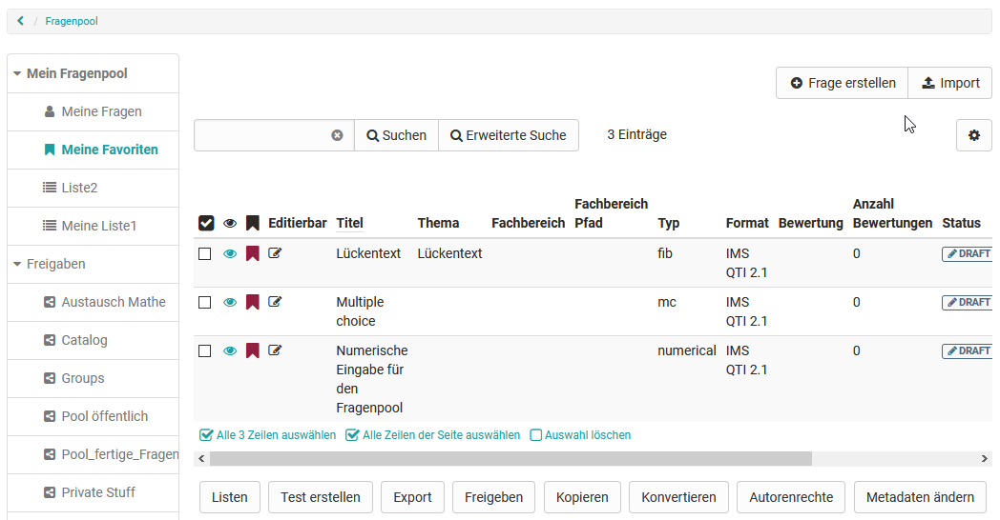
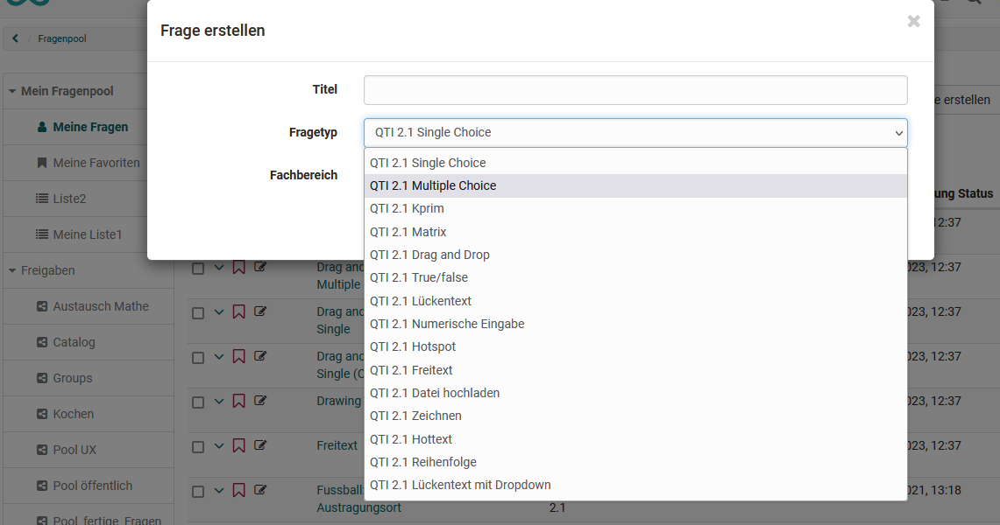
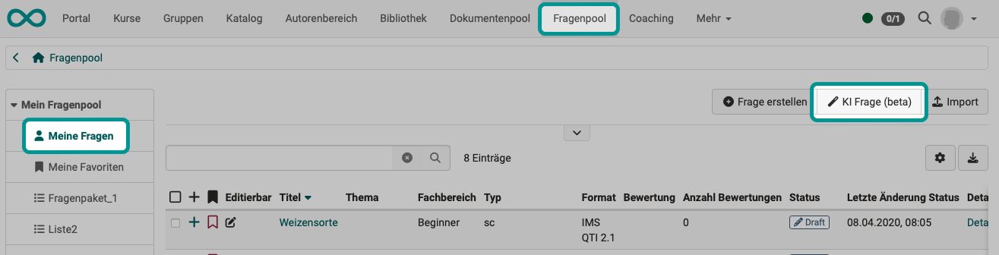
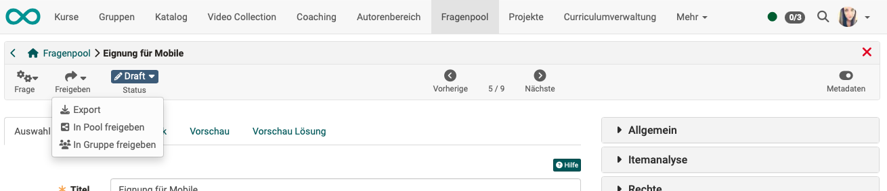

# Question pool: Create Questions {: #question_pool_create_questions}

## Overview of available questions {: #question_list}

The table view of the questions stored in the question pool offers a wide range of options. Make sure that all the columns relevant to you are selected using the cogwheel symbol.

You can mark particularly relevant questions as **favorites** and find them again quickly. Another option is to organize several questions in **lists** and thus create an individual system for your questions.

You can create or import questions in the "My questions" area, in a list or in a group share. However, the question items are always stored under "My questions" and then referenced. 

An overview of the **question types** that can be created and imported can be found in the chapter ["Test Question types"](../learningresources/Test_question_types.md)

[To the top of the page ^](#create_questions)

## Create questions in the question pool {: #create}

Question items can be created in the question pool using the "Create question" button in QTI 2.1 format and saved directly for further use. 

During creation, a title is specified, followed by the question type and finally, if available, the subject area is selected. The questions created in this way can then be imported and used in the OpenOlat learning resource "Test".

[To the top of the page ^](#create_questions)

## Create questions with AI (Artificial Intelligence) {: #create_with_AI}

!!! warning "Attention"

    This function is currently being tested. Please note that errors may occur when this function is used.

With [activated AI module](../../manual_admin/administration/External_Tools_-_Administration.md#ki_modul), questions can also be created in the question pool with the help of artificial intelligence. 

{ class="shadow lightbox" }

This function can be used to create suggestions for multiple choice questions using AI. You insert text content (max. 6000 characters) directly into the "Source text" field in OpenOlat as source material, which is passed to the AI, which then generates questions from it. 

Only German and English texts are currently supported. 

Please note that the questions must be checked for correctness in each individual case.

[To the top of the page ^](#create_questions)

## Assessment by expert colleagues {: #review}

Once the first version of a question has been created, it can be submitted to a peer review process.

[Details about the review progress >](Question_Bank_Review_Process.md) 
[To the top of the page ^](#create_questions)

## Share question in the pool {: #share_in_pool}

{ class="shadow lightbox" }

Several pools may have been created by the pool administrator. As the author of a question, you can decide in which pool your question is released.

[Details zur Freigabe >](Question_Pool_Sharing_Options.de.md) 
[To the top of the page ^](#create_questions)

## Share question in group {: #share_with_group}

If you are developing questions together, for example, you can create a workgroup in advance. If a newly created question should initially only be visible to the group members, you can also release the question for this group only in the toolbar under "Release".

[Details about Sharing >](Question_Pool_Sharing_Options.md) 
[To the top of the page ^](#create_questions)

## Further information {: #further_info}

[Import questions >](Question_Bank_Import_Questions.md) 
[Question detailed view >](Item_Detailed_View.md) 
[Details of the assessment process >](Question_Bank_Review_Process.md) 
[Release details >](Question_Pool_Sharing_Options.md) 
[Instructions for creating the test >](../../manual_how-to/test_creation_procedure/test_creation_procedure.md)  

[To the top of the page ^](#create_questions)

