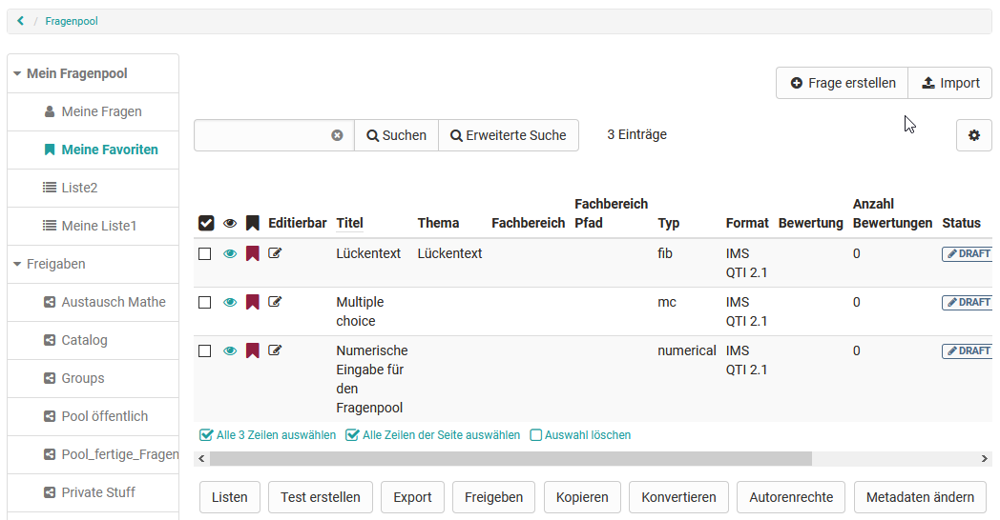
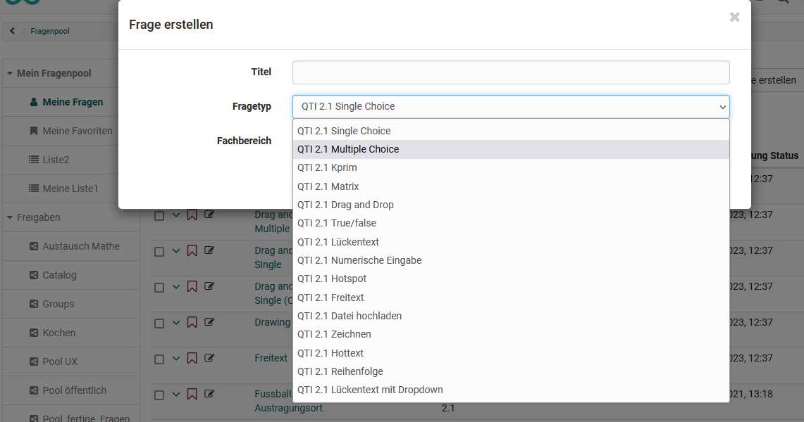
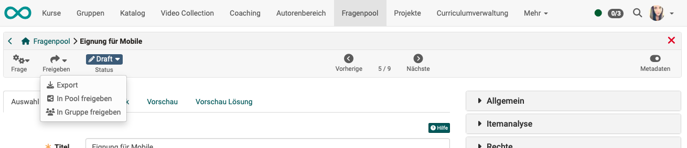

# Question pool: Create Questions {: #question_pool_create_questions}

## Overview of available questions [:octicons-tag-16:{ title="from Release 9.0.0 (OO-533)" }](https://track.frentix.com/issue/OO-533){:target="_blank"} {: #question_list}

The table view of the questions stored in the question pool offers a wide range of options. Make sure that all the columns relevant to you are selected using the cogwheel symbol.

You can mark particularly relevant questions as **favorites** and find them again quickly. Another option is to organize several questions in **lists** and thus create an individual system for your questions.

You can create or import questions in the "My questions" area, in a list or in a group share. However, the question items are always stored under "My questions" and then referenced. 

An overview of the **question types** that can be created and imported can be found in the chapter ["Test Question types"](../learningresources/Test_question_types.md)

[To the top of the page ^](#create_questions)

## Create questions in the question pool [:octicons-tag-16:{ title="from Release 9.0.0 (OO-533)" }](https://track.frentix.com/issue/OO-533){:target="_blank"} {: #create}

Question items can be created in the question pool using the "Create question" button in QTI 2.1 format and saved directly for further use. 

During creation, a title is specified, followed by the question type and finally, if available, the subject area is selected. The questions created in this way can then be imported and used in the OpenOlat learning resource "Test".

[To the top of the page ^](#create_questions)

## Create questions with AI (Artificial Intelligence) [:octicons-tag-16:{ title="from Release 19.0.0 (OO-7787)" }](https://track.frentix.com/issue/OO-7787){:target="_blank"} {: #create_with_AI}

In the question pool, questions can also be created with the help of artificial intelligence. The "AI questions" entry opens the generation dialog.

!!! info "Important"

    This function is only available if the [AI module](../../manual_admin/administration/External_Tools_AI.md) is enabled in the administration and at least one matching AI feature is configured with an AI provider and model: "MC Question Generator" for multiple-choice questions, and "Essay Question Generator" and "Essay Grading" for open-text questions with AI correction.

You choose one of two modes as source material:

* **"Upload file"**: a Markdown, plain text or Word file (.docx).
* **"Paste text"**: you paste the source text directly into the input field.

You then define how many questions are generated: "Multiple-choice questions" and, when AI correction is configured, "Essay questions with AI correction" [:octicons-tag-16:{ title="from Release 21.0 (OO-9498)" }](https://track.frentix.com/issue/OO-9498){:target="_blank"}. The AI suggests sensible values based on the text length, which you can adjust. Start the process with "Generate questions".

Generation runs in the background. You can leave the dialog open or close it; the new questions appear in the question pool once they are ready. They are created in the language of the inserted source text [:octicons-tag-16:{ title="from Release 20.3.0 (OO-9355)" }](https://track.frentix.com/issue/OO-9355){:target="_blank"}. AI-generated questions receive the "Review" status so they are checked before reuse.

Please note that the questions must be checked for correctness in each individual case.

[To the top of the page ^](#create_questions)

## Edit the AI grading of an essay question [:octicons-tag-16:{ title="from Release 21.0 (OO-9498)" }](https://track.frentix.com/issue/OO-9498){:target="_blank"} {: #ai_grading}

For essay questions with AI correction, a grading kit defines how the AI assesses the answers. The AI prefills this kit during generation; you can adjust it by hand in the question's "AI feedback" tab.

The following entries are available:

* **"Model answer"**: the expected reference answer.
* **"Key points"**: the core aspects to cover, each with a description and a weight from 0.0 to 1.0.
* **"Rubric criteria"**: named criteria with "Name", "Descriptor", a "Scope" ("Content" or "Language") and a weight.
* **"Common misconceptions"**: typical false assumptions that are taken into account in the feedback.
* **"Grading hints"** as well as a "Difficulty" from 1 to 5 and a "Bloom level" for further control.

With the **"Test feedback"** button you enter a sample answer and see in the preview which AI feedback learners would receive. This lets you fine-tune the grading kit before use.

[To the top of the page ^](#create_questions)

## Assessment by expert colleagues [:octicons-tag-16:{ title="from Release 12.3 (OO-3111)" }](https://track.frentix.com/issue/OO-3111){:target="_blank"} {: #review}

Once the first version of a question has been created, it can be submitted to a peer review process.

[Details about the review progress >](Question_Bank_Review_Process.md) 
[To the top of the page ^](#create_questions)

## Share question in the pool [:octicons-tag-16:{ title="from Release 9.0.0 (OO-533)" }](https://track.frentix.com/issue/OO-533){:target="_blank"} {: #share_in_pool}

{ class="shadow lightbox" }

Several pools may have been created by the pool administrator. As the author of a question, you can decide in which pool your question is released.

[Details zur Freigabe >](Question_Pool_Sharing_Options.md) 
[To the top of the page ^](#create_questions)

## Share question in group [:octicons-tag-16:{ title="from Release 9.0.0 (OO-533)" }](https://track.frentix.com/issue/OO-533){:target="_blank"} {: #share_with_group}

If you are developing questions together, for example, you can create a workgroup in advance. If a newly created question should initially only be visible to the group members, you can also release the question for this group only in the toolbar under "Share".

[Details about Sharing >](Question_Pool_Sharing_Options.md) 
[To the top of the page ^](#create_questions)

## Further information {: #further_info}

[Import questions >](Question_Bank_Import_Questions.md) 
[Question detailed view >](Item_Detailed_View.md) 
[Details of the assessment process >](Question_Bank_Review_Process.md) 
[Release details >](Question_Pool_Sharing_Options.md) 
[Instructions for creating the test >](../../manual_how-to/test_creation_procedure/test_creation_procedure.md)  

[To the top of the page ^](#create_questions)

