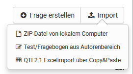

# Fragenpool: Fragen importieren {: #question_bank_import}

## Import-Möglichkeiten {: #import_options}

Es gibt drei Möglichkeiten QTI 2.1-Fragen über den Import-Button in den Fragenpool zu importieren.

  *  **ZIP-Datei** von lokalem Computer:  
  Falls Ihnen ein Set an QTI 2.1-Fragen oder ein Test als .zip-Datei zur Verfügung steht, können Sie diese hier importieren.
  *  **Lernressource Test aus dem Autorenbereich**:  
  Wählen Sie aus den verfügbaren Test-Lernressourcen den Test aus, den Sie importieren möchten. Klicken Sie dazu in der entsprechenden Zeile auf den Link "Auswählen". Alle Fragen der gewählten Lernressource werden dann direkt in den Fragenpool importiert.   
  * QTI 2.1 **Excelimport** über Copy&Paste:  
  Bereiten Sie die Fragen in einem Tabellenkalkulationsprogramm vor (z.B. Excel). Verwenden Sie die Excelimport-Vorlage, die Ihnen während des Imports angezeigt wird. Kopieren Sie die ausgefüllte Exceltabelle dann in das Formular-Feld. 

[Zum Seitenanfang ^](#question_bank_import)

## Nutzung der Datei "Vorlage Excelimport" {: #excelimport}

Mit dem Fragenimport über Exceldateien können viele Fragen auf einen Schlag auf einfache Art und Weise importiert werden. Dieser Weg bietet sich beispielsweise auch an, um Fragen aus anderen Systemen zu importieren, welche im QTI-Standard 2.1 vorliegen.

Starten Sie den Excelimport über Copy&Paste und laden Sie sich die "Vorlage Excelimport" herunter. Sie bildet die Basis für Ihr weiteres Vorgehen.

Die Excel Vorlage beinhaltet vier Spalten:

  a) Keyword/Punkte: Aspekt um den es geht

  b) Value: der gewünschte Wert oder Text

  c) Extra: Extra Informationen

  d) Erklärung: weitere Erläuterungen z.B. ob dieses Element optional ist.

 

Die Vorlage enthält Informationen für den Import der folgenden Fragetypen:

  * [MC (Multiple Choice)](#template_mc)
  * [SC (Single Choice))](#template_sc)
  * [FIB - Fill in the blank (Lückentext)](#template_fib)
  * [Numerical (Numerische Eingabe)](#template_numerical)
  * [Inlinechoice (Lückentext mit Dropdown)](#template_inlinechoice)
  * [KPRIM](#template_kprim) 
  * [Essay (Freitext)](#template_essay) 
  * [Matrix](#template_matrix) 
  * [Drag&Drop](#template_dragdrop)
  * [True-False](#template_truefalse) 

Die Fragen werden mit jeweils einer Trennzeile untereinander aufgeführt. Beim Kopieren wandelt Excel bzw. ein ähnliches Programm wie OpenOffice oder Numbers die Daten in einen Komma-separierten Text um. 

Im Folgenden werden die Möglichkeiten der in der Vorlage enthaltenen Fragetypen vorgestellt.

---

### Multiple-Choice Fragen {: #template_mc}

 **type**|MC für Multiple-Choice    
---|---  
 **title**|Titel der Frage / Themengebiet   
 **question**|  Der Fragetext. Minimale HTML Formatierung ist erlaubt.  
 **max. answers**|  Max. Anzahl möglicher Antworten.  
 **min. answers**|  Min. Anzahl möglicher Antworten.  
 **points**|Maximal erreichbare Punktzahl. Die minimale Punktzahl ist 0.
 
Sie können beliebig viele Antworten, jeweils in einer separaten Zeile erstellen. Die Punktwerte für die einzelnen Antworten können ebenfalls definiert werden z.B.

[Zum Seitenanfang ^](#question_bank_import)

---

### Single-Choice Fragen {: #template_sc}

 **type**| SC für Single-Choice    
---|---  
 **title**| Titel der Frage / Themengebiet    
 **question**| Der Fragetext. Minimale HTML Formatierung ist erlaubt.    
 **points**| Maximal erreichbare Punktzahl. Die minimale Punktzahl ist 0.   
 **Punkte wenn Option gewählt z.B. "1" (richtig) oder "0" (falsch)**|Optionstext. Es können beliebig viele Optionen angegeben werden, jede Option verwendet eine eigene Zeile mit der jeweiligen Punktzahl.  
  
  [Zum Seitenanfang ^](#question_bank_import)

---

### Lückentext Fragen {: #template_fip}

 **type**| FIB für Lückentext 
---|---
 **title**|Titel der Frage / Themengebiet
 **points**| Maximal erreichbare Punktzahl. Die minimale Punktzahl ist 0.  
 **text**|  Ein Textelement
 **Punkte, wenn Lücke korrekt z.B. "1"**|Korrekte Antwort in Lücke. Synonyme werden mit ";" getrennt. Grösse der Lücke und die maximale Anzahl Zeichen, z.B: "10,8".  

[Zum Seitenanfang ^](#question_bank_import)

---

### Numerische Eingabe {: #template_numerical}

 **type**| Numerical für numerische Eingabe
---|---
 **title**|Titel der Frage / Themengebiet
 **points**| Maximal erreichbare Punktzahl. Die minimale Punktzahl ist 0.  
 **text**|  Ein Textelement, die Fragestellung
 **Punkte, wenn Lücke korrekt z.B. "1"**|Korrekte Antwort in Lücke. Synonyme werden mit ";" getrennt. 

 Beispiel:

 

[Zum Seitenanfang ^](#question_bank_import)

---

### Lückentext mit Dropdown {: #template_inlinechoice}

 **type**| Inlinechoice für Lückentext mit Dropdown
---|---
 **title**|Titel der Frage / Themengebiet
 **Question** | Fragestellung bzw. erstes Textelement der Frage 
 **points**| Maximal erreichbare Punktzahl. Die minimale Punktzahl ist 0.  
 **text**|  Textelemente mit weiteren Teilen für die Frage bzw. Zwischentexte vor und nach den Lücken.
**Punkte, wenn Lücke korrekt z.B. "1"**|die optionalen Antworten der Dropdown-Liste getrennt. Die korrekte Antwort wird in die folgende Spalte eingetragen.
  
 Beispiel:

[Zum Seitenanfang ^](#question_bank_import)

---

### KPRIM Fragen {: #template_kprim}

 **type**|  KPRIM  
---|---  
 **title**|  Titel der Frage / Themengebiet  
 **question**|  Fragentext  
 **points**|  Maximal erreichbare Punktzahl. Die minimale Punktzahl ist 0.  
+| korrekte Antwort  
-| falsche Antwort  
-| falsche Antwort  
+| korrekte Antwort  

Korrekte Antworten werden also mit einem **+** und falsche mit **-** gekennzeichnet.

[Zum Seitenanfang ^](#question_bank_import)

---

### Essay Fragen {: #template_essay}

**type**|  ESSAY  
---|---  
 **title**|  Titel der Frage / Themengebiet  
 **question**|  Fragentext  
 **points**|  Maximal erreichbare Punktzahl. Die minimale Punktzahl ist 0.  
 **min**|  Mindestanzahl Wörter  
 **max**|  Maximale Anzahl Wörter  
  
[Zum Seitenanfang ^](#question_bank_import)

---

### Matrix Fragen {: #template_matrix}

**type**|  MATRIX|  
---|---
 **title**|  Titel der Frage / Themengebiet 
 **question**|  Fragentext   
 **points**|  Maximal erreichbare Punktzahl. Die minimale Punktzahl ist 0.|    

Die Matrix selbst verteilt sich über die Spalten und Zeilen. Die entsprechenden Punkte werden in das passende Feld eingetragen.
Hier ein Beispiel mit 3 Spalten und 3 Zeilen:

 

[Zum Seitenanfang ^](#question_bank_import)

---

### Drag & Drop Fragen {: #template_dragdrop}

**type**|  Drag & drop  
---|---
 **title**|  Titel der Frage / Themengebiet  
 **question**|  Fragentext  
 **points**|  Maximal erreichbare Punktzahl. Die minimale Punktzahl ist 0. 

Die Umsetzung in der Excel-Vorlage ist ähnlich wie bei Matrix Fragen und verteilt sich über mehrere Spalten und Zeilen. Die entsprechenden Punkte werden in das passende Feld eingetragen. Hier ein Beispiel mit 3 Spalten und 3 Zeilen:   
  
 

[Zum Seitenanfang ^](#question_bank_import)

---

### TrueFalse Fragen {: #template_truefalse}

 **type**|  Truefalse  
---|---
 **title**|  Titel der Frage / Themengebiet|  
 **question**|  Fragentext  
 **points**|  Maximal erreichbare Punktzahl. Die minimale Punktzahl ist 0.  
 
 Spalte **Unanswered**: Punkte die vergeben oder abgezogen werden wenn vom User keine Entscheidung getroffen wird.

Spalte **Right**: Punkte die vergeben werden, wenn die Antwort "Richtig" vom User ausgewählt wird.

Spalte **Wrong**: Punkte die vergeben werden, wenn die Antwort "Falsch" vom User ausgewählt wird.

Beispiel:

[Zum Seitenanfang ^](#question_bank_import)

---

!!! Info

    Neben den aufgeführten Feldern gibt es noch weitere optionale Felder wie "Topic", "Keywords", "License" usw. Weitere Details dazu finden Sie direkt in der bereitgestellten Datei "Vorlage Excelimport".

## Weitere Informationen {: #further_info}

[Fragen erstellen >](Question_Bank_Create_Questions.de.md) 
[Detailansicht einer Frage >](Item_Detailed_View.de.md) 
[Details zum Beurteilungsprozess >](Question_Bank_Review_Process.de.md) 
[Details zur Freigabe >](Question_Pool_Sharing_Options.de.md) 
[Anleitung zur Testerstellung >](../../manual_how-to/test_creation_procedure/test_creation_procedure.de.md)  

[Zum Seitenanfang ^](#create_questions)