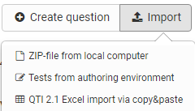

# Question Bank: Import Questions {: #question_bank_import}

## Import options {: #import_options}

There are three ways to import QTI 2.1 questions into the question bank using the Import button.

{ class="shadow lightbox" }

  *  **ZIP-file** from local computer: 
  If you have a set of QTI 2.1 questions or a test available as a .zip file, you can import it here.
  *  **Tests from authoring environment**: 
  Select the test you want to import from the available test learning resources. To do this, click on the "Select" link in the corresponding row. All questions of the selected learning resource are then imported directly into the question bank.
  * QTI 2.1 **Excel import** via copy&paste: 
  Prepare the questions in a spreadsheet program (e.g. Excel). Use the Excel import template that is displayed to you during the import. Then copy the completed Excel table into the form field.

[To the top of the page ^](#question_bank_import)

## Usage of the file "Excel Import Template" {: #excelimport}

The question import via Excel files allows you to import many questions at once in a simple way. This is also a good way to import questions from other systems that are available in the QTI 2.1 standard.

Start the Excel import via copy&paste and download the "Excel Import Template". It forms the basis for your further procedure.

The Excel template contains four columns:

  a) Keyword/Score: aspect at issue

  b) Value: the desired value or text

  c) Extra: extra information

  d) Explanation: further explanations, e.g. whether this element is optional.

 

The template contains information for importing the following question types:

  * [MC (Multiple Choice)](#template_mc)
  * [SC (Single Choice)](#template_sc)
  * [FIB - Fill in the blank (gap text)](#template_fip)
  * [Numerical (numerical input)](#template_numerical)
  * [Inlinechoice (gap text with dropdown)](#template_inlinechoice)
  * [KPRIM](#template_kprim)
  * [Essay](#template_essay)
  * [Matrix](#template_matrix)
  * [Drag&Drop](#template_dragdrop)
  * [True-False](#template_truefalse)

The questions are each listed one below the other with a separator line. When copying, Excel or a similar program such as OpenOffice or Numbers converts the data into a comma-separated text.

The options for the question types contained in the template are presented below.

---

### Multiple-choice questions {: #template_mc}

**type**|MC for multiple-choice
---|---
**title**|Title of the question / topic
**question**|The question text. Minimal HTML formatting is allowed.
**max. answers**|Max. number of possible answers.
**min. answers**|Min. number of possible answers.
**points**|Maximum achievable score. The minimum score is 0.

You can create as many answers as you like, each in a separate row. The point values for the individual answers can also be defined, e.g.

{ class="shadow lightbox" }

[To the top of the page ^](#question_bank_import)

---

### Single-choice questions {: #template_sc}

**type**|SC for single-choice
---|---
**title**|Title of the question / topic
**question**|The question text. Minimal HTML formatting is allowed.
**points**|Maximum achievable score. The minimum score is 0.
**Points when option is selected, e.g. "1" (correct) or "0" (incorrect)**|Option text. You can specify as many options as you like, each option uses its own row with the respective score.

[To the top of the page ^](#question_bank_import)

---

### Gap text questions {: #template_fip}

**type**|FIB for gap text
---|---
**title**|Title of the question / topic
**points**|Maximum achievable score. The minimum score is 0.
**text**|A text element
**Points when the gap is correct, e.g. "1"**|Correct answer in the gap. Synonyms are separated with ";". Size of the gap and the maximum number of characters, e.g. "10,8".

[To the top of the page ^](#question_bank_import)

---

### Numerical input {: #template_numerical}

**type**|Numerical for numerical input
---|---
**title**|Title of the question / topic
**points**|Maximum achievable score. The minimum score is 0.
**text**|A text element, the question
**Points when the gap is correct, e.g. "1"**|Correct answer in the gap. Synonyms are separated with ";".

Example:

{ class="shadow lightbox" }

[To the top of the page ^](#question_bank_import)

---

### Gap text with dropdown {: #template_inlinechoice}

**type**|Inlinechoice for gap text with dropdown
---|---
**title**|Title of the question / topic
**Question**|Question or first text element of the question
**points**|Maximum achievable score. The minimum score is 0.
**text**|Text elements with further parts of the question or intermediate texts before and after the gaps.
**Points when the gap is correct, e.g. "1"**|The optional answers of the dropdown list, separated. The correct answer is entered in the following column.

Example:

{ class="shadow lightbox" }

[To the top of the page ^](#question_bank_import)

---

### KPRIM questions {: #template_kprim}

**type**|KPRIM
---|---
**title**|Title of the question / topic
**question**|Question text
**points**|Maximum achievable score. The minimum score is 0.
+|correct answer
-|incorrect answer
-|incorrect answer
+|correct answer

Correct answers are therefore marked with **+** and incorrect answers with **-**.

[To the top of the page ^](#question_bank_import)

---

### Essay questions {: #template_essay}

**type**|ESSAY
---|---
**title**|Title of the question / topic
**question**|Question text
**points**|Maximum achievable score. The minimum score is 0.
**min**|Minimum number of words
**max**|Maximum number of words

[To the top of the page ^](#question_bank_import)

---

### Matrix questions {: #template_matrix}

**type**|MATRIX
---|---
**title**|Title of the question / topic
**question**|Question text
**points**|Maximum achievable score. The minimum score is 0.

The matrix itself is distributed across the columns and rows. The corresponding points are entered in the appropriate field.
Here is an example with 3 columns and 3 rows:

{ class="shadow lightbox" }

[To the top of the page ^](#question_bank_import)

---

### Drag & Drop questions {: #template_dragdrop}

**type**|Drag & drop
---|---
**title**|Title of the question / topic
**question**|Question text
**points**|Maximum achievable score. The minimum score is 0.

The implementation in the Excel template is similar to matrix questions and is spread over several columns and rows. The corresponding points are entered in the appropriate field. Here is an example with 3 columns and 3 rows:

{ class="shadow lightbox" }

[To the top of the page ^](#question_bank_import)

---

### TrueFalse questions {: #template_truefalse}

**type**|Truefalse
---|---
**title**|Title of the question / topic
**question**|Question text
**points**|Maximum achievable score. The minimum score is 0.

Column **Unanswered**: Points that are awarded or deducted if the participants do not make a decision.

Column **Right**: Points that are awarded if the participants select the answer "Right".

Column **Wrong**: Points that are awarded if the participants select the answer "Wrong".

Example:

{ class="shadow lightbox" }

[To the top of the page ^](#question_bank_import)

---

!!! info "Important"

    In addition to the listed fields, there are other optional fields such as "Topic", "Keywords", "License", etc. For more details, see the provided file "Excel Import Template".

## Further information {: #further_information}

[Create questions >](Question_Bank_Create_Questions.md) 
[Item Detailed View >](Item_Detailed_View.md) 
[Details about the review process >](Question_Bank_Review_Process.md) 
[Details about sharing >](Question_Pool_Sharing_Options.md) 
[Instructions for creating the test >](../../manual_how-to/test_creation_procedure/test_creation_procedure.md)

[To the top of the page ^](#question_bank_import)
