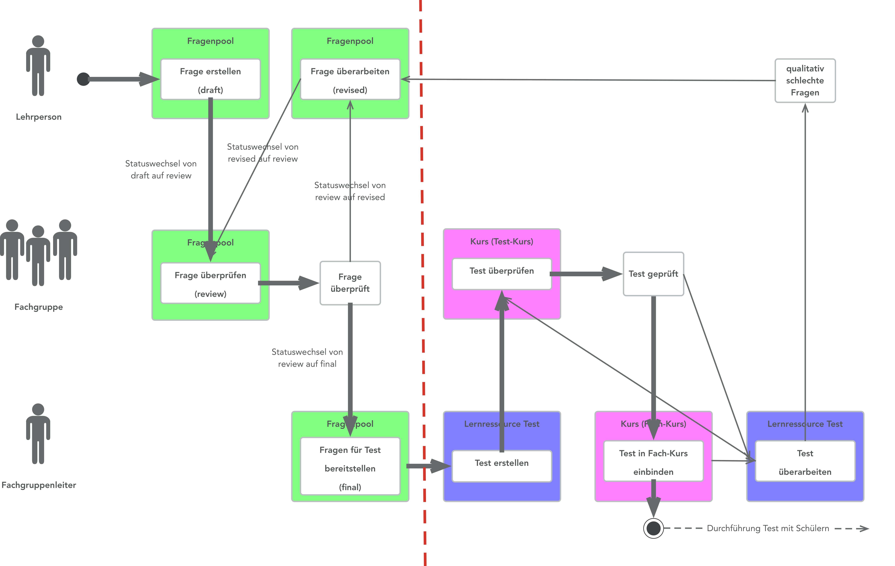
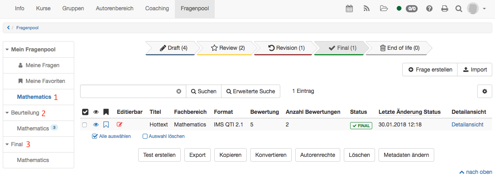
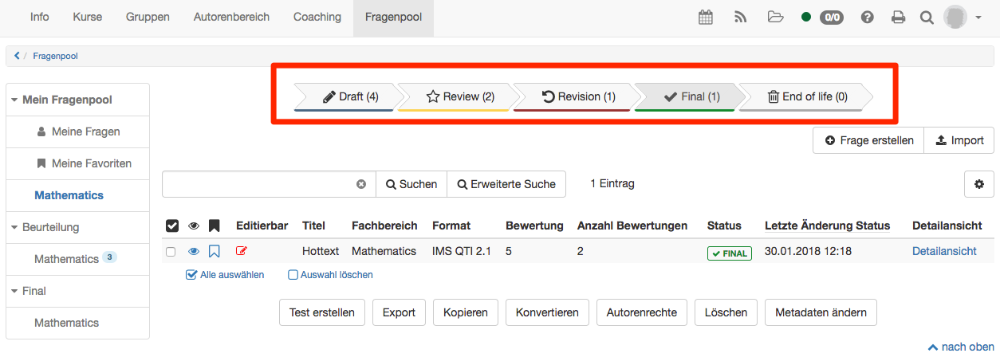
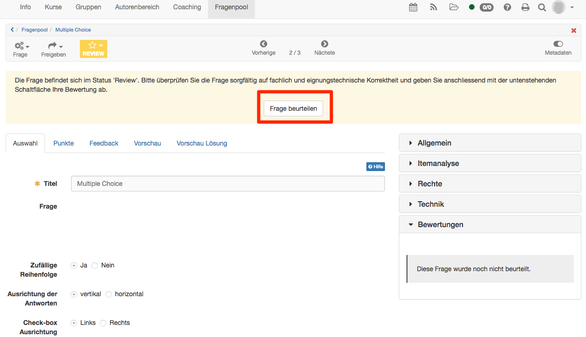
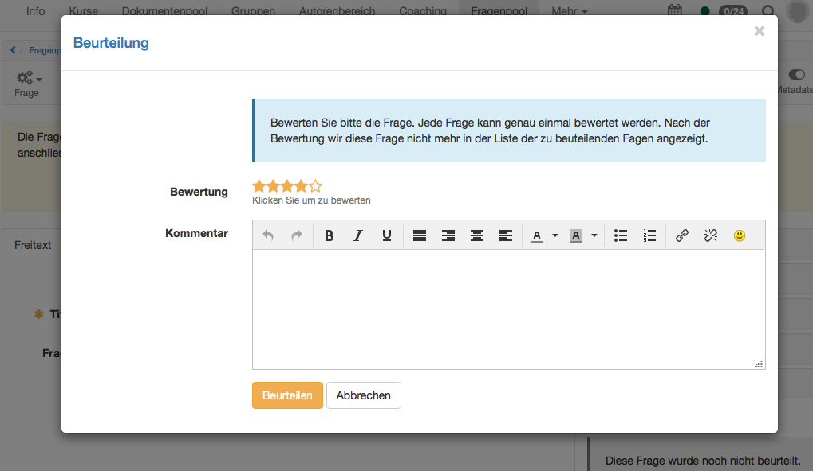

# Fragenpool: Beurteilungsprozess {: #review_process}

Alle Fragen des Fragenpools können einen Beurteilungsprozess durchlaufen. Dadurch kann die Qualitätssicherung gewährleistet werden.

## Voraussetzungen

In der Administration kann der Beurteilungsprozess aktiviert werden.

Um mit dem Beurteilungsprozess arbeiten zu können, muss ausserdem zwingend eine sogenannte Taxonomiestruktur (auch Fachbereiche) definiert werden. Alle Fragen werden einem Fachbereich zugeordnet. Die Benutzer:innen des Fragenpools erhalten Rechte auf gewisse Fachbereiche. Auf diese Fachbereiche haben die Benutzer:innen Zugriff und diese Fachbereiche sind im Fragenpool sichtbar. Im Beispiel unten ist dies der Fachbereich "Mathematics".

## Prozess

In der folgenden Grafik ist ein beispielhafter Prozessablauf dargestellt.

Folgende Prozessschritte sind also im Beurteilungsprozess des Fragenpools abgebildet:

  1. Fragen werden entweder unter "Meine Fragen" oder direkt im eigenen Fach (oder Kompetenz, Handlungsfeld...) erstellt. Die Frage befindet sich im Status "Draft".
  2. Die Frage wird in die Beurteilung gegeben. Der Status der Frage wechselt auf Review.
  3. Die Fragen werden beurteilt. Die eigenen Fragen können nicht beurteilt werden, sondern nur die Fragen der anderen Benutzer, welche derselben Fachgruppe angehören.
  4. a) Die Beurteilung ist ungenügend. Das heisst, die Untergrenze der Bewertung mit den Sternen wird nicht erreicht. Die Frage geht zurück an den Ersteller in den Status Revision. Hier kann die Frage überarbeitet und erneut in die Beurteilung gegeben werden.  
b) Die Beurteilung durch die Sterne ist genügend. Die definierte Anzahl Personen hat eine genügende Bewertung abgegeben. Die Frage wechselt in den Status "Final".

  5. Die Fragen aus dem Bereich "Final" können in den Test eingebunden werden.

In der folgenden Abbildung sind auf der linken Seite die verschiedenen Bereiche aus dem Prozess abgebildet.

1) Das Fach Mathematics ist unter "Mein Fragenpool" sichtbar. Hier sind alle eigenen Fragen dieses Fachbereichs abgebildet. Es werden hier alle Fragen nach Status aufgelistet.

2) Unter "Beurteilung" ist wiederum das Fach Mathematics abgebildet. Hier sind Fragen im Status "Review" aufgelistet. Die eigenen Fragen tauchen hier jedoch nicht auf, da man die eigenen Fragen nicht selbst beurteilen soll. Es werden die Fragen von anderen Benutzern mit dem Recht Mathematics aufgelistet. Nun können die Fragen beurteilt werden.

3) Sobald die Beurteilungskriterien erfüllt sind, kommt die Frage in den Bereich "Final". Es ist möglich, dass Sie nicht über genügend Rechte verfügen und Sie deshalb den Bereich "Final" nicht sehen. Trotzdem können Sie die Beurteilung gemäss 2. durchführen.

[Zum Seitenanfang ^](#review_process)

## Status

Wenn Sie unter "Mein Fragenpool" ein Fach auswählen, wird ein Prozessablauf mit verschiedenen Status abgebildet (rot markiert). Hier bekommen Sie einen Überblick, welche Ihrer Fragen sich in welchem Status befindet.

  * **Draft:** Alle Fragen, die noch in Bearbeitung sind und noch nicht in den Beurteilungsprozess gegeben wurden. Sobald eine Frage aus "Meine Fragen" mit dem entsprechenden Fachbereich verknüpft ist, taucht sie hier im Status Draft auf.
  * **Review:** Hier sehen Sie alle Ihre Fragen, die sich momentan gerade im Status Review befinden. Diese Fragen müssen also von den anderen Personen Ihrer Fachgruppe beurteilt werden. Sie selbst können Ihre Fragen nicht beurteilen. 
  * **Revision:** Hierhin gelangen alle Fragen, welche im Reviewprozess die Untergrenze der Beurteilung nicht erreicht haben. Die Untergrenze bezieht sich auf die Bewertung durch die Sterne und kann durch die Administration definiert werden. Die Fragen, welche sich hier befinden, müssen von Ihnen überarbeitet und wieder in die Beurteilung gegeben werden.
  * **Final:** Wenn eine Frage die Beurteilungskriterien erfüllt, gelangt sie in den Status Final. Hier sind nun die Fragen, welche die Qualitätssicherung überstanden haben und in Tests eingebunden werden können. 
  * **End of life:** Hierhin kommen Fragen, welche durch den Manager oder Administrator im Status Final in den Status End of life gesetzt worden sind. Nun ist es Ihnen überlassen, ob Sie die Fragen hier belassen oder löschen möchten. Wenn Sie die Frage wieder bearbeiten möchten, müssen Sie eine Kopie davon erstellen. Anschliessend befindet sich die Frage wieder im Status Draft und der Prozess kann von vorne beginnen.

[Zum Seitenanfang ^](#review_process)

**Beurteilung**

Im Bereich "Beurteilung" können Sie nun die Fragen der anderen Personen aus Ihrer Fachgruppe beurteilen. Die Frage befindet sich im Lesemodus. Sie können also die gesamte Frage anschauen, inklusive Punkte, Feedback und Metadaten. Sie können jedoch nichts editieren.

Die Beurteilung der Frage starten Sie mit "Frage beurteilen".

Anschliessend öffnet sich ein Dialog:

Hier können Sie nun zum einen die Bewertung mit den Sternen vornehmen und zum anderen einen Kommentar hinzufügen. vor allem wenn die Bewertung unter dem Grenzwert liegt ist ein Kommentar zentral. Nur so hat der Ersteller der Frage die Möglichkeit, die Frage anhand Ihrer Rückmeldung zu verbessern. Mit "Beurteilen" wird Ihre Beurteilung gespeichert.

[Zum Seitenanfang ^](#review_process)

## Weitere Informationen {: #further_info}

[Fragen erstellen >](Question_Bank_Create_Questions.de.md) 
[Fragen importieren >](Question_Bank_Import_Questions.de.md) 
[Detailansicht einer Frage >](Item_Detailed_View.de.md) 
[Weitere Möglichkeiten zur Verwendung der Fragen >](Question_bank_possible_operations.de.md) 
[Details zur Freigabe >](Question_Pool_Sharing_Options.de.md) 
[Anleitung zur Testerstellung >](../../manual_how-to/test_creation_procedure/test_creation_procedure.de.md)  

[Zum Seitenanfang ^](#review_process)