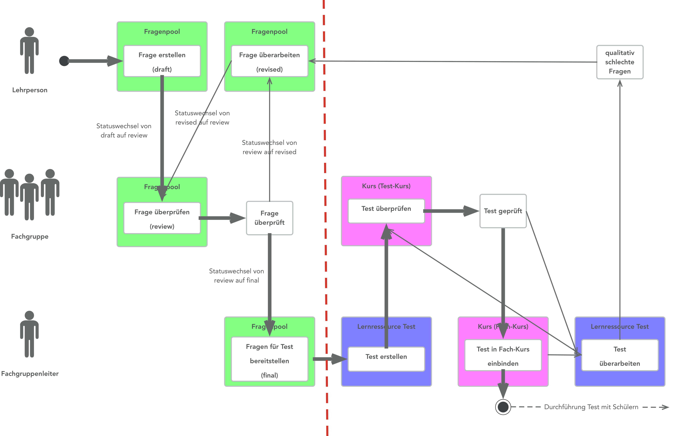
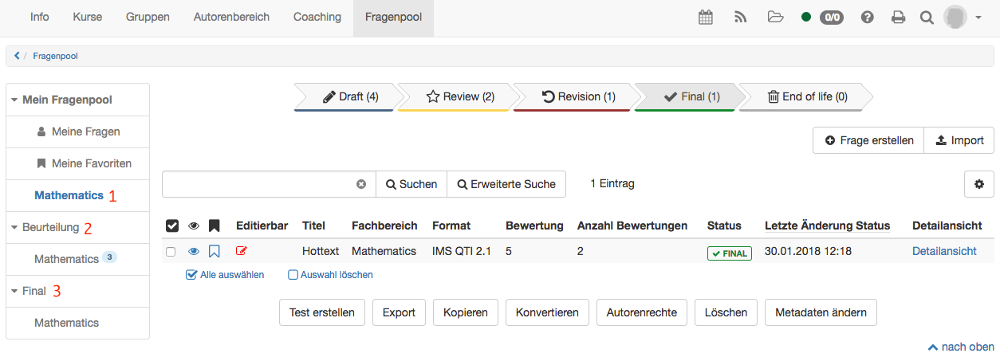
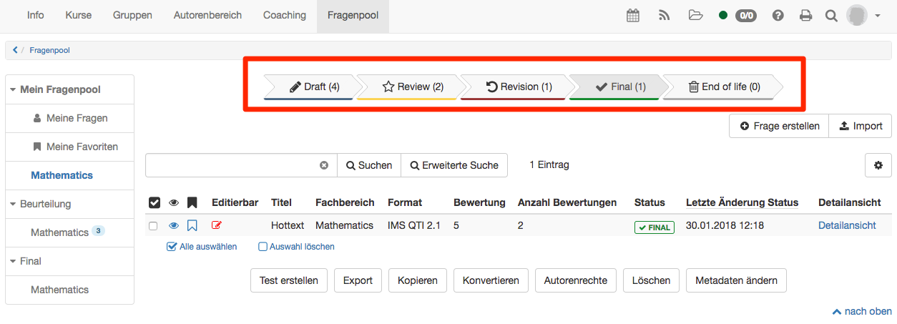
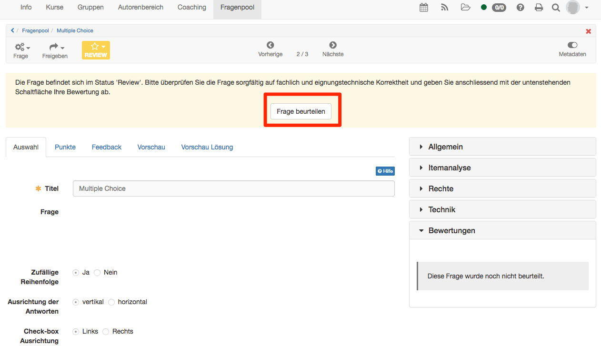
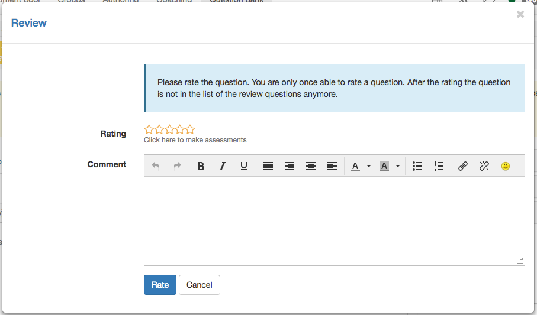

# Question Bank Review Process {: #review_process}

All questions in the question bank can undergo a review process. This ensures quality assurance.

## Requirements

The review process is activated in the system administration: `Administration > e-Assessment > Question bank`. You can find details on the page [e-Assessment Administration: Question bank](../../manual_admin/administration/eAssessment_Question_bank.md).

In order to be able to work with the review process, it is also essential to define a so-called taxonomy structure (also known as subjects). All questions are assigned to a subject. The users of the question bank are given rights to certain subjects. The users have access to these subjects and these subjects are visible in the question bank. In the example below, this is the subject "Mathematics".

## Process

The following graphic shows an exemplary process flow.

{ class="shadow lightbox" }

The following process steps are therefore depicted in the review process of the question bank:

  1. Questions are created either under "My questions" or directly in the own subject (or competence, field of action...). The question has the status "Draft".
  2. The question is submitted for review. The status of the question changes to Review.
  3. The questions are reviewed. Your own questions cannot be reviewed, only the questions of the other users who belong to the same subject group.
  4. a) The review is insufficient. This means that the lower limit of the star rating is not reached. The question goes back to the creator in the status Revision. Here the question can be revised and submitted for review again. 
b) The star rating is sufficient. The defined number of persons has given a sufficient rating. The question changes to the status "Final".
  5. The questions from the "Final" area can be integrated into the test.

The following figure shows the different areas from the process on the left side.

{ class="shadow lightbox" }

1) The subject Mathematics is visible under "My question bank". All your own questions of this subject are shown here. All questions are listed here by status.

2) Under "Review" the subject Mathematics is shown again. Questions in the status "Review" are listed here. However, your own questions do not appear here, because you should not review your own questions yourself. The questions of other users with the right Mathematics are listed. Now the questions can be reviewed.

3) As soon as the review criteria are fulfilled, the question moves to the "Final" area. It is possible that you do not have sufficient rights and therefore do not see the "Final" area. Nevertheless, you can carry out the review as described under 2.

[To the top of the page ^](#review_process)

## Status

If you select a subject under "My question bank", a process flow with different statuses is shown (marked in red). Here you get an overview of which of your questions is in which status.

{ class="shadow lightbox" }

  * **Draft:** All questions that are still being edited and have not yet been submitted to the review process. As soon as a question from "My questions" is linked to the corresponding subject, it appears here in the status Draft.
  * **Review:** Here you see all your questions that are currently in the status Review. These questions must therefore be reviewed by the other persons in your subject group. You cannot review your own questions.
  * **Revision:** All questions that did not reach the lower limit of the review in the review process go here. The lower limit refers to the star rating and can be defined by the administration. The questions located here must be revised by you and submitted for review again.
  * **Final:** If a question fulfils the review criteria, it moves to the status Final. Here are the questions that have passed quality assurance and can be integrated into tests.
  * **End of life:** Questions that have been set from the status Final to the status End of life by question bank managers or administrators go here. It is now up to you whether you want to leave the questions here or delete them. If you want to edit the question again, you must create a copy of it. The question is then back in the status Draft and the process can start again.

[To the top of the page ^](#review_process)

**Review**

In the "Review" area you can now review the questions of the other persons in your subject group. The question is in read mode. You can therefore view the entire question, including score, feedback and metadata. However, you cannot edit anything.

Start the review of the question with "Review question".

{ class="shadow lightbox" }

A dialog then opens:

{ class="shadow lightbox" }

Here you can now give the star rating and add a comment. Especially if the rating is below the threshold value, a comment is essential. This is the only way the creator of the question has the opportunity to improve the question based on your feedback. Click "Rate" to save your review.

[To the top of the page ^](#review_process)

## Further information {: #further_information}

[e-Assessment Administration: Question bank >](../../manual_admin/administration/eAssessment_Question_bank.md) 
[Create questions >](Question_Bank_Create_Questions.md) 
[Import questions >](Question_Bank_Import_Questions.md) 
[Item Detailed View >](Item_Detailed_View.md) 
[Further possibilities to use questions >](Question_bank_possible_operations.md) 
[Details about sharing >](Question_Pool_Sharing_Options.md) 
[Instructions for creating the test >](../../manual_how-to/test_creation_procedure/test_creation_procedure.md)

[To the top of the page ^](#review_process)
