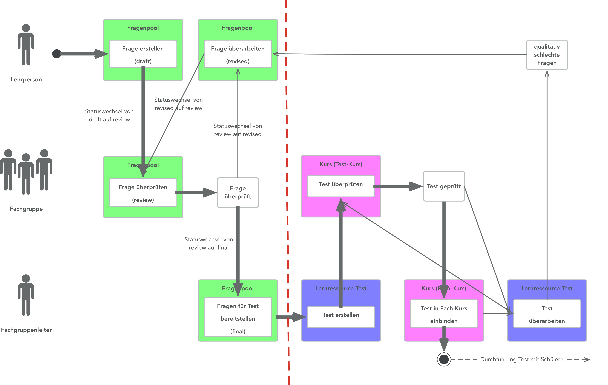

# Question Bank Review Process

All questions in the question pool can undergo an assessment process. This ensures quality assurance.

## Requirements

The assessment process can be activated in the administration.

In order to be able to work with the assessment process, it is also essential to define a so-called taxonomy structure (also known as subject areas). All questions are assigned to a subject area. The users of the question pool are given rights to certain subject areas. The users have access to these subject areas and these subject areas are visible in the question pool. In the example below, this is the subject area "Mathematics".

## Process

In the following graphic the review process is shown exemplarily.

The following steps are depicted in the question bank review process:

  1. Questions are created under "My Questions" or directly under the assigned subjects (or teaching field, competence...). The question has the status "Draft".
  2. The question is added to the review process, the status changes to "Review".
  3. During the review, the question is assessed. Review is only possible for questions of other teachers of the same subject.
  4. a) The star rating is below the defined lower limit. The question status changes to "Revision" and the question is put back to the author to be edited again. After editing the review process for this question can be started again.  
b) The star rating is equal or above the defined lower limit. That also means the defined number of ratings per question is reached. The question status changes to "Final".
  1. Questions with the status "Final" can be integrated in tests.  

On the left, the different parts of the review process are shown.

  

1) The subject Mathematics is visible under "My question bank". Here you can find all the questions of this subject you created yourself. The questions are listed in order of their status.

2) Under "Review" there is also the subject Mathematics. All questions of other authors of the subject Mathematics with the status "Review" are listed there. You can not see your own questions here because authors can not review their own questions. The questions from other users with the Mathematics permission are listed.The questions are ready to review.

3) If a question meets all the defined review process criteria its status changes to "Final". The block "Final" is only visible to you if you have the corresponding rights. Nevertheless questions can be reviewed as specified under 2).

[To the top of the page ^](#review_process)

## Status

If you choose a subject under "My question bank" the review process with all its different status is shown (marked in red). By clicking on each status you can see which of your questions have this status.

  * **Draft**: All questions that are still being processed and have not yet been submitted to the evaluation process. As soon as a question from "My questions" is linked to the corresponding department, it will appear here in the Draft status.
  * **Review**: Here you can see all your questions that are currently in the status review. These questions must therefore be assessed by the other people in your specialist group. You cannot assess your questions yourself.
  * **Revision**: All questions that did not reach the lower limit of the assessment in the review process go here. The lower limit refers to the star rating and can be defined by the administration. The questions located here must be revised by you and returned to the assessment.
  * **Final**: If a question fulfills the evaluation criteria, it is assigned the status Final. Here are the questions that have survived quality assurance and can be integrated into tests.
  * **End of life**: Questions that have been set to the End of life status by the manager or administrator in the Final status go here. It is now up to you whether you want to leave the questions here or delete them. If you want to edit the question again, you must create a copy of it. The question then returns to draft status and the process can start again.

[To the top of the page ^](#review_process)

**Review question**

Here you can review the question of another teacher from the same subject (teaching field). The question is "read only" mode, so you can view the question including score, feedback and metadata, but you can not edit the question.

Start the review with "Review question".

The following dialog appears:

  

Here you can now enter the star rating and add a comment. A comment is particularly important if the rating is below the threshold value. This is the only way the question creator has the opportunity to improve the question based on your feedback. Click "Rate" to save your assessment.

[To the top of the page ^](#review_process)

## Further information {: #further_info}

[Create questions >](Question_Bank_Create_Questions.md) 
[Import questions >](Question_Bank_Import_Questions.md) 
[Item detailed view >](Item_Detailed_View.md) 
[Further possibilities to use questions >](Question_bank_possible_operations.md) 
[Sharing options >](Question_Pool_Sharing_Options.md) 
[Test creation procedure >](../../manual_how-to/test_creation_procedure/test_creation_procedure.md)  

[To the top of the page ^](#review_process)

