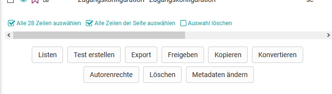

# Mögliche Aktionen im Fragenpool

## Listen {: #lists}

Listen gestatten Ihnen die Sammlung von Frageitems nach Ihren persönlichen Kriterien. Wählen Sie dazu unter Meine Fragen oder einem Pool die entsprechenden Fragen aus, und klicken Sie im Anschluss auf die Schaltfläche "Listen" unterhalb der Tabelle. Erstellen Sie eine neue Liste oder fügen Sie die Frage einer bestehenden Liste hinzu.

Eine Liste ist nur für Sie sichtbar. Wenn Sie eine Frage zu einer Liste hinzufügen, wird diese nur referenziert und nicht kopiert. Änderungen an Fragen die Sie in einer Liste vornehmen, werden dementsprechend auch im Original unter "Meine Fragen" vorgenommen. Ihre Liste finden Sie im Anschluss Links im Menü unterhalb von "Meine Favoriten".

Ist eine Liste geöffnet, erlaubt diese Schaltfläche die entsprechende Liste zu löschen oder umzubenennen. Items werden nicht separat auf Listen gespeichert. Wenn Sie Items von Listen entfernen, werden diese Items nicht aus der Datenbank gelöscht.

## Test erstellen

Mit dieser Option wird aus den ausgewählten Fragen direkt eine neue Lernressource Test erstellt. Es kann dann sogleich der Titel der Lernressource eingetragen werden. Dieser Test befindet sich anschliessend im Autorenbereich unter "Meine Einträge".

## Export

Markierte Fragen können Sie in verschiedene Formate exportieren. Folgende Möglichkeiten stehen zur Verfügung:

* Word Datei für offline Prüfung (inkl. Korrekturblatt)
* QTI Testdatei für Austausch mit anderen kompatiblen LMS
* ZIP Datei für Austausch mit anderen OpenOlat Systemen oder Archivierung

## Freigeben {: #share}

Vorab markierte Items können mit dieser Funktion zu Gruppen oder Pools hinzugefügt werden auf die der Benutzer Zugriff hat.

Gruppenmitglieder der von Ihnen ausgewählten Gruppen erhalten dadurch Zugriff auf die entsprechenden Fragen. Wurden ein oder mehrere Fragen für eine oder mehrere Gruppen freigegeben, so erscheinen die Gruppennamen im Fragenpool-Menü unter "Freigaben".

Anders als Gruppen haben bei öffentlichen Pools alle die Benutzer Zugriff auf freigegebene Fragen, die auch auf die Fragenpool-Funktionalität Zugriff haben. Bei der Freigabe kann zudem definiert werden, ob die Frage am neuen Ort bearbeitet werden darf oder nicht.

Beachten Sie, dass auch bei der Freigabe per Pool oder Gruppe die jeweiligen Personen grundsätzlich zunächst das Recht auf den Zugriff zum Fragenpool besitzen müssen. Beispielsweise besitzen normale Benutzer normalerweise nicht das Zugriffsrecht auf den Fragenpool.

Der [Poolverwalter](Question_Bank_Administration.de.md) (eine spezifische OpenOlat Rolle) kann eine unbegrenzte Anzahl an Pools anlegen. Diese können entweder öffentlich, und damit für alle Benutzer sichtbar sein, oder privat. Die Anzahl der angezeigten Pools kann daher von Benutzer zu Benutzer unterschiedlich sein. Kontaktieren Sie ihren Poolverwalter, falls kein öffentlicher Pool vorhanden sein sollte.

Items, die in der Gruppe oder dem Pool nicht bearbeitet werden dürfen, können bearbeitet werden sobald Sie in "Meine Fragen" kopiert wurden.

## Kopieren

Kopieren Sie Items aus Pools um eine Kopie in ihrer Fragendatenbank unter "Meine Fragen" zu erstellen. Kopierte Fragen haben den Zusatz "(Copy)". Die Kopie der Fragen, welche in Listen oder Freigaben erstellt wird, kann zusätzlich zu "Meine Fragen" auch unter der jeweiligen Liste oder Freigabe abgespeichert werden.

## Konvertieren

Fragen im QTI Standard 1.2 sollten in den QTI Standard 2.1 konvertiert werden. Wählen Sie dazu die gewünschten Fragen in der Liste aus. Klicken Sie anschliessend auf "Konvertieren". Nachdem Sie den Dialog bestätigt haben, stehen nun die konvertierten Fragen im Standard 1.2 und neu auch im Standard 2.1 zur Verfügung.

Die Fragen, welche in Listen oder Freigaben konvertiert werden, sind zusätzlich zu "Meine Fragen" auch unter der jeweiligen Liste oder Freigabe abgespeichert. Fragen, die bereits im QTI Format 2.1 vorliegen brauchen nicht konvertiert zu werden.

Weitere Informationen zum Konvertieren finden Sie unter "[Von QTI 1.2 zu QTI 2.1"](../learningresources/Changing_from_QTI_1.2_to_QTI_2.1.de.md).

## Autorenrechte {: #rights}

Weitere Autoren - und damit deren Zugriffsrechte - fügen Sie hier zu einer oder mehreren Fragen hinzu.

## Entfernen bzw. Löschen

Items können von Listen, Pools und Gruppenfreigaben entfernt werden, ohne die Originalfrage unter Meine Fragen zu löschen. Mit der Schaltfläche "Entfernen" wird lediglich die Referenz auf das Item entfernt, nicht aber das Item selbst gelöscht. Eine Frage wird immer nur aus dem jeweiligen Kontext entfernt in dem Sie sich gerade befinden. Indem Sie eine Frage von einer Liste, aus einer Gruppe oder einem Pool entfernen, ändern Sie nichts an eventuellen anderen Freigaben.

Um eine Frage endgültig von allen Listen, Gruppen und Pools zu löschen, müssen Sie die entsprechende Frage in Ihrem Fragenpool unter "Meine Fragen" löschen. Dort wird sie endgültig gelöscht und kann nicht mehr wiederhergestellt werden.

## Metadaten ändern {: #metadata}

Metainformationen zu Fragen können hier oder in der Detailansicht eines Items angepasst werden. Mit der Funktion "Metadaten ändern" können einzelne Informationen bei mehreren Items gleichzeitig angepasst werden, ohne die Detailansicht der Fragen zu öffnen. So gemachte Änderungen können hier nicht mehr rückgängig gemacht werden. Für weitere Anpassungen muss jede Frage einzeln aufgerufen werden. Weitere Informationen zu den einzelnen Metadaten finden Sie im Kapitel "Detailansicht einer Frage" \- [Metadaten](Item_Detailed_View.de.md#ItemDetailedView-item_details_metadaten).

Um die Vorschau eines Items und eine Übersicht der wichtigsten Metadaten zu erhalten, klicken Sie auf das Auge.

Um eine Frage zu bearbeiten klicken Sie auf Detailansicht.
