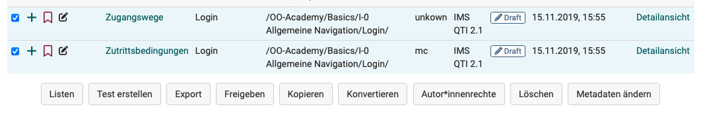
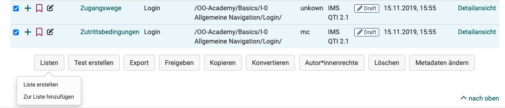
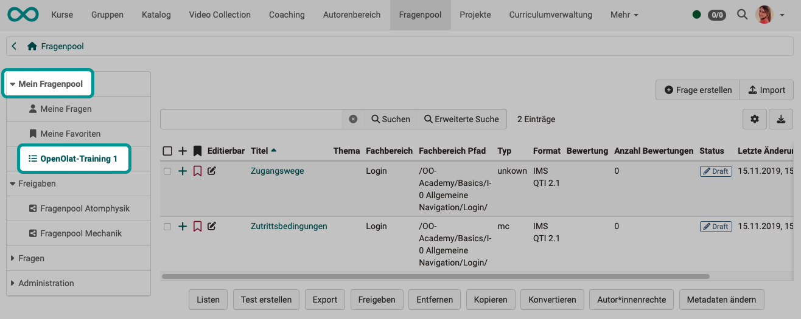
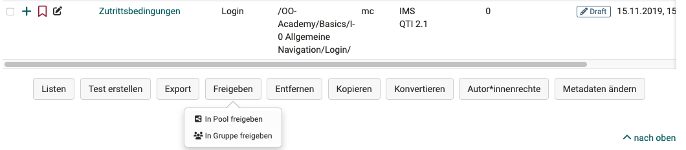
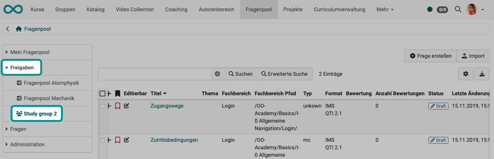
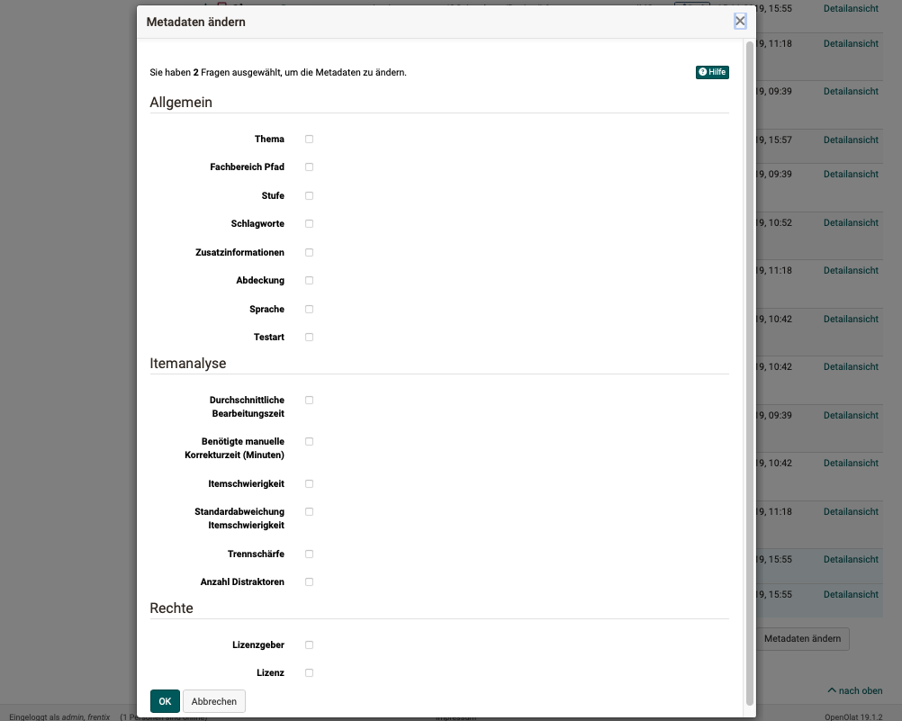
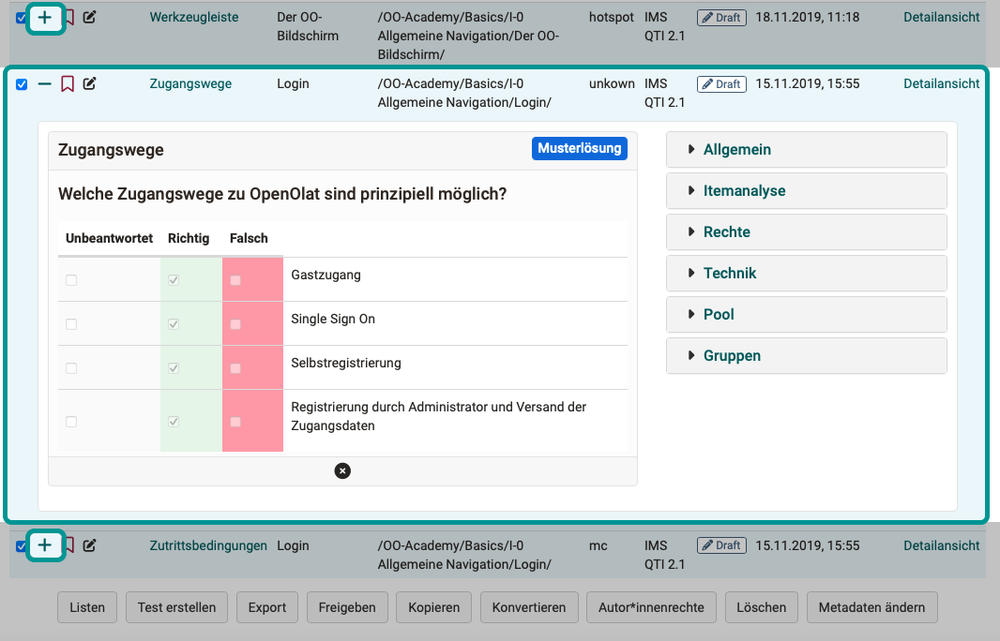

# Fragenpool: Fragen verwenden {: #using_the_questions}

Selektieren Sie in der Liste mehrere Fragen, können Sie mit den Buttons am unteren Rand die ausgewählten Fragen weiter verwenden.

{ class="shadow lightbox" }

## Listen {: #lists}

Listen gestatten Ihnen die Sammlung von Frageitems nach Ihren persönlichen Kriterien. Wählen Sie dazu unter ""Meine Fragen" oder einem Pool die entsprechenden Fragen aus, und klicken Sie im Anschluss auf die Schaltfläche "Listen" unterhalb der Tabelle. Erstellen Sie eine neue Liste oder fügen Sie die Frage einer bestehenden Liste hinzu.

{ class="shadow lightbox" }

Eine Liste ist nur für Sie sichtbar. Wenn Sie eine Frage zu einer Liste hinzufügen, wird diese nur referenziert und nicht kopiert. Änderungen an Fragen, die Sie in einer Liste vornehmen, werden dementsprechend auch im Original unter "Meine Fragen" vorgenommen. Ihre Liste finden Sie im Anschluss links im Menü unterhalb von "Meine Favoriten".

{ class="shadow lightbox" }

Ist eine Liste geöffnet, erlaubt diese Schaltfläche die entsprechende Liste zu löschen oder umzubenennen. Items werden nicht separat auf Listen gespeichert. Wenn Sie Items von Listen entfernen, werden diese Items nicht aus der Datenbank gelöscht.

[Zum Seitenanfang ^](#using_the_questions)

## Test erstellen {: #learning_resource_test}

Mit dieser Option wird aus den ausgewählten Fragen direkt eine neue [Lernressource Test](../learningresources/Test.de.md) erstellt. Es kann dann sogleich der Titel der Lernressource eingetragen werden. Dieser Test befindet sich anschliessend im Autorenbereich unter "Meine Einträge".

[Zum Seitenanfang ^](#using_the_questions)

## Export {: #export}

Markierte Fragen können Sie in verschiedene Formate exportieren. Folgende Möglichkeiten stehen zur Verfügung:

* Word Datei für offline Prüfung (inkl. Korrekturblatt)
* QTI Testdatei für Austausch mit anderen kompatiblen LMS
* ZIP Datei für Austausch mit anderen OpenOlat Systemen oder Archivierung

[Zum Seitenanfang ^](#using_the_questions)

## Freigeben {: #share}

Vorab markierte Items können mit dieser Funktion zu Gruppen oder Pools hinzugefügt werden, auf die andere Benutzer:innen Zugriff haben.

{ class="shadow lightbox" }

**in Gruppe freigeben**

Gruppenmitglieder der von Ihnen ausgewählten Gruppen erhalten dadurch Zugriff auf die entsprechenden Fragen. Sie können entscheiden, ob die Gruppenmitglieder Ihre Fragen auch bearbeiten dürfen. 

Wurden ein oder mehrere Fragen für eine oder mehrere Gruppen freigegeben, so erscheinen die Gruppennamen im Fragenpool-Menü unter "Freigaben".

{ class="shadow lightbox" }

**in Pool freigeben**

Bei Freigabe in einen Pool haben alle Benutzer:innen Zugriff auf die freigegebenen Fragen, die auch auf diesen Fragenpool Zugriff haben. 

!!! tip "Hinweis"

    Beachten Sie, dass auch bei der Freigabe in einen Pool oder für eine Gruppe die jeweiligen Personen grundsätzlich zunächst das Recht auf den Zugriff zum Fragenpool besitzen müssen. Beispielsweise besitzen normale Benutzer:innen standardmässig nicht das Zugriffsrecht auf die Fragenpools.

[Poolverwalter:innen](Question_Bank_Administration.de.md) (eine spezifische OpenOlat-Rolle) können eine unbegrenzte Anzahl an Pools anlegen. Diese können entweder öffentlich, und damit für alle zugriffsberechtigten Benutzer:innen sichtbar sein, oder privat. Die Anzahl der angezeigten Pools kann daher von Benutzer:in zu Benutzer:in unterschiedlich sein. Kontaktieren Sie Ihren/Ihre Poolverwalter:in, falls Sie auf einen Pool keinen Zugriff haben.

Bei der Freigabe kann definiert werden, ob die Frage am neuen Ort bearbeitet werden darf oder nicht.

!!! tip "Hinweis"

    Items, die in der Gruppe oder dem Pool nicht bearbeitet werden dürfen, können bearbeitet werden, sobald Sie in "Meine Fragen" kopiert wurden.

[Zum Seitenanfang ^](#using_the_questions)

## Kopieren {: #copy}

Kopieren Sie Items aus Pools um eine Kopie in ihrer Fragendatenbank unter "Meine Fragen" zu erstellen. Kopierte Fragen haben den Zusatz "(Copy)". 

Die Kopie von Fragen, welche in Listen oder Freigaben erstellt wird, kann zusätzlich zu "Meine Fragen" auch unter der jeweiligen Liste oder Freigabe abgespeichert werden.

[Zum Seitenanfang ^](#using_the_questions)

## Konvertieren {: #convert}

Fragen im QTI Standard 1.2 sollten in den QTI Standard 2.1 konvertiert werden. Wählen Sie dazu die gewünschten Fragen in der Liste aus. Klicken Sie anschliessend auf "Konvertieren". Nachdem Sie den Dialog bestätigt haben, stehen nun die konvertierten Fragen im Standard 1.2 und zusätzlich neu auch im Standard 2.1 zur Verfügung.

Die Fragen, welche in Listen oder Freigaben konvertiert werden, sind zusätzlich zu "Meine Fragen" auch unter der jeweiligen Liste oder Freigabe abgespeichert. Fragen, die bereits im QTI Format 2.1 vorliegen brauchen nicht konvertiert zu werden.

Weitere Informationen zum Konvertieren finden Sie unter "[Von QTI 1.2 zu QTI 2.1"](../learningresources/Changing_from_QTI_1.2_to_QTI_2.1.de.md).

[Zum Seitenanfang ^](#using_the_questions)

## Autor:innenrechte {: #rights}

Mit diesem Button fügen Sie weitere Co-Autor:innen hinzu und erteilen ihnen damit Zugriffsrechte zu den selektierten Fragen.

In der Detailansicht der Fragen werden die weiteren Autor:innen in den [Metadaten im Abschnitt "Rechte"](Item_Detailed_View.de.md#metadata_rights) angezeigt und können dort auch wieder entfernt werden.

[Zum Seitenanfang ^](#using_the_questions)

## Löschen (bzw. Entfernen) {: #delete}

Items können von Listen, Pools und Gruppenfreigaben entfernt werden, ohne die Originalfrage unter "Meine Fragen" zu löschen. Mit der Schaltfläche "Entfernen" wird lediglich die Referenz auf das Item entfernt, nicht aber das Item selbst gelöscht. Eine Frage wird immer nur aus dem jeweiligen Kontext entfernt, in dem Sie sich gerade befinden. Indem Sie eine Frage von einer Liste, aus einer Gruppe oder einem Pool entfernen, ändern Sie nichts an eventuellen anderen Freigaben.

Um eine Frage endgültig von allen Listen, Gruppen und Pools zu löschen, müssen Sie die entsprechende Frage in Ihrem Fragenpool unter "Meine Fragen" löschen. Dort wird sie endgültig gelöscht und kann nicht mehr wiederhergestellt werden.

[Zum Seitenanfang ^](#using_the_questions)

## Metadaten ändern {: #metadata}

Metainformationen zu Fragen können hier oder in der [Detailansicht](Item_Detailed_View.de.md) eines Items angepasst werden. 

Mit dem Button "Metadaten ändern" können einzelne Informationen bei mehreren Items gleichzeitig angepasst werden, ohne die Detailansicht der Fragen zu öffnen. So gemachte Änderungen können hier aber nicht mehr rückgängig gemacht werden. 

{ class="shadow lightbox" }

Für weitere Anpassungen muss jede Frage einzeln aufgerufen werden. 

Klicken Sie auf das "+"-Icon zu Beginn einer Zeile der Fragenliste. Es öffnet sich die Vorschau dieses Items und das Menü zu den Metadaten dieser Frage.

{ class="shadow lightbox" }

Weitere Informationen zu den einzelnen Metadaten finden Sie im Kapitel [Detailansicht einer Frage - Metadaten](Item_Detailed_View.de.md#metadata).

[Zum Seitenanfang ^](#using_the_questions)

## Weitere Informationen {: #further_info}

[Fragen erstellen >](Question_Bank_Create_Questions.de.md) 
[Fragen importieren >](Question_Bank_Import_Questions.de.md) 
[Detailansicht einer Frage >](Item_Detailed_View.de.md) 
[Details zum Beurteilungsprozess >](Question_Bank_Review_Process.de.md) 
[Details zur Freigabe >](Question_Pool_Sharing_Options.de.md) 
[Anleitung zur Testerstellung >](../../manual_how-to/test_creation_procedure/test_creation_procedure.de.md)  

[Zum Seitenanfang ^](#using_the_questions)

