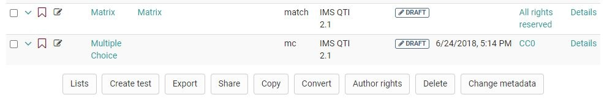

# Question bank possible operations

## Lists {: #lists}

Lists allow for you to compile question items taylored to your needs. To do
this, select the corresponding questions under My questions or a pool and then
click the "Lists" button below the table. Create a new list or add the
question to an existing list.  

A list is only visible to you. An item added to a list is only referenced and
not copied. Modification to items in lists are therefore made to the original
under "My questions". You can find all your lists in the left menu under "My
favourites".

Add items to already existing lists or create new lists. If a list is already
open, this button allows you to rename or delete the respective list.

## Create test

This option directly creates a new test from all chosen questions. The title
of this new learning resource must be entered. Then the test is available
under "Authoring - My entries".

## Export

You can export marked questions to different formats. The following options
are available:

* Word file for offline testing (incl. correction sheet).
* QTI test file for exchange with other compatible LMSs
* ZIP file for exchange with other OpenOlat systems or archiving

## Share {: #share}

Shares items with pools and groups a user has access to.

Members of such a group have now access to the shared items. If one or more
items were shared with one or more groups, the respective group names will be
listed in the left menu under "Public shares".

Unlike groups, all users with question bank access (authors) have access to
public pools. Please contact your pool administrator if you have any questions
concerning pools.

Note that even when sharing through a pool or a group, the respective persons
must first have the right to access the question bank. For example, normal
users do not normally have the right to access the question bank.  

The [pool administrator](Question_Bank_Administration.md) (a specific
OpenOlat role) can create an unlimited number of pools. These can be either
public, and thus visible to all users, or private. The number of pools
displayed can therefore vary from user to user. Contact your pool
administrator if there is no public pool.

Items that are not allowed to be edited in the group or pool can be edited
once they have been copied to "My Questions".

## Copy

Copy items from pools to create your own copy in "My Questions" in your
question database. Copied questions initially have the suffix "(Copy)". In
addition to "My questions", the copy of the questions that is created in lists
or shares can also be saved under the respective list or share.

## Convert

Questions can be converted from the QTI Standard 1.2 to the QTI Standard 2.1.
Therefore you chose the desired questions in the list. Afterward click on
"Convert". After confirming the dialogue, the converted questions are now
available in the standard 1.2 as well as in the standard 2.1.

The questions that are converted within lists or shares are also stored under
the respective list or share in addition to "My questions".

For more information on converting, see [changing from QTI 1.2 to QTI
2.1](../learningresources/Changing_from_QTI_1.2_to_QTI_2.1.md).

## Author rights {: #rights}

Use this function to add more authors and thus their access rights to one or
more items.

## Remove & Delete

Item shares can be removed from lists, pools, and groups without deleting the
original question in the question database. Using the "Remove" button only
removes the reference to an item, but does not delete the item itself. An item
is always only removed from the table you have currently open. By removing an
item from a list, a group or a pool, no other shares than the one in question
are affected.

In order to irrevocably remove an item from all lists, groups and pools, you
have to delete the item in your question database under "My questions".

## Change metadata {: #metadata}

Metadata about items can be either adapted in an items detail view or with
this function. The "Change metadata" function allows you to adjust single
information statements simultaneously for multiple items, without entering the
detailed view. Changes cannot be canceled. More information on the individual
metadata fields can be found in the chapter "Item Detailed View" - [Meta
Data](Item_Detailed_View.md#ItemDetailedView-item_details_metadaten).

To get a preview of an item and an overview of relevant metadata, select the
table row of the corresponding item by clicking into the row.

In order to edit a question and view all available metadata, click in the
preview pane on the "Details" button. If you are navigating in your question
database, you can open the item editor with the "Edit" button.
