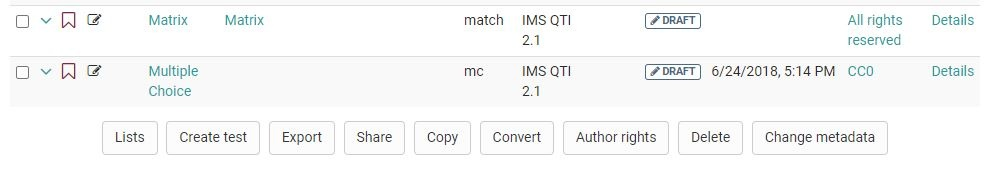
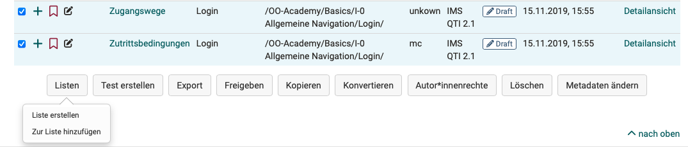
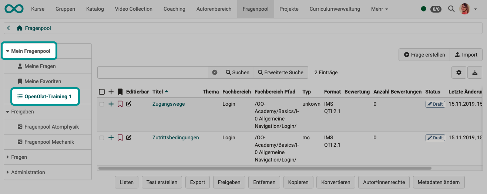
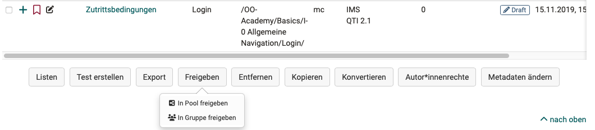
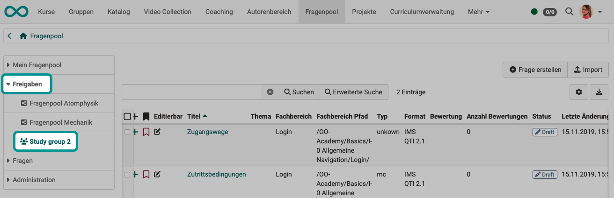
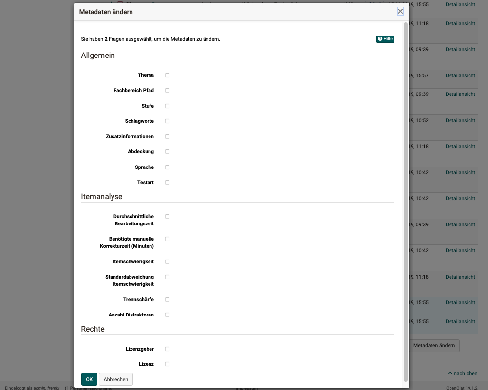
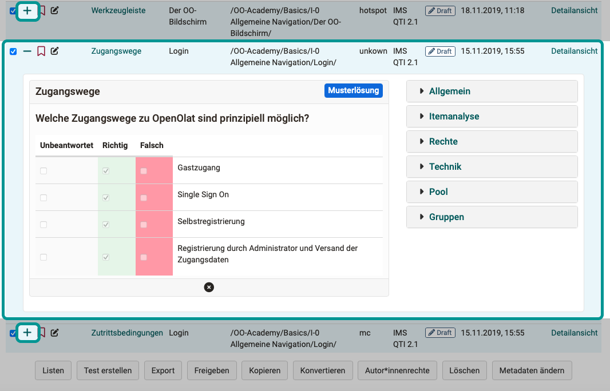

# Question bank: Use questions {: #using_the_questions}

If you select several questions in the list, you can continue to use the selected questions with the buttons at the bottom.

{ class="shadow lightbox" }

## Lists {: #lists}

Lists allow you to collect question items according to your personal criteria. To do this, select the corresponding questions under "My questions" or a pool and then click the "Lists" button below the table. Create a new list or add the question to an existing list.

{ class="shadow lightbox" }

A list is only visible to you. If you add a question to a list, it is only referenced and not copied. Changes to questions that you make in a list are therefore also made to the original under "My questions". You will then find your list on the left in the menu below "My favorites".

{ class="shadow lightbox" }

If a list is open, this button allows you to delete or rename the respective list. Items are not saved separately on lists. If you remove items from lists, these items are not deleted from the database.

[To the top of the page ^](#using_the_questions)

## Create test {: #learning_resource_test}

With this option, a new [Learning resource Test](../learningresources/Test.md) is created directly from the selected questions. The title of the learning resource can then be entered immediately. This test can then be found in Authoring under "My entries".

[To the top of the page ^](#using_the_questions)

## Export {: #export}

You can export marked questions to different formats. The following options are available:

* Word file for offline exams (incl. correction sheet)
* QTI test file for exchange with other compatible LMS
* ZIP file for exchange with other OpenOlat systems or for archiving

[To the top of the page ^](#using_the_questions)

## Share {: #share}

Pre-selected items can be added to groups or pools with this function, to which other users have access.

{ class="shadow lightbox" }

**Share with group**

Group members of the groups you have selected will then have access to the corresponding questions. You can decide whether the group members may also edit your questions. 

If one or more questions have been shared with one or more groups, the group names appear in the question bank menu under "Public shares".

{ class="shadow lightbox" }

**Share with pool**

When sharing with a pool, all users who also have access to this question pool have access to the shared questions. 

!!! info "Important"

    Please note that even when sharing with a pool or a group, the respective persons must first have the right to access the question bank. For example, normal users do not have access rights to the question pools by default.

[Question bank managers](Question_Bank_Administration.md) (a specific OpenOlat role) can create an unlimited number of pools. These can either be public, and therefore visible to all authorized users, or private. The number of pools displayed may therefore vary from user to user. Contact your question bank manager if you do not have access to a pool.

When sharing, you can define whether the question may be edited in the new location or not.

!!! tip "Tip"

    Items that may not be edited in the group or pool can be edited as soon as they have been copied to "My questions".

[To the top of the page ^](#using_the_questions)

## Copy {: #copy}

Copy items from pools to create a copy in your question database under "My questions". Copied questions have the addition "(Copy)". 

The copy of questions created in lists or shares can also be saved under the respective list or share in addition to "My questions".

[To the top of the page ^](#using_the_questions)

## Convert {: #convert}

Questions in the QTI standard 1.2 should be converted to the QTI standard 2.1. To do this, select the desired questions in the list. Then click on "Convert". After you have confirmed the dialog, the converted questions are now available in the standard 1.2 and additionally in the standard 2.1.

The questions that are converted in lists or shares are also stored under the respective list or share in addition to "My questions". Questions that are already in QTI format 2.1 do not need to be converted.

For more information on converting, see "[Changing from QTI 1.2 to QTI 2.1](../learningresources/Changing_from_QTI_1.2_to_QTI_2.1.md)".

[To the top of the page ^](#using_the_questions)

## Author rights {: #rights}

Use this button to add further co-authors and grant them access rights to the selected questions.

In the detailed view of the questions, the other authors are displayed in the [metadata in the "Rights" section](Item_Detailed_View.md#metadata_rights) and can also be removed there.

[To the top of the page ^](#using_the_questions)

## Delete (or remove) {: #delete}

Items can be removed from lists, pools and group shares without deleting the original question under "My questions". The "Remove" button only removes the reference to the item, but does not delete the item itself. A question is always only removed from the respective context you are currently in. By removing a question from a list, a group or a pool, you do not change any other shares.

In order to delete a question permanently from all lists, groups and pools, you have to delete the corresponding question in your question bank under "My questions". There it is permanently deleted and can no longer be restored.

[To the top of the page ^](#using_the_questions)

## Change metadata {: #metadata}

Meta information on questions can be adjusted here or in the [detailed view](Item_Detailed_View.md) of an item. 

The "Change metadata" button can be used to adjust individual pieces of information for several items at the same time without opening the detailed view of the questions. However, changes made in this way can no longer be undone. 

{ class="shadow lightbox" }

For further adjustments, each question must be called up individually. 

Click on the "+" icon at the beginning of a row in the question list. The preview of this item and the menu for the metadata of this question open.

{ class="shadow lightbox" }

Further information on the individual metadata can be found in the chapter [Item Detailed View - Metadata](Item_Detailed_View.md#metadata).

[To the top of the page ^](#using_the_questions)

## Further information {: #further_information}

**Mentioned on this page** 
[Creating Tests >](../learningresources/Test.md) 
[Question Bank: Administration >](Question_Bank_Administration.md) 
[Changing from QTI 1.2 to QTI 2.1 >](../learningresources/Changing_from_QTI_1.2_to_QTI_2.1.md) 
[Item Detailed View >](Item_Detailed_View.md)

**Further reading** 
[Create questions >](Question_Bank_Create_Questions.md) 
[Import questions >](Question_Bank_Import_Questions.md) 
[Details about the review process >](Question_Bank_Review_Process.md) 
[Details about sharing >](Question_Pool_Sharing_Options.md) 
[Instructions for creating the test >](../../manual_how-to/test_creation_procedure/test_creation_procedure.md)

[To the top of the page ^](#using_the_questions)
