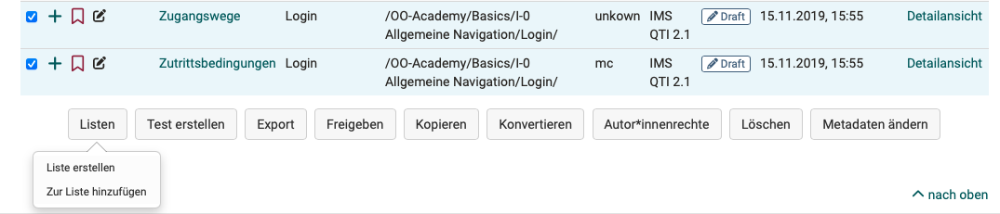
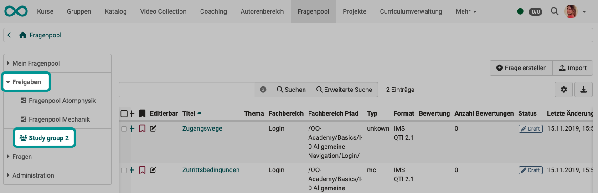
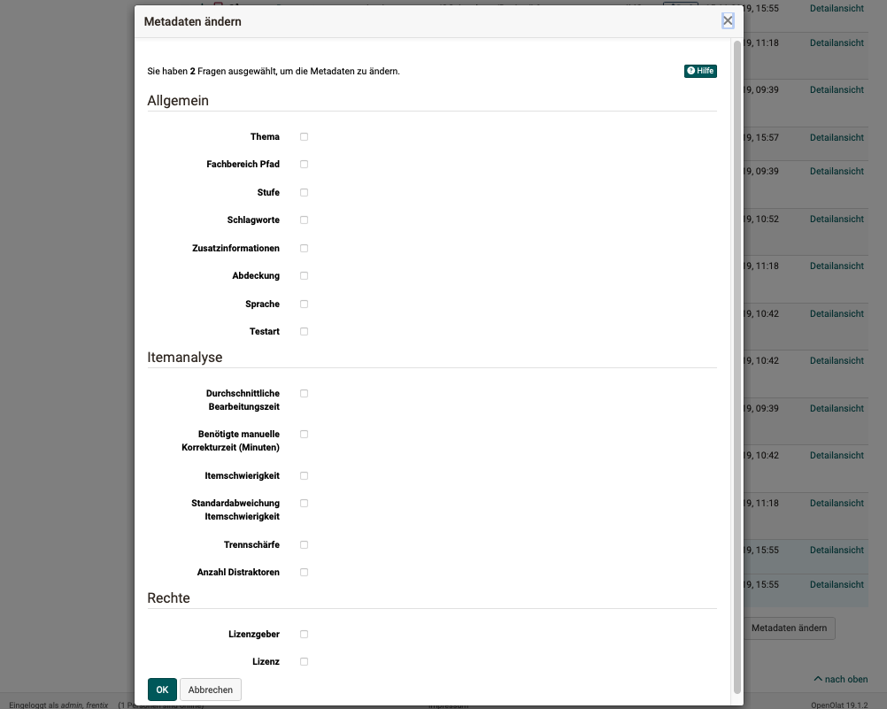

# Question bank: Use questions {: #using_the_questions}

If you select several questions in the list, you can continue to use the selected questions using the buttons at the bottom.

## Lists {: #lists}

Lists allow for you to compile question items taylored to your needs. To do this, select the corresponding questions under "My questions" or a pool and then click the "Lists" button below the table. Create a new list or add the question to an existing list.  

{ class="shadow lightbox" }

A list is only visible to you. An item added to a list is only referenced and not copied. Modification to items in lists are therefore made to the original under "My questions". You can find all your lists in the left menu under "My favorites".

{ class="shadow lightbox" }

If a list is already open, this button allows you to rename or delete the respective list. Items are not saved separately on lists. If you remove items from lists, these items are not deleted from the database.

[To the top of the page ^](#using_the_questions)

## Create test {: #learning_resource_test}

With this option, a new [Learning resource Test](../learningresources/Test.md) is created directly from the selected questions. The title of the learning resource can then be entered immediately. This test can then be found in the author area under "My entries".

[To the top of the page ^](#using_the_questions)

## Export {: #export}

You can export marked questions to different formats. The following options are available:

* Word file for offline testing (incl. correction sheet).
* QTI test file for exchange with other compatible LMSs
* ZIP file for exchange with other OpenOlat systems or archiving

[To the top of the page ^](#using_the_questions)

## Share {: #share}

Pre-selected items can be added to groups or pools with this function, to which other users have access.

{ class="shadow lightbox" }

**share in group**

Group members of the groups you have selected will then have access to the corresponding questions. You can decide whether the group members can also edit your questions. 

If one or more questions have been released for one or more groups, the group names will appear in the question pool menu under "Releases".

{ class="shadow lightbox" }

**share in pool**

When released into a pool, all users who also have access to this question pool have access to the released questions. 

!!! tip "Note"

    Please note that even when sharing to a pool or for a group, the respective persons must first have the right to access the question pool. For example, normal users do not have access rights to the question pools by default.

[Pool administrators](Question_Bank_Administration.md) (a specific OpenOlat role) can create an unlimited number of pools. These can either be public, and therefore visible to all authorized users, or private. The number of pools displayed may therefore vary from user to user. Contact your pool administrator if you do not have access to a pool.

When releasing, you can define whether the question may be edited in the new location or not.

!!! tip "Note"

    Items that may not be edited in the group or pool can be edited as soon as they have been copied to "My questions".

[To the top of the page ^](#using_the_questions)

## Copy {: #copy}

Copy items from pools to create a copy in your question database under "My questions". Copied questions have the addition "(Copy)".

The copy of questions created in lists or shares can also be saved under the respective list or share in addition to "My questions".

[To the top of the page ^](#using_the_questions)

## Convert {: #convert}

Questions can be converted from the QTI Standard 1.2 to the QTI Standard 2.1. Therefore you chose the desired questions in the list. Afterward click on "Convert". After confirming the dialogue, the converted questions are now available in the standard 1.2 as well as in the standard 2.1.

The questions that are converted within lists or shares are also stored under the respective list or share in addition to "My questions". Questions that are already in QTI format 2.1 do not need to be converted.

For more information on converting, see [changing from QTI 1.2 to QTI 2.1](../learningresources/Changing_from_QTI_1.2_to_QTI_2.1.md).

[To the top of the page ^](#using_the_questions)

## Author rights {: #rights}

Use this button to add further co-authors and grant them access rights to the selected questions.

In the detailed view of the questions, the other authors are displayed in the [metadata in the "Rights" section](Item_Detailed_View.md) and can also be removed there.

[To the top of the page ^](#using_the_questions)

## Remove & Delete {: #delete}

Item shares can be removed from lists, pools, and groups without deleting the original question in the question database. Using the "Remove" button only removes the reference to an item, but does not delete the item itself. An item is always only removed from the table you have currently open. By removing an item from a list, a group or a pool, no other shares than the one in question are affected.

In order to irrevocably remove an item from all lists, groups and pools, you have to delete the item in your question database under "My questions". There it is permanently deleted and can no longer be restored.

[To the top of the page ^](#using_the_questions)

## Change metadata {: #metadata}

Meta information on questions can be customized here or in the [Detailed View](Item_Detailed_View.md) of an item. 

The "Change metadata" button can be used to adjust individual pieces of information for several items at the same time without opening the detailed view of the questions. However, changes made in this way can no longer be undone. 

{ class="shadow lightbox" }

For further adjustments, each question must be called up individually. 

Click on the "+" icon at the beginning of a line in the question list. The preview of this item and the menu for the metadata of this question will open.

{ class="shadow lightbox" }

Further information on the individual metadata can be found in the chapter [Detailed view of a question - Metadata](Item_Detailed_View.md#edit-metadata--metadata_edit).

[To the top of the page ^](#using_the_questions)

## Further information {: #further_info}

[Create questions >](Question_Bank_Create_Questions.md) 
[Import questions >](Question_Bank_Import_Questions.md) 
[Item detailed view >](Item_Detailed_View.md) 
[Details about the review process >](Question_Bank_Review_Process.md) 
[Details about sharing options >](Question_Pool_Sharing_Options.md) 
[Test creation procedure >](../../manual_how-to/test_creation_procedure/test_creation_procedure.md) 

[To the top of the page ^](#using_the_questions)