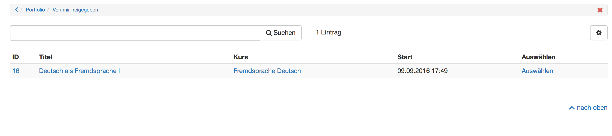

# Von mir freigegeben

Im Bereich **"Zu meinen freigegeben Mappen"** erscheinen alle Mappen die der jeweilige OpenOlat User selbst freigegeben hat. Dabei ist es egal welche Rolle die Person in OpenOlat hat, um welche Art von Mappe es sich handelt und ob die gesamte Mappe oder nur Teile der Mappe zur Kommentierung oder Bewertung freigegeben wurden.  

In diesem Bereich erhält man somit rasch einen Überblick, wer auf welche eigene Portfolio Ressourcen zugreifen kann. Ferner ist es möglich die jeweiligen Mappen von hier aus mit allen üblichen Einstellungen aufzurufen. So lassen sich Änderungen bezüglich der Freigabe bei Bedarf durch Klick auf die jeweilige Mappe und Änderung der Einstellungen im Bereich "Freigabe" rasch vornehmen.

  

