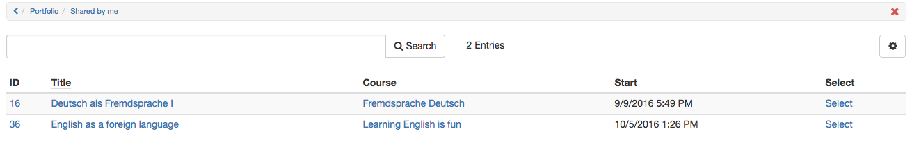

# Shared by me

In this section "Go to my shares", you can see all the binders you have shared, regardless of your role, the type of the binder or if the binder is shared completely or partially to comment on or grade it.

This overview shows at a glance who can access which Portfolio resources. From here it is possible to access the binders with the usual settings. Access modifications can easily be made by clicking on a binder and changing the specific settings under "Access control".

  

