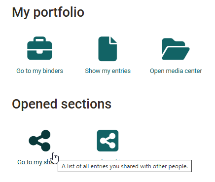

# Shared by me

In the area **"Go to my shares"**, all binders appear that the respective user has shared. It does not matter which role the person has in OpenOlat, what type of binder it is and whether the entire binder or only parts of the binder have been shared for commenting or grading.

This area gives you a quick overview of who can access which of your own portfolio resources. From here it is also possible to open the respective binders with all the usual settings. Changes to the sharing can thus be made quickly by clicking on the respective binder and changing the settings in the "Access control" area.

{ class="shadow lightbox" }
