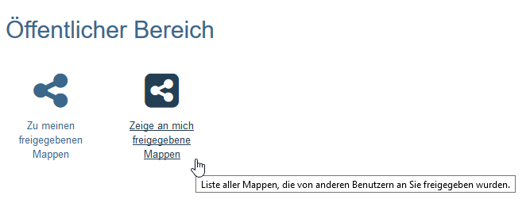
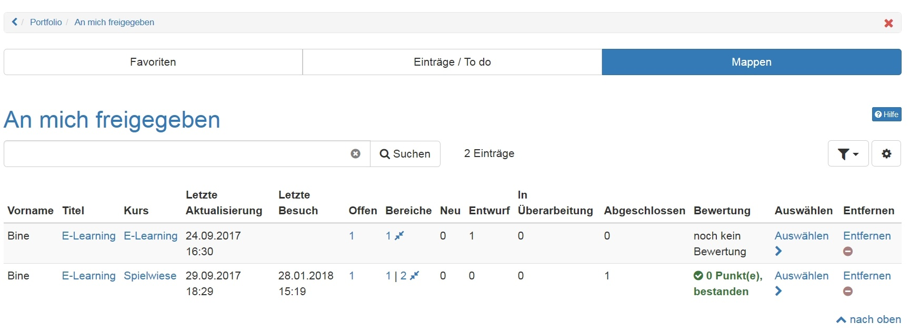

# An mich freigegeben

Sie gelangen zu den für Sie freigegebenen Mappen über den Klick auf "Zeige an mich freigegebene Mappen". Es erscheint das folgende Menü mit den drei Tabs "Favoriten", "Einträge/To do" und "Mappen". Auch sehen Sie, welche Einträge bereits eine Bewertung erhalten haben.  

Unter "**Mappen**" werden sämtliche für den jeweiligen User freigegebene Mappen angezeigt. Erkennbar ist hier auch in welchem Status sich die Mappe befindet. Ebenfalls ist ein Entfernen von geteilten Mappen möglich. Es kann hier auch nach Mappen mit noch offenen Sektionen gefiltert werden.

Im Tab "**Einträge/To do**" werden die Einträge angezeigt, die noch eine Aktion erfordern. Auch eine Markierung als Favorit ist hier möglich.

Im Tab "**Favoriten**" werden die Einträge angezeigt, die vom User als Favorit gekennzeichnet wurden. Die Favoriten können auch entsprechend ihres Status (Entwurf, in Überarbeitung, publiziert oder abgeschlossen) gefiltert werden.

Die Spalten in den drei Tabs können wie gewohnt nach Bedarf ein- oder ausgeblendet werden.

