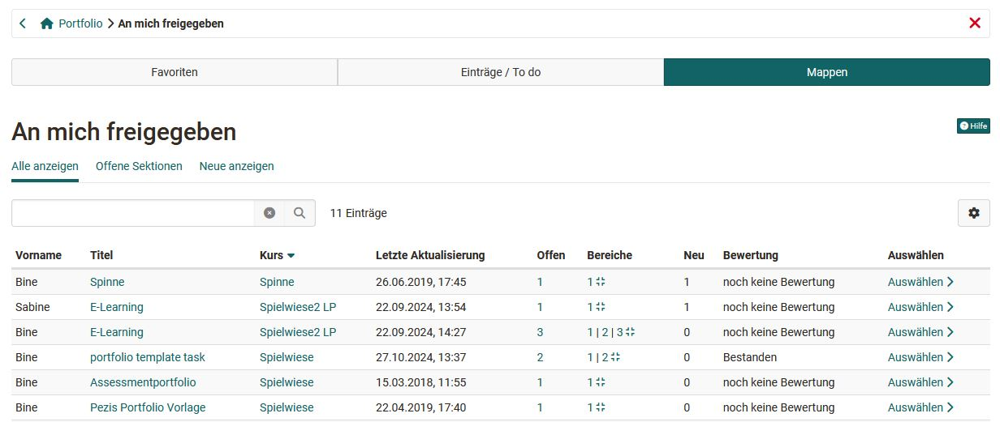

# An mich freigegeben

Sie gelangen zu den für Sie freigegebenen Mappen über den Klick auf "Zeige an mich freigegebene Mappen". Es erscheint das folgende Menü mit den drei Tabs "Favoriten", "Einträge/To do" und "Mappen". Auch sehen Sie, welche Einträge bereits eine Bewertung erhalten haben.  

## Tab Mappen
Unter "**Mappen**" werden alle Mappen angezeigt, die für Sie freigegeben wurden. Über das Zahnradsymbol können Sie die für Sie relevanten Spalten auswählen. So lassen sich beispielsweise Informationen darüber einblenden, ob die Mappen in einem bestimmten Kurs verwendet werden, wie der Bearbeitungsstatus lautet oder wann die letzte Änderung erfolgt ist. Mit der Funktion "Entfernen" können Sie Ihren Zugang zu einer Mappe aufheben, ohne dass die Mappe selbst gelöscht wird.  

Die Spaltenansicht ermöglicht es Ihnen, schnell zu erkennen, ob und wo Handlungsbedarf besteht. In einigen Fällen können Sie zudem direkt zur entsprechenden Stelle navigieren (Direktlink).  

Zusätzlich haben Sie die Möglichkeit, gezielt nach Mappen mit offenen Sektionen zu filtern.

## Tab Einträge/To do

Im Tab "**Einträge/To do**" werden die freigegebenen Einträge der Mappen angezeigt und können nach dem Status "Entwurf", "In Überarbeitung", "publiziert" gefiltert werden. Publizierte oder sich in Überarbeitung befindende Einträge sind verlinkt und können direkt angeklickt werden. 

## Tab Favoriten

Im Tab "**Favoriten**" werden die Einträge angezeigt, die Sie zuvor als Favorit markiert haben. Die Markierung für die Favoriten erfolgt direkt im konkreten Eintrag bzw. der Aufgabe über das Flag-Symbol rechts oben.

Die Favoriten können auch entsprechend ihres Status "Entwurf", "In Überarbeitung", "publiziert" und "abgeschlossen" gefiltert werden.

