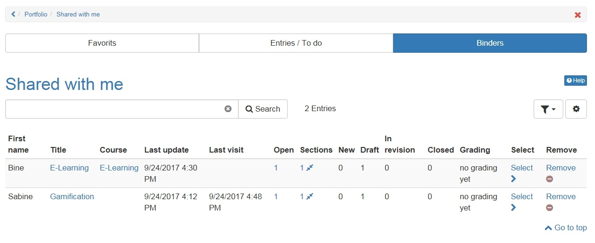

# Shared with me

You can access the binders released for you by clicking on "Show binders shared with me". The following menu appears with the three tabs "Favorites", "Entries/To do" and "Folders". Also you can see the entries which already got an assessment.  

In "**Binders**" all binders shared with the corresponding user are shown. Here it is visible in which status the binder stands. Additionally removing shared binders is possible. It is also possible to filter by binders with sections still open.

In the Tab "**Entries/To do**" all entries which require an action of the user are shown. Also a marking of favorites is possible here.

In the tab "**Favorites**" all entries which have been marked as favorite by the user are shown. The favorites can also be filtered according to their status (draft, in revision, published or closed).

As usual, the columns in the three tabs can be hidden or shown as desired.

