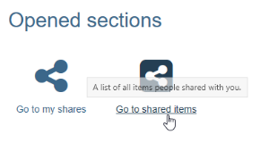

# Shared with me

You can access the binders released for you by clicking on "Go to shared items". The following menu appears with the three tabs "Favorites", "Entries/To do" and "Binders". Also you can see the entries which already got an assessment.  

## Tab Binders
In "**Binders**" all binders shared with the corresponding user are shown. 
Über das Zahnradsymbol können Sie die für Sie relevanten Spalten auswählen. So lassen sich beispielsweise Informationen darüber einblenden, ob die Mappen in einem bestimmten Kurs verwendet werden, wie der Bearbeitungsstatus lautet oder wann die letzte Änderung erfolgt ist. Mit der Funktion "Entfernen" können Sie Ihren Zugang zu einer Mappe aufheben, ohne dass die Mappe selbst gelöscht wird.  
Die Spaltenansicht ermöglicht es Ihnen, schnell zu erkennen, ob und wo Handlungsbedarf besteht. In einigen Fällen können Sie zudem direkt zur entsprechenden Stelle navigieren (Direktlink).  

It is also possible to filter by binders with sections still open.

## Tab Entries / To do

In the “**Entries/To do**” tab, the released entries of the folders are displayed and can be filtered according to the status “Draft”, “In revision”, “Published”. Published entries or entries under revision are linked and can be clicked on directly. 

## Tab Favorites
In the tab "**Favorites**" all entries which have previously been marked as favorite are shown. Favorites are marked directly in the specific entry or task using the flag symbol at the top right.

The favorites can also be filtered according to their status (draft, in revision, published or closed).

