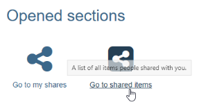
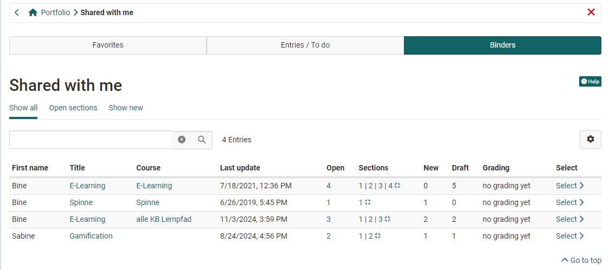

# Shared with me

{ class="shadow lightbox" }

You can access the binders shared with you by clicking on "Go to shared items". The following menu appears with the three tabs "Favorites", "Entries / To do" and "Binders". You can also see which entries have already received a grading.

{ class="shadow lightbox" }

## Tab Binders

Under "**Binders**", all binders that have been shared with you are displayed. You can use the gear icon to select the columns that are relevant to you. For example, you can display information on whether the binders are used in a specific course, what the editing status is or when the last change was made. You can use the "Remove" function to remove your access to a binder without deleting the binder itself.

The column view allows you to quickly identify whether and where action is required. In some cases, you can also navigate directly to the relevant location (direct link).

Use the filters "Show all", "Open sections" and "Show new" to narrow down the list, for example specifically to binders with sections still open.

## Tab Entries / To do

In the "**Entries / To do**" tab, the shared entries of the binders are displayed and can be filtered according to the status "Draft", "In revision", "published". Published entries or entries under revision are linked and can be clicked on directly.

## Tab Favorites

In the "**Favorites**" tab, the entries that you have previously marked as favorites are displayed. Favorites are marked directly in the specific entry or task using the flag symbol at the top right.

The favorites can also be filtered according to their status "Draft", "In revision", "published" and "closed".
