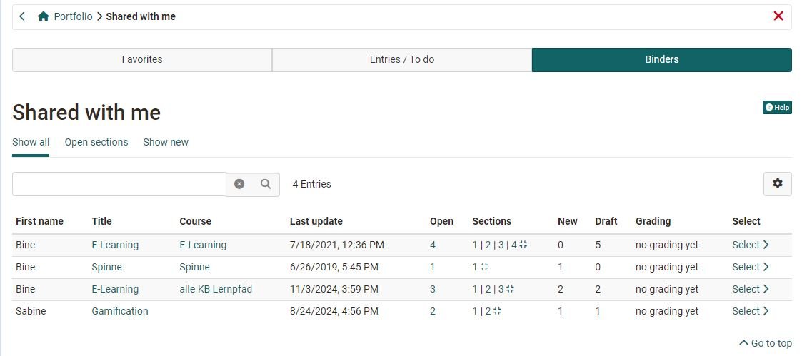

# Shared with me

You can access the binders released for you by clicking on "Go to shared items". The following menu appears with the three tabs "Favorites", "Entries/To do" and "Binders". Also you can see the entries which already got an assessment.  

## Tab Binders
In "**Binders**" all binders shared with the corresponding user are shown. 
You can use the gear icon to select the columns that are relevant to you. For example, you can display information on whether the folders are used in a specific course, what the editing status is or when the last change was made. You can use the "Remove" function to remove your access to a folder without deleting the folder itself.  
The column view allows you to quickly identify whether and where action is required. In some cases, you can also navigate directly to the relevant location (direct link).  

It is also possible to filter by binders with sections still open.

## Tab Entries / To do

In the "**Entries/To do**" tab, the released entries of the folders are displayed and can be filtered according to the status "Draft", "In revision", "Published". Published entries or entries under revision are linked and can be clicked on directly. 

## Tab Favorites
In the tab "**Favorites**" all entries which have previously been marked as favorite are shown. Favorites are marked directly in the specific entry or task using the flag symbol at the top right.

The favorites can also be filtered according to their status "Draft", "In revision", "Published" and "Completed".

