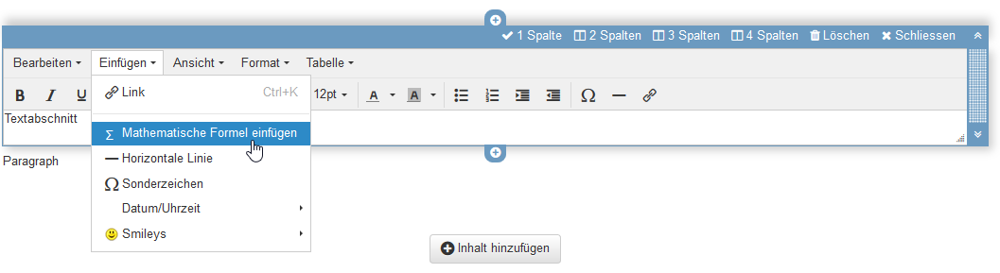
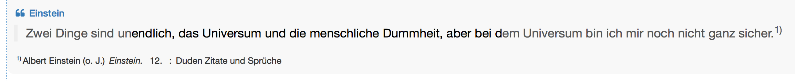
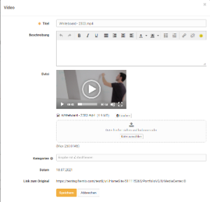

# The Portfolio Editor

## Design portfolio entries with content

Different content elements can be added to each portfolio entry.

The Portfolio Editor largely corresponds to the Form Editor.

Quotes, videos and images are added to the media library and can only be edited there. Editing is possible as long as the entry containing the medium has not yet been published!

## Content

### Title

An entry can contain several titles and subtitles.

By selecting h1-h6, the size of the heading can be selected, whereby h1 corresponds to "Heading 1" and is therefore the largest and h6 corresponds to "Heading 6" and is therefore the smallest.

### Paragraph

Element for adding text blocks. The paragraph element contains central formatting as well as the option to distribute the text across columns.

### Table

Add a table to your portfolio. Define the number of rows and columns of a table and make further settings.

### Image

Add image elements to your portfolio. To do this, upload a suitable graphic file. You can then configure the file further, e.g. place a title or subtitle and also define the size, placement or border.

Positioning can also be further optimized by using the container element.

### Text segment

"Normal" text can be added using the html editor. The usual formatting can be applied. Under "Insert" you can also insert [mathematical formulas](../basic_concepts/Math_formula.md).

## Integrate

### Create file

A new document can be created here according to the specified file types. If OnlyOffice is used, for example, the files created can also be edited directly online.

### Quote

A quote can be added directly in the entry, as well as in the media library. First select the appropriate quote type and then fill in as many fields as possible.

### File

Various file formats can be uploaded here and made available via a link.

If an external [document editor](../../manual_admin/administration/External_Tools_-_Administration.md) is activated and the files are in a format that is supported by it, the files can also be edited directly online.

### Video

Videos can be uploaded to the portfolio via this link.

### Select from Media Center

Files that are already in the [Media Center](../personal_menu/Media_Center.md) can be added to an entry. The search and filter options help to find the desired file more quickly.

## Layout

### Container

Containers can be used to further structure a portfolio. A 1-4 column layout is available. Nesting within a container field is also possible.

### Separator

A separator helps to divide the page graphically. A gray line is created, but its formatting cannot be adjusted.

## Further configurations

In addition to the "Overview" tab, the portfolio folder also contains the "Entries", "Change log" and "Share" tabs.

### Timeline

The timeline provides the user with a graphical overview of the activities in the portfolio. The colored dots indicate when something was changed. Left-click on an item to display details of the corresponding entries. The different colors stand for the respective status of the entry. The timeline is helpful if an e-portfolio is used over a certain period of time, e.g. over a semester or a year.

### Change log

All changes made are listed in chronological order in the change log. The most recent change is always at the top.

Areas and entries are released under Release. You can find out more [here](../learningresources/Portfolio_task_and_assignment_Collecting_and_editing.md).

