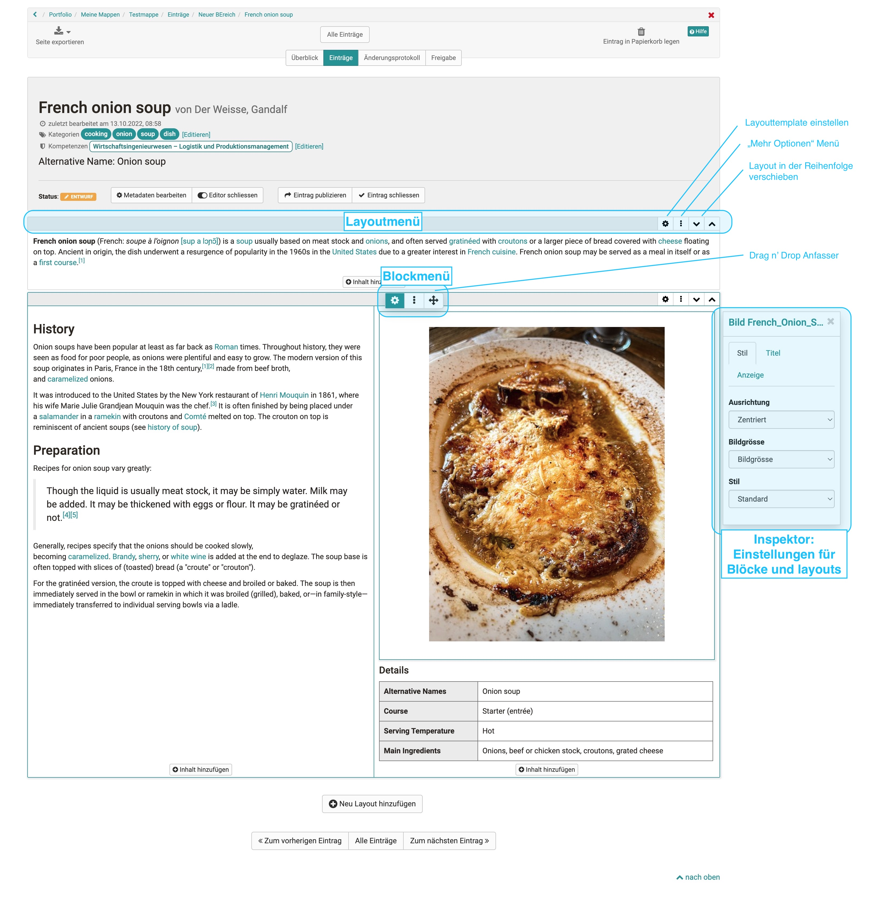

# Der Portfolio Editor

!!! note "Verfügbarkeit"

    Ab :octicons-tag-24: Release 17.1. ist dieser Portfolio Editor verfügbar. Er enthält konzeptionelle und UX Verbesserungen, um eine angenehmere Erstellung zu gewährleisten. Alte Portfoliobeiträge können weiterhin geöffnet und bearbeitet werden. Wollen sie einen alten Eintrag mit neuem Inhalt befüllen, benutzen sie dafür die neuen Layouts.

## Bedienelemente

In der Mitte ist der Inhaltsbereich.

* **Layoutmenü**: Dort kann man all das Template für das Layout einstellen, Layouts oben und unten hinzufügen und das Layout in der Position bzw. Reihenfolge verschieben.
* **Blockmenü**: (von l. n. r.) Schalten sie den Inspektor an und aus. Fügen sie Blöcke hinzu und verschieben sie den Block an der Schaltfläche mittels drag n drop an die gewünschte Position.
* **Inspektor**: Dort befinden sich alle Einstellungen, die den Funktionsumfang, sowie das Aussehen des jeweiligen Blocks oder Layouts verändern.

{ class="lightbox" }

### Layout

Ein Layout ist ein übergeordneter Block, der dir unterschiedliche Strukturierung des Inhalts durch Spalten und Zeilen ermöglicht. Innerhalb einer Spalte und Zeile kannst du beliebig viele Blöcke hinzufügen.

Löschen oder verändern sie Layouts werden existierende Blöcke in die vorhandenen Spalten geschoben. Sollten sie keine

Aktuell sind folgende Layoutvorlagen verfügbar:

### Inspektor

Die Einstellungen zu den jeweiligen Blöcken befinden sich im Inspektor. Auf grösseren Bildschirmen öffnet er sich standardmässig rechts neben dem selektierten Block. Man kann das Fenster mit Klick auf das Einstellungsicon :material-cog: anzeigen und verstecken.

Mit dem Klick auf der Titelzeile des Inspektorfensters kann dieser auch verschoben werden. Wenn sie einen neuen Block selektieren, springt der Inspektor wieder an die Standardposition.

## Inhaltsblöcke

### Titel

Ein Eintrag kann mehrere Titel und Untertitel beinhalten.

Mit der Auswahl von h1-h6 kann die Größe der Überschrift ausgewählt werden,
wobei h1 der "Überschrift 1" entspricht und somit am grössten und h6 der
"Überschrift 6" und somit am kleinsten ist.

### Paragraph

Element zum Hinzufügen von Textblöcken. Das Paragraph Element beinhaltet
zentrale Formatierungen sowie die Möglichkeit den Text auf Spalten zu
verteilen.

### Tabelle

Fügen Sie Ihrem Portfolio eine Tabelle hinzu. Definieren sie die Anzahl der
Zeilen und Spalten einer Tabelle und fügen sie eine Kopfzeile hinzu.

### Bild

Fügen Sie Ihrem Portfolio Bildelemente hinzu. Laden Sie dafür eine passende
Grafikdatei hoch. Anschließend können Sie die Datei weiter konfigurieren, z.B.
einen Titel oder Untertitel platzieren und auch die Größe, Platzierung oder
Umrandung definieren.

Auch kann die Positionierung durch die Verwendung des Container Element weiter
optimiert werden.

Wenn sie ein Bild neben einen Text platzieren wollen, benutzen sie ein 1/2 / 1/2 Layout und platzieren sie die Blöcke wie gewünscht.

### Textabschnitt

Mithilfe des html-Editors kann "normaler" Text hinzugefügt werden. Dabei kann
die übliche Formatierung vorgenommen werden.  
Unter "Einfügen" können auch [mathematische
Formeln](../basic_concepts/Math_formula.de.md) eingefügt werden.

## Einbinden von Medien

### Dokument erstellen

Hier kann ein neues Dokument entsprechend der angegebenen Dateitypen erstellt
werden. Wird beispielweise OnlyOffice verwendet, können die erstellten Dateien
auch direkt online bearbeitet werden.

### Zitat

Direkt im Eintrag, wie auch in der Mediathek, kann ein Zitat hinzugefügt
werden. Zuerst wird der entsprechende Zitat Typ ausgewählt und anschliessend
möglichst jedes vorgegebene Feld ausgefüllt.

### Dokument

Hier können diverse Dateiformate hochgeladen und per Link bereitgestellt
werden.

Ist ein externer [Dokumenteneditor](../../../manual_admin/administration/External_Tools_-_Administration.de.md)aktiviert und liegen die Dateien in
einem Format vor, das von diesem unterstützt wird, können die Dateien auch
direkt online weiter bearbeitet werden.

### Video

Über diesen Link können Videos ins Portfolio hochgeladen werden.

### Aus Mediathek wählen

Dateien, welche sich bereits in der [Mediathek](Media_center.de.md)befinden,
können hiermit einem Eintrag hinzugefügt werden. Die Such- und Filteroptionen
helfen, die gewünschte Datei schneller zu finden.
