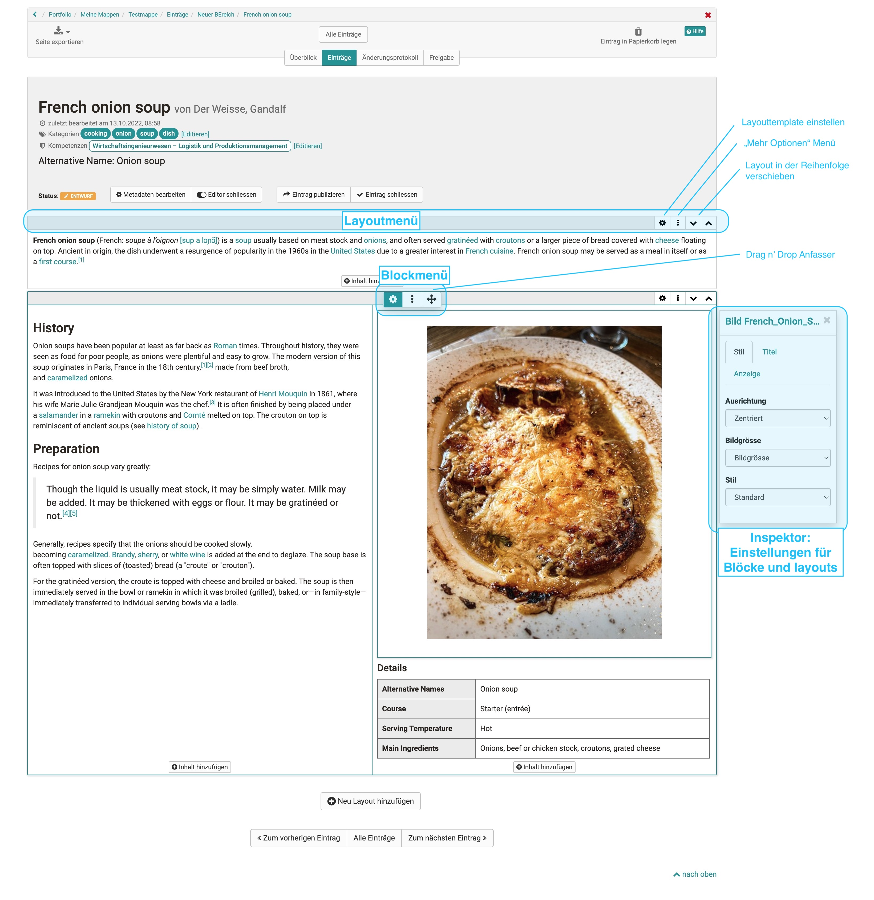
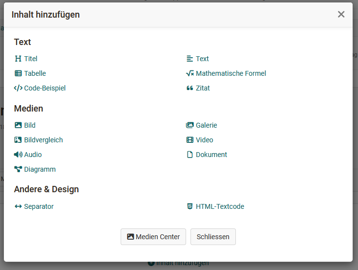

# Der Portfolio Editor {: #portfolio_editor}

Jedem Portfolioeintrag können unterschiedliche Layouts und Inhaltselemente hinzugefügt werden. Auch ältere Einträge füllen Sie mit diesen Layouts weiter. Die Konfiguration erfolgt über drei Bedienelemente: das Layoutmenü, das Blockmenü und den Inspektor.

## Bedienelemente im Überblick

Der Portfolio Editor umfasst verschiedene Menü-Bereiche für die Konfiguration:

{ class="shadow lightbox" }

* **Layoutmenü**: Ein Layout ist ein übergeordneter Bereich, der unterschiedliche Strukturierungen des Inhalts durch Spalten und Zeilen ermöglicht. Im Layoutmenü kann ein ein- oder mehrspaltiges Layout ausgewählt, Layoutbereiche verschoben oder neue Layouts hinzugefügt werden. Löscht oder verändert man Layouts, werden existierende Blöcke in die vorhandenen Spalten geschoben. Aktuell sind folgende Layoutvorlagen verfügbar:
{ class="shadow lightbox" }
* **Blockmenü**: Menü eines einzelnen Inhaltselements innerhalb eines Layouts. Über das Blockmenü kann ein Inhaltselement verschoben, hinzugefügt oder gelöscht werden. Auch der Inspektor mit weiteren Einstellungen für ein Inhaltselement kann über das Zahnrad :o_icon_o_icon_inspect: aktiviert werden.
* **Inspektor**: Dient der Konfiguration einzelner Inhaltselemente. Dort befinden sich alle Einstellungen, die den Funktionsumfang sowie das Aussehen des jeweiligen Elements verändern, z.B. die Ausrichtung von Bildern. Klickt man auf die Titelzeile des Inspektor-Fensters, kann das Konfigurationsmenü selbst auch verschoben werden. Wenn Sie einen neuen Block selektieren, springt der Inspektor wieder an die Standardposition.

**Hinweis-Box im Inspektor**

Interessant ist auch die Möglichkeit, den Inhaltselementen eine Hinweis-Box hinzuzufügen. Diese Option steht für fast alle Inhaltselemente bis auf Titel und HTML-Textcode zur Verfügung.

{ class="shadow lightbox" }

Hierüber können einzelne Inhaltselemente hervorgehoben und z.B. als Info, Tipp, Wichtig usw. gekennzeichnet werden. Auch die Vergabe eines eigenen Titels ist möglich. Darüber hinaus können die Hinweis-Boxen noch mit einem Icon versehen und definiert werden, ob die Hinweis-Box einklappbar ist oder nicht. Bei benutzerdefinierten Hinweis-Typen kann auch ein Icon aus der Liste gewählt und die Farbe angepasst werden. Bei vordefinierten Typen sind diese Dinge vordefiniert.

## Inhaltsblöcke - Inhalt hinzufügen

Über "Inhalt hinzufügen" werden die konkreten Inhaltselemente wie Texte, Bilder oder sonstige Medien hinzugefügt. Folgende Inhaltselemente stehen zur Wahl:

{ class="shadow lightbox" }

### Titel

Nutzen Sie dieses Element, um schnell und einfach eine Überschrift hinzuzufügen.

Im Inspektor kann eine Grösse von h1 bis h6 eingestellt werden, wobei h1 der "Überschrift 1" entspricht und somit am grössten und h6 der "Überschrift 6" und somit am kleinsten ist. Im Tab "Layout" kann ferner, wie bei den meisten Inhaltselementen, der Abstand zum Text definiert werden.

{ class="shadow lightbox" }

### Text

Nutzen Sie dieses Element, um beliebige Textpassagen einzufügen. Der Text kann mit Hilfe des Editors passend formatiert werden, z.B. für Fettdruck, Verlinkungen, Schriftfarbe usw.

### Tabelle

Verwenden Sie dieses Inhaltselement, wenn Sie Ihrem Portfolio eine Tabelle hinzufügen möchten. Definieren Sie die Anzahl der Zeilen und Spalten einer Tabelle und fügen Sie eine Kopfzeile hinzu. Anschliessend befüllen Sie die jeweiligen Tabellenfelder. Im Inspektor legen Sie zudem Kopfspalte und Kopfzeile, die Optionen "Gestreift" und "Umrandet" sowie die Farbe fest; eine Tabellenunterschrift ist optional.

{ class="shadow lightbox" }

### Mathematische Formel

Klicken Sie in das Bearbeitungsfeld und Sie erhalten Zugriff auf einen speziellen Formel-Editor. Sie können entweder die Formel im grafischen Editor oder im LaTeX Editor eingeben.

{ class="shadow lightbox" }

### Code-Beispiel

Element zum Einfügen von Programmiercode. Der Inhalt wird als Code angezeigt und nicht ausgeführt. Diverse Code-Sprachen stehen zur Auswahl. Auch Zeilennummern können für die Übersicht eingeblendet werden.

{ class="shadow lightbox" }

### Zitat

Hier können Sie neue Zitate erstellen (Zitat hinzufügen) oder auf bereits im Media Center hinterlegte Zitate zurückgreifen und diese einbinden. Einem neuen Zitat können diverse Informationen hinzugefügt werden, z.B. Quelle, Sprache, Autor, URL.

### Bild

Fügen Sie Bildelemente hinzu, indem Sie eine Grafikdatei hochladen oder auf eine Grafik Ihres Media Centers zugreifen. Anschliessend können Sie die Datei weiter konfigurieren, z.B. einen Titel oder Untertitel platzieren und auch die Grösse, Platzierung oder Umrandung definieren. Nutzen Sie hierfür den Inspektor.

!!! tip "Tipp"

    Um die Positionierung einer Grafik zu optimieren, verwenden Sie am besten ein passendes, z.B. mehrspaltiges Layout. Je nach Art der Grafiken gilt dieser Tipp auch für das Inhaltselement "Galerie".

### Galerie [:octicons-tag-16:{ title="ab Release 19.0.0 (OO-7142)" }](https://track.frentix.com/issue/OO-7142){:target="_blank"}

Mit dem Inhaltselement "Galerie" fügen Sie eine Bildergalerie hinzu. Mit einem Klick auf den Button "Hinzufügen" öffnet sich das Media Center, in dem mehrere Bilder ausgewählt werden können. Die Anzeigeart (Vorschau, Raster oder Slideshow) lässt sich im Inspektor festlegen. Das gezeigte Beispiel präsentiert eine Galerie mit Vorschau aus der Perspektive der Lesenden.

{ class="shadow lightbox" }

### Bildvergleich [:octicons-tag-16:{ title="ab Release 19.0.0 (OO-7143)" }](https://track.frentix.com/issue/OO-7143){:target="_blank"}

Mit dem Inhaltselement "Bildvergleich" stellen Sie 2 Bilder aus dem Media Center nebeneinander, z.B. zwei Versionen desselben Bildes. Die Auswahl der Bilder erfolgt über den Inspektor. Neben dem Standardtyp kann der Bildvergleich auch für die Gegenüberstellung von einem richtigen und einem falschen Bild verwendet werden.

{ class="shadow lightbox" }

Lesende können mit einem Schieberegler den Ansichtsbereich der Bilder justieren.

### Video

Sie haben folgende Möglichkeiten, ein Video in den Editor zu laden und bereitzustellen:

* Video hinzufügen: Eine mp4 Videodatei hochladen
* Video per URL hinzufügen
* Video aufnehmen: Eine Videoaufnahme mit der Webcam erstellen
* Eine Videodatei, die sich im Media Center befindet, auswählen und hinzufügen.

{ class="shadow lightbox" }

### Audio

Sie haben folgende Möglichkeiten, ein Audio in den Editor zu laden und bereitzustellen:

* Nutzen Sie den integrierten Audio-Editor und erstellen Sie eine Tonaufnahme (Audio aufzeichnen)
* Laden Sie eine Audiodatei hoch (Audio hinzufügen)
* Verbinden Sie eine Audiodatei aus Ihrem Media Center (Auswahl aus der Liste).

{ class="shadow lightbox" }

### Dokument

Sie haben folgende Möglichkeiten, ein Dokument in den Editor zu laden und bereitzustellen:

* Erstellen Sie ein neues Dokument, entsprechend der angegebenen Dateitypen (Dokument erstellen)
* Laden Sie ein neues Dokument hoch (Dokument hinzufügen) oder
* Verbinden Sie ein Dokument aus Ihrem Media Center (Auswahl aus der Liste).

Ist ein externer Dokumenteneditor aktiviert und liegen die Dateien in einem Format vor, das von diesem unterstützt wird, können die Dateien auch direkt online in OpenOlat weiterbearbeitet werden.

!!! info "Wichtig"

    Die Inhalte der Dateien werden hier nicht direkt dargestellt, sondern müssen per Klick auf den Link geöffnet werden.

### Diagramm

Sie können ein neues draw.io Diagramm anlegen oder Sie fügen ein existierendes draw.io Diagramm aus Ihrem Media Center hinzu. Die konkrete Ausgestaltung des Diagramms erfolgt über den Klick auf den "Bearbeiten" Link im Eintrag.

{ class="shadow lightbox" }

Beim Erstellen eines Diagramms kann auch definiert werden, ob bzw. wer das Diagramm bearbeiten darf.

### Separator

Hinzufügen einer Trennlinie.

### HTML-Textcode

Hier erscheint ein ähnlicher, aber etwas erweiterter Text-Editor wie beim Inhaltselement "Text".

### Media Center

Anstatt ein spezielles Inhaltselement zu wählen, können Sie auch direkt in Ihr [Media Center](../personal_menu/Media_Center.de.md) wechseln und dort hinterlegte Elemente auswählen oder Mediendateien hochladen bzw. hinzufügen.

Die Such- und Filteroptionen helfen, die gewünschte(n) Datei(en) schnell zu finden.

{ class="shadow lightbox" }

## Weiterführende Informationen {: #further_information}

[Persönliche Werkzeuge: Das Media Center >](../personal_menu/Media_Center.de.md)

[Zum Seitenanfang ^](#portfolio_editor)
