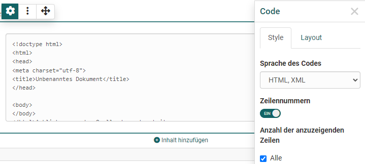
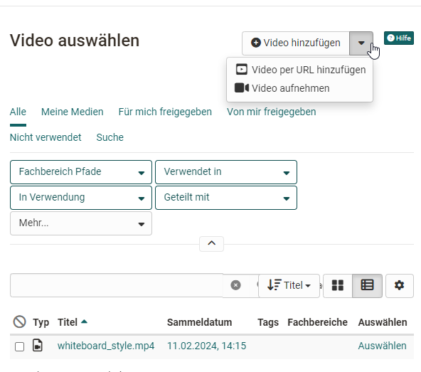
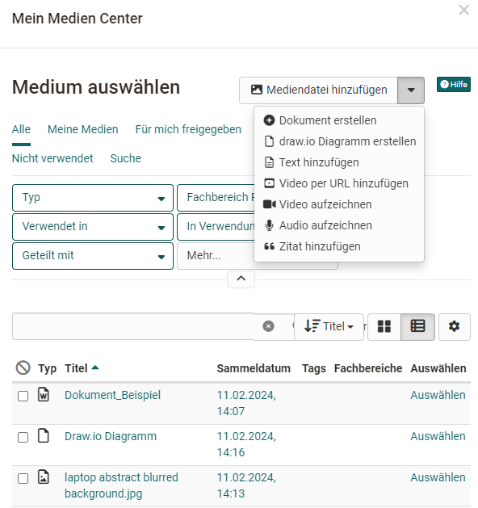

# Der Portfolio Editor

!!! note "Verfügbarkeit"

    Ab :octicons-tag-24: Release 17.1. ist dieser Portfolio Editor verfügbar. Wollen sie einen alten Eintrag mit neuem Inhalt befüllen, benutzen sie dafür die neuen Layouts.

Jedem Portfolio Eintrag können unterschiedliche Layouts und Inhaltselemente hinzugefügt werden. Die Konfiguration erfolgt über die Bedienelemente: Layout, das Blockmenü und den Inspektor. 

## Bedienelemente im Überblick 
Der Portfolio Editor umfasst verschiedene Menü-Bereiche für die Konfiguration: 

{ class="lightbox" }

* **Layoutmenü**: Ein Layout ist ein übergeordneter Bereich, der  unterschiedliche Strukturierungen des Inhalts durch Spalten und Zeilen ermöglicht. Im Layoutmenü kann ein ein- oder mehrspaltiges Layout ausgewählt, Layoutbereiche verschoben oder neue Layouts hinzufügt werden. Löscht oder verändert man Layouts werden existierende Blöcke in die vorhandenen Spalten geschoben. Aktuell sind folgende Layoutvorlagen verfügbar:

* **Blockmenü**: Menü eines einzelnen Inhaltselements innerhalb eines Layouts. Über das Blockmenü kann ein Inhaltselement verschoben, hinzugefügt oder gelöscht werden. Auch der Inspektor mit weiteren Einstellungen für ein Inhaltselement kann über das Zahnrad :material-cog: aktiviert werden. 
* **Inspektor**: Dort befinden sich alle Einstellungen, die den Funktionsumfang, sowie das Aussehen des jeweiligen Elements verändern, z.B. die Ausrichtung Bildern. Klickt man auf die Titelzeile des Inspektorfensters kann das Konfigurationsmenü auch verschoben werden. Wenn Sie einen neuen Block selektieren, springt der Inspektor wieder an die Standardposition.

## Inhaltsblöcke - Inhalt hinzufügen 

Über "Inhalt hinzufügen" werden die konkreten Inhaltselemente wie Texte, Bilder oder sonstige Medien hinzugefügt. Folgende Inhaltselemente stehen zur Wahl: 

{ class="lightbox" }

### Titel

Nutzen Sie dieses Element um schnell und einfach Titel hinzuzufügen.

Mit der Auswahl von h1-h6 kann die Größe der Überschrift ausgewählt werden, wobei h1 der "Überschrift 1" entspricht und somit am grössten und h6 der "Überschrift 6" und somit am kleinsten ist. Im Tab "Layout kann ferner der Abstand zum Text definiert.
{ class="lightbox" }

### Paragraph

Paragraph bietet Zugriff auf eine einfache Version eines Text-Editors. Beispielsweise können Wörter fett formatiert, die Textfarbe geändert oder die Zentrierung im Textfluss definiert werden. Textelemente mit einfachen Formatierungen können so rasch erstellt werden.

{ class="lightbox" }

### Tabelle

Fügen Sie Ihrem Portfolio eine Tabelle hinzu. Definieren sie die Anzahl der Zeilen und Spalten einer Tabelle und fügen sie eine Kopfzeile hinzu. Anschliessend befüllen Sie die jeweiligen Tabellenfelder.

### Mathematische Formel

Klicken Sie in das Bearbeitungsfeld und Sie erhalten Zugriff auf einen speziellen Formel-Editor. Sie können entweder die Formel im grafischen Editor oder im LaTeX Editor eingeben. 
{ class="lightbox" }

### Code
Einfügen von Programmiercode. Der Inhalt wird als Code angezeigt und nicht ausgeführt. 
{ class="lightbox" }

### Dokument

Hier haben Sie drei Möglichkeiten: 

* Erstellen Sie ein neues Dokument, entsprechend der angegebenen Dateitypen (Dokument erstellen)
* Laden Sie ein neues Dokument hoch (Dokument hinzufügen) oder 
* Verbinden Sie ein Dokument aus Ihrem Medien Center (Auswahl aus der Liste).

Ist ein externer Dokumenteneditor aktiviert und liegen die Dateien in einem Format vor, das von diesem unterstützt wird, können die Dateien auch direkt online weiterbearbeitet werden.

### Audio
Hier haben Sie die folgenden Möglichkeiten: 
* Nutzen Sie den Audio-Editor und erstellen Sie eine Tonaufnahme (Audio aufnehmen)
* Laden Sie eine Audiodatei (Audio hinzufügen)
* Verbinden Sie eine Audiodatei aus Ihrem Medien Center (Auswahl aus der Liste).
{ class="lightbox" }

### Bild

Fügen Sie Bildelemente hinzu indem Sie eine Grafikdatei hochladen oder auf eine Grafik Ihres Medien Centers zugreifen. Anschliessend können Sie die Datei weiter konfigurieren, z.B. einen Titel oder Untertitel platzieren und auch die Größe, Platzierung oder Umrandung definieren. Nutzen Sie hierfür das Inspektor Menü.

!!! "Tipp"

    Um die Positionierung einer Grafik zu optimieren nutzen sie am besten ein passendes z.B. mehrspaltiges Layout. 

### Video

Sie haben folgende Möglichkeiten ein Video in den Editor zu laden:

* Video hinzufügen: Eine mp4 Videodatei hochladen
* Video per URL hinzufügen
* Video aufnehmen: Eine Videoaufnahme mit der Webcam erstellen
* Eine Video Datei, die sich im Medien Center befindet auswählen und hinzufügen. 
{ class="lightbox" }

### draw.io Diagramm

Sie können ein neues draw.io Diagramm anlegen oder Sie fügen ein existierendes draw.io Diagramm aus Ihrem Medien Center hinzu. Die konkrete Ausgestaltung des Diagramms erfolgt über den Klick auf den "Editieren" Link im Eintrag.  

### Zitat

Hier können Sie neue Zitate erstellen (Zitat hinzufügen) oder auf bereits im Medien Center hinterlegte Zitate zurückgreifen und diese einbinden. Einem neuen Zitat können diverse Informationen hinzugefügt werden z.B. Quelle, Sprache, Autor, URL ...

### Aus meinem Medien Center wählen

Anstatt über einen speziellen Medientyp zu gehen können Sie auch direkt auf Ihr Medien Center zugreifen und dort hinterlegte Artefakte einbinden als auch neue Mediendateien des Medien Centers erstellen. Die Such- und Filteroptionen helfen, die gewünschte Datei schneller zu finden.
{ class="lightbox" }

Weitere Informationen finden Sie im [Medien Center](../personal_menu/Media_Center.de.md). 

### Textabschnitt

Das Element ähnelt dem Element "Paragraph" und dient somit ebenfalls dem Hinzufügen von Texten und Inhalten. Allerdings sind die Möglichkeiten deutlich umfangreicher. So können z.B. umfangreiche Formatierungen vorgenommen werden. 

### Separator 
Hinzufügen einer Trennlinie