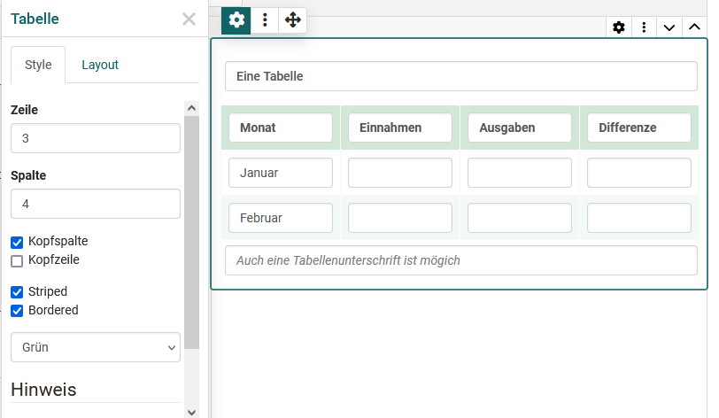
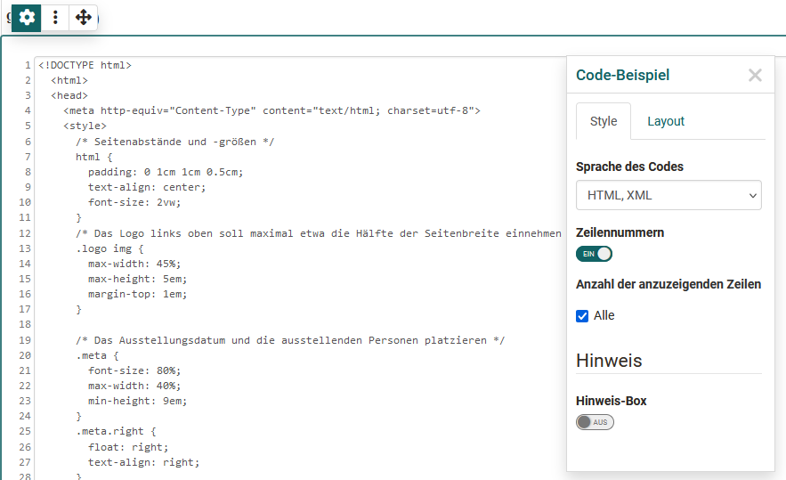
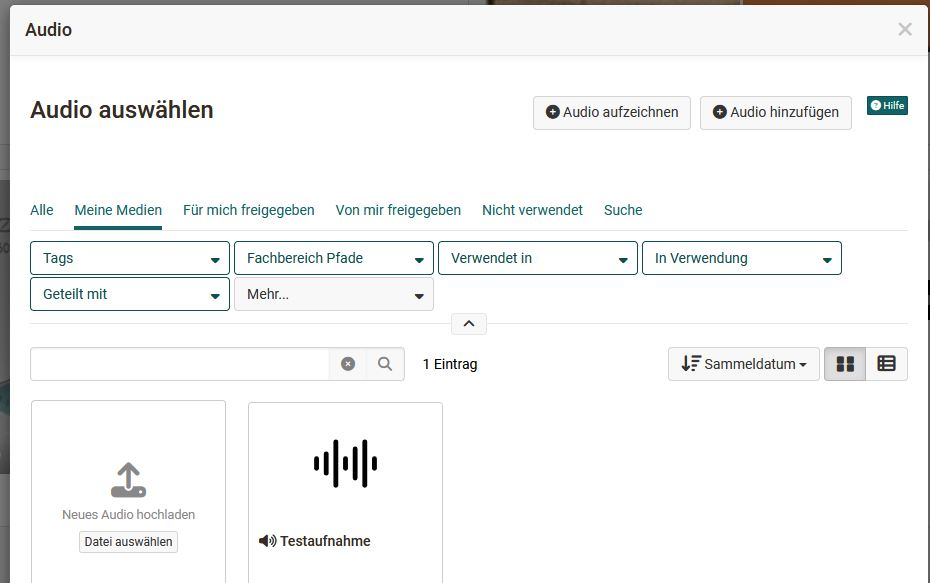
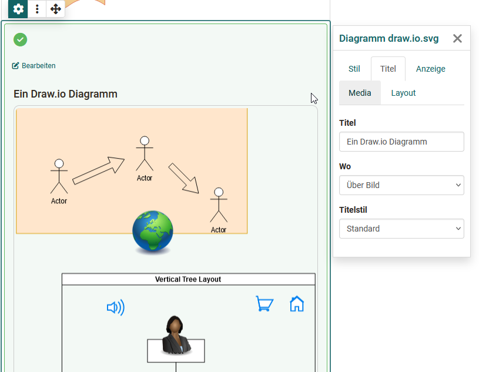

# Der Portfolio Editor

!!! note "Verfügbarkeit"

    Ab :octicons-tag-24: Release 17.1. ist dieser Portfolio Editor verfügbar. Wollen sie einen alten Eintrag mit neuem Inhalt befüllen, benutzen sie dafür die neuen Layouts.

Jedem Portfolio Eintrag können unterschiedliche Layouts und Inhaltselemente hinzugefügt werden. Die Konfiguration erfolgt über die Bedienelemente: Layout, das Blockmenü und den Inspektor. 

## Bedienelemente im Überblick 
Der Portfolio Editor umfasst verschiedene Menü-Bereiche für die Konfiguration: 

{ class="lightbox" }

* **Layoutmenü**: Ein Layout ist ein übergeordneter Bereich, der  unterschiedliche Strukturierungen des Inhalts durch Spalten und Zeilen ermöglicht. Im Layoutmenü kann ein ein- oder mehrspaltiges Layout ausgewählt, Layoutbereiche verschoben oder neue Layouts hinzufügt werden. Löscht oder verändert man Layouts werden existierende Blöcke in die vorhandenen Spalten geschoben. Aktuell sind folgende Layoutvorlagen verfügbar:
{ class="shadow lightbox" }
* **Blockmenü**: Menü eines einzelnen Inhaltselements innerhalb eines Layouts. Über das Blockmenü kann ein Inhaltselement verschoben, hinzugefügt oder gelöscht werden. Auch der Inspektor mit weiteren Einstellungen für ein Inhaltselement kann über das Zahnrad :material-cog: aktiviert werden. 
* **Inspektor**: Dient der Konfiguration einzelner Inhaltselemente. Dort befinden sich alle Einstellungen, die den Funktionsumfang, sowie das Aussehen des jeweiligen Elements verändern, z.B. die Ausrichtung von Bildern. Klickt man auf die Titelzeile des Inspektor Fensters kann das Konfigurationsmenü selbst auch verschoben werden. Wenn Sie einen neuen Block selektieren, springt der Inspektor wieder an die Standardposition.

**Hinweis-Box im Inspektor**

Interessant ist auch die Möglichkeit den Inhaltselementen eine Hinweis-Box hinzuzufügen. Diese Option steht für fast alle Inhaltselemente bis auf Titel und HTML-Textcode zur Verfügung. 

{ class="lightbox" }

Hierüber können einzelne Inhaltselemente hervorgehoben und z.B. als Info, Tipp, Wichtig usw. gekennzeichnet werden. Auch die Vergabe eines eigenen Titels ist möglich. Darüber hinaus können die Hinweis-Boxen noch mit einem Icon versehen und definiert werden ob die Hinweis-Box einklappbar ist oder nicht. Bei benutzerdefinierten Hinweis-Typen kann auch ein Icon aus der Liste gewählt und die Farbe angepasst werden. Bei vordefinierten Typen sind diese Dinge vordefiniert.   

## Inhaltsblöcke - Inhalt hinzufügen 

Über "Inhalt hinzufügen" werden die konkreten Inhaltselemente wie Texte, Bilder oder sonstige Medien hinzugefügt. Folgende Inhaltselemente stehen zur Wahl: 

{ class="lightbox" }

### Titel

Nutzen Sie dieses Element um schnell und einfach eine Überschrift hinzuzufügen.

Im Inspektor Menü kann eine Grösse von h1-h6 kann eingestellt werden, wobei h1 der "Überschrift 1" entspricht und somit am grössten und h6 der "Überschrift 6" und somit am kleinsten ist. Im Tab "Layout kann ferner, wie in den meisten Inhaltselemente, der Abstand zum Text definiert.
{ class="lightbox" }

### Text

Nutzen sie dieses Element um beliebige Textpassagen einzufügen. Der Text kann mit Hilfe des Editors passend formatiert werden, z.B. für Fettdruck, Verlinkungen, Schriftfarbe usw.. 

### Tabelle

Verwenden Sie dieses Inhaltselement, wenn Sie Ihrem Portfolio eine Tabelle hinzufügen möchten. Definieren sie die Anzahl der Zeilen und Spalten einer Tabelle und fügen sie eine Kopfzeile hinzu. Anschliessend befüllen Sie die jeweiligen Tabellenfelder.

{ class="lightbox" }

### Mathematische Formel

Klicken Sie in das Bearbeitungsfeld und Sie erhalten Zugriff auf einen speziellen Formel-Editor. Sie können entweder die Formel im grafischen Editor oder im LaTeX Editor eingeben. 
{ class="lightbox" }

### Code-Beispiel
Element zum Einfügen von Programmiercode. Der Inhalt wird als Code angezeigt und nicht ausgeführt. Diverse Code-Sprachen stehen zur Auswahl. Auch Zeilennummern können für die Übersicht eingeblendet werden. 
{ class="lightbox" }

### Zitat

Hier können Sie neue Zitate erstellen (Zitat hinzufügen) oder auf bereits im Media Center hinterlegte Zitate zurückgreifen und diese einbinden. Einem neuen Zitat können diverse Informationen hinzugefügt werden z.B. Quelle, Sprache, Autor, URL.

### Bild

Fügen Sie Bildelemente hinzu indem Sie eine Grafikdatei hochladen oder auf eine Grafik Ihres Media Centers zugreifen. Anschliessend können Sie die Datei weiter konfigurieren, z.B. einen Titel oder Untertitel platzieren und auch die Größe, Platzierung oder Umrandung definieren. Nutzen Sie hierfür das Inspektor Menü.

!!! Tip "Tipp"

    Um die Positionierung einer Grafik zu optimieren verwenden Sie am besten ein passendes z.B. mehrspaltiges Layout. Je nach Art der Grafiken gilt dieser Tipp auch für das Inhaltselement "Galerie".

### Galerie

Neu ab :octicons-tag-24: Release 19 ist die Möglichkeit eine Bildergalerie hinzuzufügen. Mit einem Klick auf den Button „Hinzufügen“ öffnet sich das Media Center, in dem mehrere Bilder ausgewählt werden können. Die Anzeigeart – Vorschau, Raster oder Slideshow – lässt sich im Inspector festlegen. Das gezeigte Beispiel präsentiert eine Galerie mit Vorschau aus der Perspektive eines Nutzers.

{ class="lightbox" }

### Bildvergleich
Neu ab :octicons-tag-24: Release 19 ist das Inhaltselement "Bildvergleich". Hierbei können 2 Bilder aus dem Media Center ausgewählt und nebeneinandergestellt werden, z.B. zwei Versionen desselben Bildes. 
Die Auswahl der Bilder erfolgt über das Inspektor Menü. Neben den Standard Typ kann der Bildvergleich auch für die Gegenüberstellung von einem richtigen und einem falschen Bild verwendet werden. 

{ class="lightbox" }

Der User kann mit einem Schieberegler den Ansichtsbereich der Bilder justieren. 

### Video

Sie haben folgende Möglichkeiten ein Video in den Editor zu laden und bereitzustellen: 

* Video hinzufügen: Eine mp4 Videodatei hochladen
* Video per URL hinzufügen
* Video aufnehmen: Eine Videoaufnahme mit der Webcam erstellen
* Eine Video Datei, die sich im Media Center befindet auswählen und hinzufügen. 
{ class="lightbox" }

### Audio
Sie haben folgende Möglichkeiten ein Audio in den Editor zu laden und bereitzustellen: 

* Nutzen Sie den integrierten Audio-Editor und erstellen Sie eine Tonaufnahme (Audio aufzeichnen)
* Laden Sie eine Audiodatei hoch (Audio hinzufügen)
* Verbinden Sie eine Audiodatei aus Ihrem Media Center (Auswahl aus der Liste).
{ class="lightbox" }

### Dokument

Sie haben folgende Möglichkeiten ein Dokument in den Editor zu laden und bereitzustellen: 

* Erstellen Sie ein neues Dokument, entsprechend der angegebenen Dateitypen (Dokument erstellen)
* Laden Sie ein neues Dokument hoch (Dokument hinzufügen) oder 
* Verbinden Sie ein Dokument aus Ihrem Media Center (Auswahl aus der Liste).

Ist ein externer Dokumenteneditor aktiviert und liegen die Dateien in einem Format vor, das von diesem unterstützt wird, können die Dateien auch direkt online in OpenOlat weiterbearbeitet werden.

!!! Tip "Hinweis"

    Die Inhalte der Dateien werden hier nicht direkt dargestellt, sondern müssen per Klick auf den Link geöffnet werden. 

###  Diagramm 

Sie können ein neues draw.io Diagramm anlegen oder Sie fügen ein existierendes draw.io Diagramm aus Ihrem Media Center hinzu. Die konkrete Ausgestaltung des Diagramms erfolgt über den Klick auf den "Bearbeiten" Link im Eintrag.  

{ class="lightbox" }

Beim Erstellen eines Diagramms kann auch definiert werden ob bzw. wer das Diagramm bearbeiten darf. 

### Separator 
Hinzufügen einer Trennlinie.

### HTML-Textcode

Hier erscheint ein ähnlicher aber etwas erweiterter Text-Editor wie beim Inhaltselement "Text".

### Media Center

Anstatt ein spezielles Inhaltselement zu wählen können Sie auch direkt in ihr [Media Center](../personal_menu/Media_Center.de.md) wechseln und dort hinterlegte Elemente auswählen oder Mediendateien hochladen bzw. hinzufügen. 

Die Such- und Filteroptionen helfen, die gewünschte Datei(en) schnell zu finden.
{ class="lightbox" }
