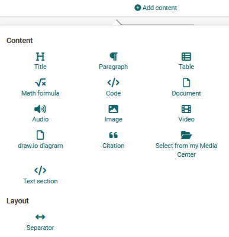
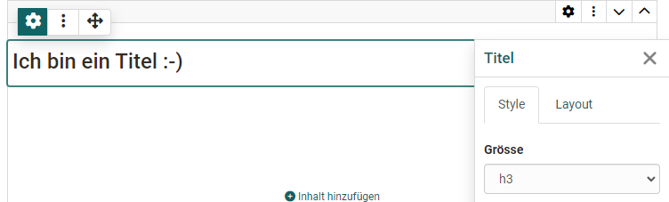
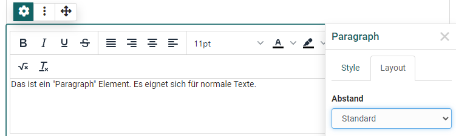
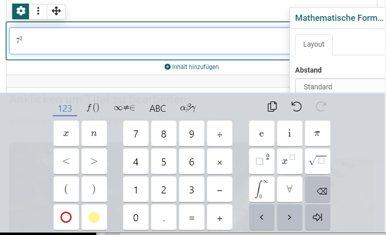
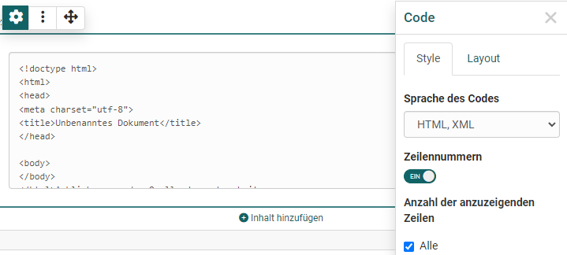
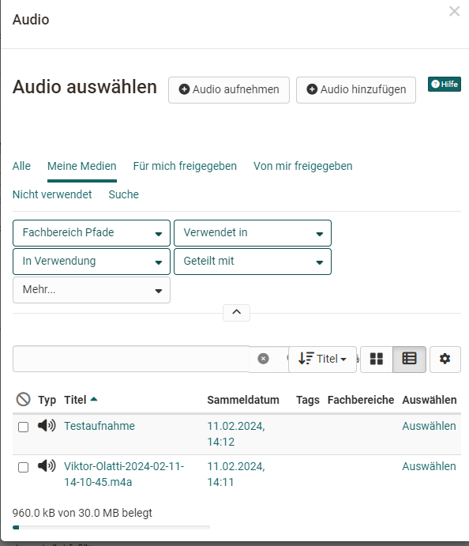
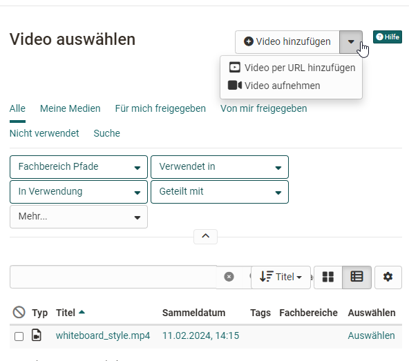

# The Portfolio Editor

!!! note "Availability"

    As of :octicons-tag-24: release 17.1. this portfolio editor is available.  If you want to fill an old entry with new content, use the new layouts.

Jedem Portfolio Eintrag können unterschiedliche Layouts und Inhaltselemente hinzugefügt werden. Die Konfiguration erfolgt über die Bedienelemente: Layout, das Blockmenü und den Inspektor.

## Controls Overview
Der Portfolio Editor umfasst verschiedene Menü-Bereiche für die Konfiguration: 

{ class="lightbox" }

* **Layout Menu**: A layout is a higher-level block that allows you to structure the content in different ways using columns and rows. Im Layoutmenü kann ein ein- oder mehrspaltiges Layout ausgewählt, Layoutbereiche verschoben oder neue Layouts hinzufügt werden. Löscht oder verändert man Layouts werden existierende Blöcke in die vorhandenen Spalten geschoben. Aktuell sind folgende Layoutvorlagen verfügbar:

* **Block Menu**: Menü eines einzelnen Inhaltselements innerhalb eines Layouts. Über das Blockmenü kann ein Inhaltselement verschoben, hinzugefügt oder gelöscht werden. Auch der Inspektor mit weiteren Einstellungen für ein Inhaltselement kann über das Zahnrad :material-cog: aktiviert werden. 
* **Inspector**: Used to configure individual content elements. There are all settings that change the functionality, as well as the appearance of the respective block or layout e.g. the alignment of images. By clicking on the title bar of the inspector window you can also move it. When you select a new block, the inspector jumps back to the default position.

## Content blocks - add content

Über "Inhalt hinzufügen" werden die konkreten Inhaltselemente wie Texte, Bilder oder sonstige Medien hinzugefügt. Folgende Inhaltselemente stehen zur Wahl: 

{ class="lightbox" }

### Title

Use this element to add titles quickly and easily.

With the selection of h1-h6 the size of the heading can be chosen, where h1 corresponds to "Heading 1" and is therefore the largest and h6 corresponds to "Heading 6" and thus smallest.
Im Tab "Layout kann ferner der Abstand zum Text definiert.
{ class="lightbox" }

### Paragraph

Paragraph provides access to a simple version of a text editor. For example, words can be formatted in bold, the text color can be changed or the centering in the text flow can be defined. Text elements with simple formatting can thus be created quickly.

{ class="lightbox" }

### Table

Add a table to your portfolio. Define the number of rows and columns in a table and add a header row. Then fill in the respective table fields.

### Math formula

Click in the editing field and you will be given access to a special formula editor. You can either enter the formula in the graphical editor or in the LaTeX editor.

{ class="lightbox" }

### Code
Einfügen von Programmiercode. Der Inhalt wird als Code angezeigt und nicht ausgeführt. 
{ class="lightbox" }

### Document

Here, you have three different possibilities:
* Create a new document according to the specified file types
* Upload a new document (add document) or
* Connect a document from your Media Center (Selection from the list).

If an external document editor is activated and the files are in a format that is supported by it, the files can also be edited directly online.

### Audio
Hier haben Sie die folgenden Möglichkeiten: 
* Nutzen Sie den Audio-Editor und erstellen Sie eine Tonaufnahme (Audio aufnehmen)
* Laden Sie eine Audiodatei (Audio hinzufügen)
* Verbinden Sie eine Audiodatei aus Ihrem Medien Center (Auswahl aus der Liste).
{ class="lightbox" }

### Image

Add image elements by uploading a graphic file or accessing a graphic from your Media Center. You can then configure the file further, e.g. place a title or subtitle and also define the size, placement or border.

!!! "Hint"

    To optimize the positioning of a graphic, it is best to use a suitable layout, e.g. multi-column layout.

### Video

You have the following options for loading a video into the editor:

* Add Video: Upload an mp4 video file
* Add video via URL
* Record Video: Create a video with a webcam
* Select and add a video file from the Media Center.
{ class="lightbox" }

### draw.io Diagramm

Sie können ein neues draw.io Diagramm anlegen oder Sie fügen ein existierendes draw.io Diagramm aus Ihrem Medien Center hinzu. Die konkrete Ausgestaltung des Diagramms erfolgt über den Klick auf den "Editieren" Link im Eintrag.  

### Citation 

Here you can create new quote (Add quote) or use quote already stored in the Media Center and integrate them. Various information can be added to a new quote, e.g. source, language, author, URL ...

### Select from Media Center

Instead of going through a specific media type, you can also access your Media Center directly and integrate artifacts stored there as well as create new Media Center media files. The search and filter options help you to find the desired file more quickly.
{ class="lightbox" }

You can find further information in the [Media Center](../personal_menu/Media_Center.md).

### Text section

The element is similar to the "Paragraph" element and is therefore also used to add text and content. However, the possibilities are much more extensive. For example, extensive formatting can be carried out.

### Separator 
Adding a separator line