# The Portfolio Editor {: #portfolio_editor}

Different layouts and content elements can be added to each portfolio entry. You can also continue to fill older entries using these layouts. The configuration is carried out via three controls: the layout menu, the block menu and the inspector.

## Controls Overview

The Portfolio Editor includes various menu areas for configuration:

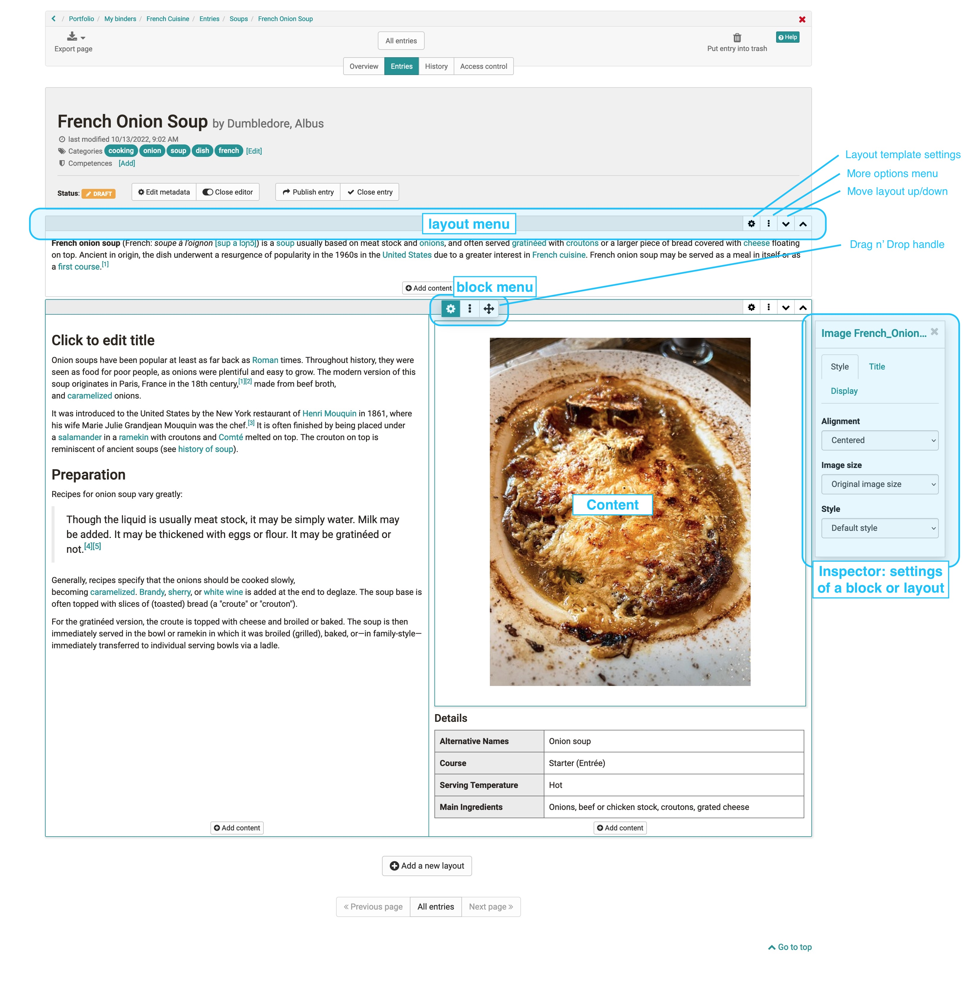{ class="shadow lightbox" }

* **Layout menu**: A layout is a higher-level block that allows you to structure the content in different ways using columns and rows. In the layout menu, you can select a single or multi-column layout, move layout areas or add new layouts. If you delete or change layouts, existing blocks are moved into the existing columns. The following layout templates are currently available:
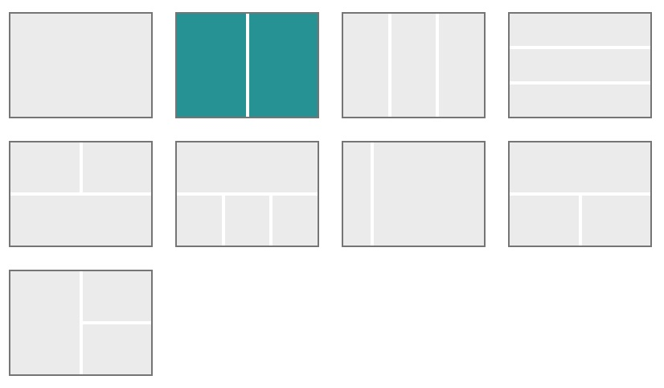{ class="shadow lightbox" }
* **Block menu**: Menu of an individual content element within a layout. A content element can be moved, added or deleted via the block menu. The inspector with further settings for a content element can also be activated via the gear wheel :o_icon_o_icon_inspect:.
* **Inspector**: Used to configure individual content elements. It contains all settings that change the functionality as well as the appearance of the respective element, e.g. the alignment of images. By clicking on the title bar of the inspector window, you can also move the configuration menu itself. When you select a new block, the inspector jumps back to the default position.

**Alert box in the inspector**

Another interesting feature is the option to add an alert box to the content elements. This option is available for almost all content elements except for title and HTML text code.

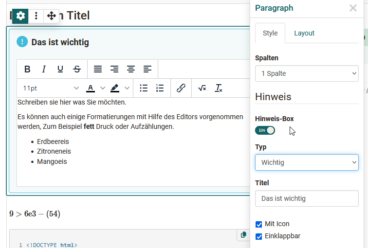{ class="shadow lightbox" }

Individual content elements can be highlighted and marked as Info, Tip, Important, etc. It is also possible to assign your own title. In addition, the alert boxes can be provided with an icon and it can be defined whether the alert box is collapsible or not. For user-defined alert types, an icon can also be selected from the list and the color can be adjusted. For predefined types, these things are predefined.

## Content blocks - add content

The specific content elements such as texts, images or other media are added via "Add content". The following content elements are available:

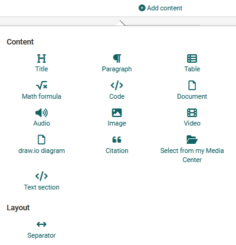{ class="shadow lightbox" }

### Title

Use this element to add a heading quickly and easily.

In the inspector, a size from h1 to h6 can be set, where h1 corresponds to "Heading 1" and is therefore the largest and h6 corresponds to "Heading 6" and is therefore the smallest. In the "Layout" tab, as with most content elements, the distance to the text can also be defined.

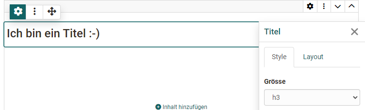{ class="shadow lightbox" }

### Text

Use this element to insert any text passages. The text can be formatted appropriately using the editor, e.g. for bold print, links, font color etc.

### Table

Use this content element if you want to add a table to your portfolio. Define the number of rows and columns of a table and add a header row. Then fill in the respective table fields. In the inspector, you also define the header column and header row, the options "Striped" and "Bordered" and the color; a table caption is optional.

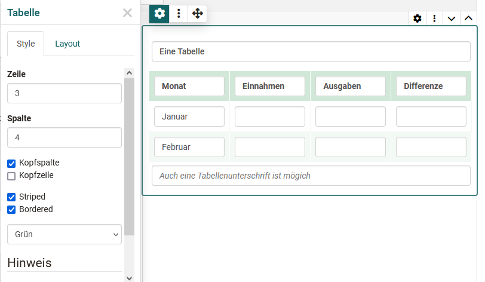{ class="shadow lightbox" }

### Math formula

Click in the editing field and you will be given access to a special formula editor. You can either enter the formula in the graphical editor or in the LaTeX editor.

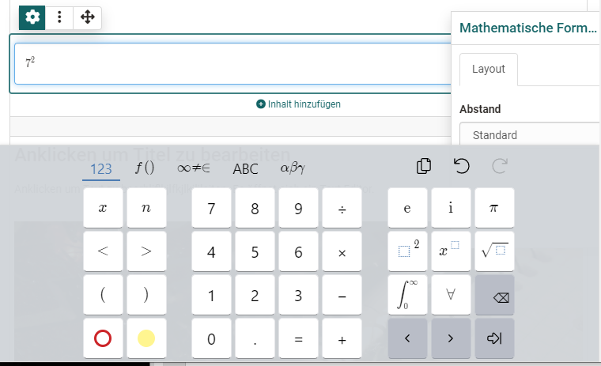{ class="shadow lightbox" }

### Code example

Element for inserting programming code. The content is displayed as code and is not executed. Various code languages are available for selection. Line numbers can also be displayed for better overview.

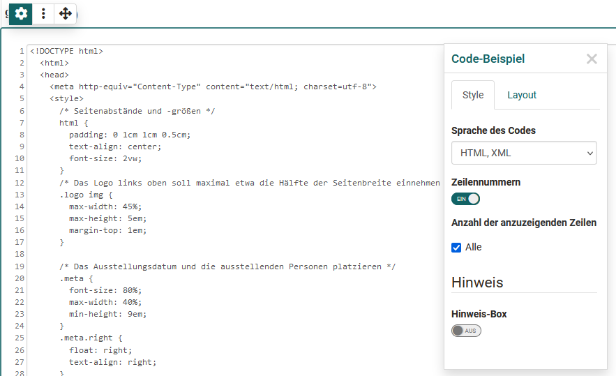{ class="shadow lightbox" }

### Citation

Here you can create new citations (Add citation) or use citations already stored in the Media Center and integrate them. Various information can be added to a new citation, e.g. source, language, author, URL.

### Image

Add image elements by uploading a graphic file or accessing a graphic from your Media Center. You can then configure the file further, e.g. place a title or subtitle and also define the size, placement or border. Use the inspector for this.

!!! tip "Tip"

    To optimize the positioning of a graphic, it is best to use a suitable, e.g. multi-column layout. Depending on the type of graphics, this tip also applies to the "Gallery" content element.

### Gallery [:octicons-tag-16:{ title="from Release 19.0.0 (OO-7142)" }](https://track.frentix.com/issue/OO-7142){:target="_blank"}

With the content element "Gallery" you add a picture gallery. Clicking on the "Add" button opens the Media Center, in which several images can be selected. The display type (preview, grid or slideshow) can be defined in the inspector. The example shown presents a gallery with preview from the perspective of the readers.

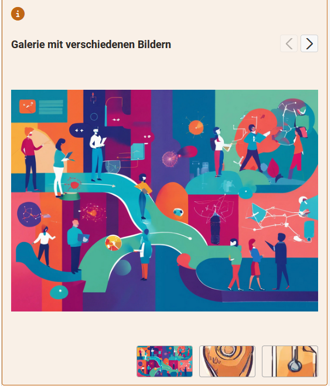{ class="shadow lightbox" }

### Image comparison [:octicons-tag-16:{ title="from Release 19.0.0 (OO-7143)" }](https://track.frentix.com/issue/OO-7143){:target="_blank"}

With the content element "Image comparison" you place 2 images from the Media Center next to each other, e.g. two versions of the same image. The images are selected via the inspector. In addition to the standard type, the image comparison can also be used to compare a correct and an incorrect image.

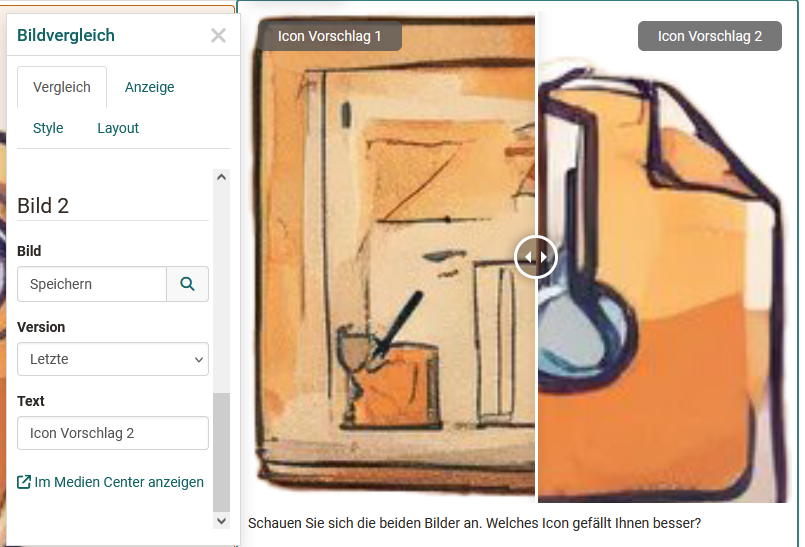{ class="shadow lightbox" }

Readers can adjust the viewing area of the images using a slider.

### Video

You have the following options for loading a video into the editor and providing it:

* Add video: Upload an mp4 video file
* Add video via URL
* Record video: Create a video recording with the webcam
* Select and add a video file that is located in the Media Center.

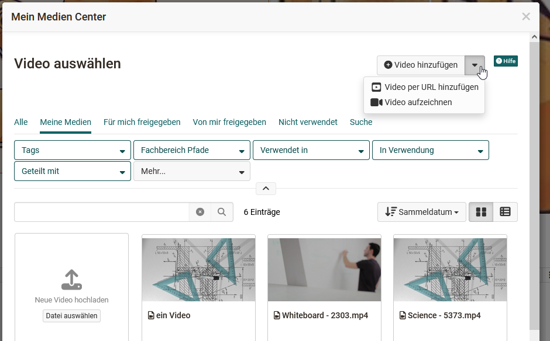{ class="shadow lightbox" }

### Audio

You have the following options for loading an audio into the editor and providing it:

* Use the integrated audio editor and create a sound recording (Record audio)
* Upload an audio file (Add audio)
* Connect an audio file from your Media Center (selection from the list).

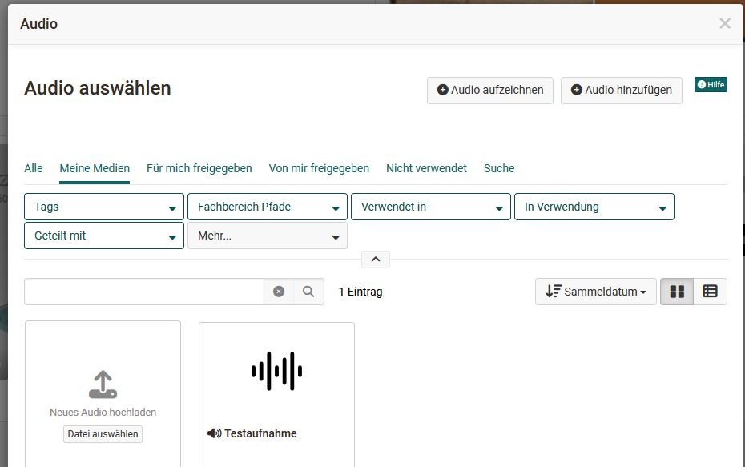{ class="shadow lightbox" }

### Document

You have the following options for loading a document into the editor and providing it:

* Create a new document according to the specified file types (Create document)
* Upload a new document (Add document) or
* Connect a document from your Media Center (selection from the list).

If an external document editor is activated and the files are in a format that is supported by it, the files can also be edited directly online in OpenOlat.

!!! info "Important"

    The contents of the files are not displayed directly here, but must be opened by clicking on the link.

### Diagram

You can create a new draw.io diagram or add an existing draw.io diagram from your Media Center. The actual design of the diagram is done by clicking on the "Edit" link in the entry.

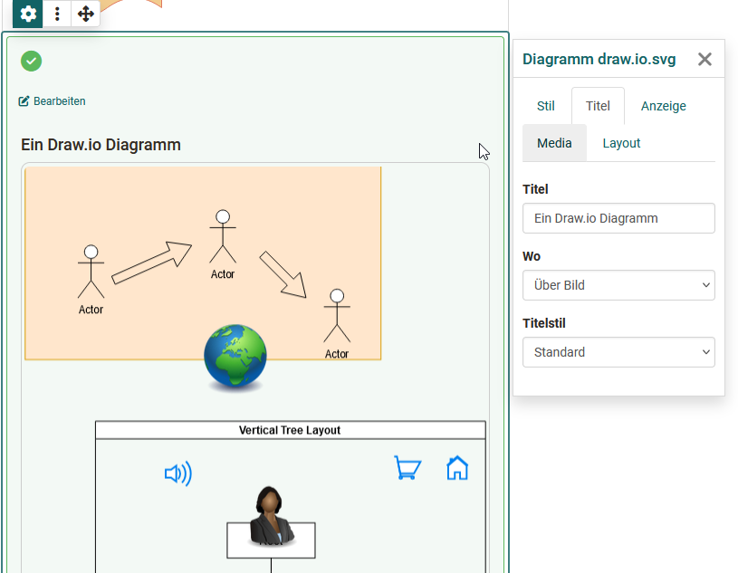{ class="shadow lightbox" }

When creating a diagram, you can also define whether or who is allowed to edit the diagram.

### Separator

Adding a separator line.

### HTML text code

A similar but slightly extended text editor appears here as for the "Text" content element.

### Media Center

Instead of selecting a specific content element, you can also switch directly to your [Media Center](../personal_menu/Media_Center.md) and select elements stored there or upload or add media files.

The search and filter options help you to find the desired file(s) quickly.

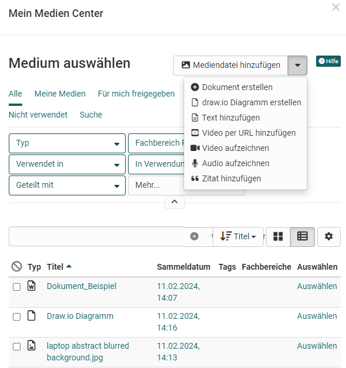{ class="shadow lightbox" }

## Further information {: #further_information}

[Personal tools: Media Center >](../personal_menu/Media_Center.md)

[To the top of the page ^](#portfolio_editor)
