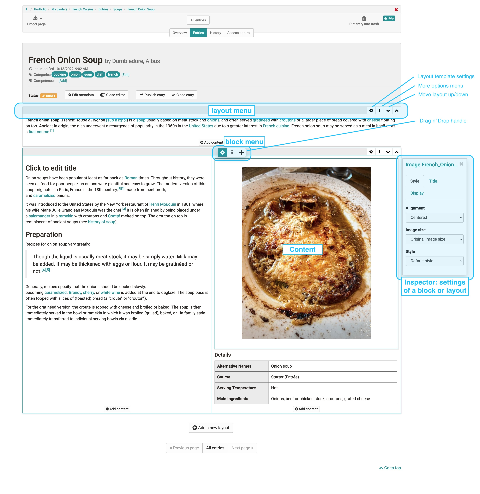
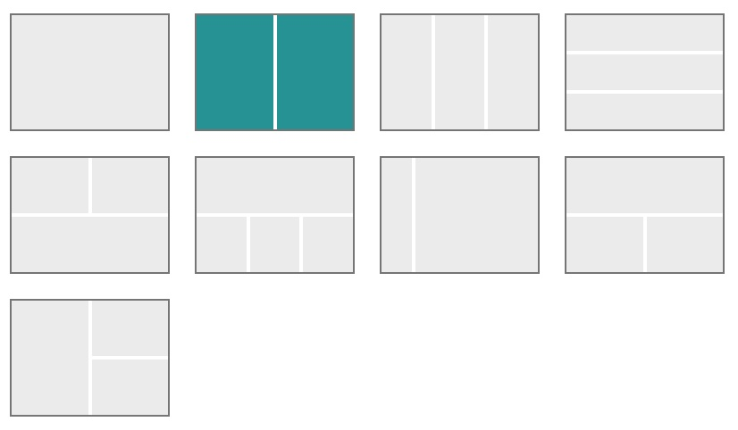

# The Portfolio Editor

!!! note "Availability"

    As of :octicons-tag-24: release 17.1. this portfolio editor is available.  If you want to fill an old entry with new content, use the new layouts.

Different layouts and content elements can be added to each portfolio entry. The configuration is carried out via the operating elements: Layout menu, the block menu and the inspector.

## Controls Overview
Der Portfolio Editor umfasst verschiedene Menü-Bereiche für die Konfiguration: 

{ class="lightbox" }

* **Layout Menu**: A layout is a higher-level block that allows you to structure the content in different ways using columns and rows. 
Im Layoutmenü kann ein ein- oder mehrspaltiges Layout ausgewählt, Layoutbereiche verschoben oder neue Layouts hinzufügt werden. Löscht oder verändert man Layouts werden existierende Blöcke in die vorhandenen Spalten geschoben. Aktuell sind folgende Layoutvorlagen verfügbar:
{ class="shadow lightbox" }
* **Block Menu**: Menü eines einzelnen Inhaltselements innerhalb eines Layouts. Über das Blockmenü kann ein Inhaltselement verschoben, hinzugefügt oder gelöscht werden. Auch der Inspektor mit weiteren Einstellungen für ein Inhaltselement kann über das Zahnrad :material-cog: aktiviert werden. 
* **Inspector**: Used to configure individual content elements. There are all settings that change the functionality, as well as the appearance of the respective block or layout e.g. the alignment of images. By clicking on the title bar of the inspector window you can also move it. When you select a new block, the inspector jumps back to the default position.

**Hinweis-Box im Inspektor**

Interessant ist auch die Möglichkeit den Inhaltselementen eine Hinweis-Box hinzuzufügen. Diese Option steht für fast alle Inhaltselemente bis auf Titel und HTML-Textcode zur Verfügung. 

{ class="lightbox" }

Hierüber können einzelne Inhaltselemente hervorgehoben und z.B. als Info, Tipp, Wichtig usw. gekennzeichnet werden. Auch die Vergabe eines eigenen Titels ist möglich. Darüber hinaus können die Hinweis-Boxen noch mit einem Icon versehen und definiert werden ob die Hinweis-Box einklappbar ist oder nicht. Bei benutzerdefinierten Hinweis-Typen kann auch ein Icon aus der Liste gewählt und die Farbe angepasst werden. Bei vordefinierten Typen sind diese Dinge vordefiniert.   

## Content blocks - add content

Über "Inhalt hinzufügen" werden die konkreten Inhaltselemente wie Texte, Bilder oder sonstige Medien hinzugefügt. Folgende Inhaltselemente stehen zur Wahl: 

{ class="lightbox" }

### Title

Use this element to add titles quickly and easily.

With the selection of h1-h6 the size of the heading can be chosen, where h1 corresponds to "Heading 1" and is therefore the largest and h6 corresponds to "Heading 6" and thus smallest.
Im Tab "Layout kann ferner der Abstand zum Text definiert.
{ class="lightbox" }

### Text

Use this element to insert any text passages. The text can be formatted appropriately using the editor, e.g. for bold print, links, font color etc.. 

### Table

Add a table to your portfolio. Define the number of rows and columns in a table and add a header row. Then fill in the respective table fields.

{ class="lightbox" }

### Math formula

Click in the editing field and you will be given access to a special formula editor. You can either enter the formula in the graphical editor or in the LaTeX editor.

{ class="lightbox" }

### Code example
Element zum Einfügen von Programmiercode. Der Inhalt wird als Code angezeigt und nicht ausgeführt. Diverse Code-Sprachen stehen zur Auswahl. Auch Zeilennummern können für die Übersicht eingeblendet werden. 
{ class="lightbox" }

### Document

Here, you have three different possibilities:
* Create a new document according to the specified file types
* Upload a new document (add document) or
* Connect a document from your Media Center (Selection from the list).

If an external document editor is activated and the files are in a format that is supported by it, the files can also be edited directly online.

### Audio
Hier haben Sie die folgenden Möglichkeiten: 
* Nutzen Sie den Audio-Editor und erstellen Sie eine Tonaufnahme (Audio aufnehmen)
* Laden Sie eine Audiodatei (Audio hinzufügen)
* Verbinden Sie eine Audiodatei aus Ihrem Medien Center (Auswahl aus der Liste).
{ class="lightbox" }

### Citation 

Here you can create new quote (Add quote) or use quote already stored in the Media Center and integrate them. Various information can be added to a new quote, e.g. source, language, author, URL ...

### Image

Add image elements by uploading a graphic file or accessing a graphic from your Media Center. You can then configure the file further, e.g. place a title or subtitle and also define the size, placement or border. Use the Inspector menu for this.

!!! "Hint"

    To optimize the positioning of a graphic, it is best to use a suitable layout, e.g. multi-column layout. Depending on the type of graphics, this tip also applies to the “Gallery” content element.

### Galerie

Neu ab :octicons-tag-24: Release 19 ist die Möglichkeit eine Bildergalerie hinzuzufügen. Mit einem Klick auf den Button „Hinzufügen“ öffnet sich das Media Center, in dem mehrere Bilder ausgewählt werden können. Die Anzeigeart – Vorschau, Raster oder Slideshow – lässt sich im Inspector festlegen. Das gezeigte Beispiel präsentiert eine Galerie mit Vorschau aus der Perspektive eines Nutzers.

{ class="lightbox" }    

### Bildvergleich
Neu ab :octicons-tag-24: Release 19 ist das Inhaltselement "Bildvergleich". Hierbei können 2 Bilder aus dem Media Center ausgewählt und nebeneinandergestellt werden, z.B. zwei Versionen desselben Bildes. 
Die Auswahl der Bilder erfolgt über das Inspektor Menü. Neben den Standard Typ kann der Bildvergleich auch für die Gegenüberstellung von einem richtigen und einem falschen Bild verwendet werden. 

{ class="lightbox" }

### Video

You have the following options for loading a video into the editor:

* Add Video: Upload an mp4 video file
* Add video via URL
* Record Video: Create a video with a webcam
* Select and add a video file from the Media Center.
{ class="lightbox" }

### Audio
Sie haben folgende Möglichkeiten ein Audio in den Editor zu laden und bereitzustellen: 

* Nutzen Sie den integrierten Audio-Editor und erstellen Sie eine Tonaufnahme (Audio aufzeichnen)
* Laden Sie eine Audiodatei hoch (Audio hinzufügen)
* Verbinden Sie eine Audiodatei aus Ihrem Media Center (Auswahl aus der Liste).
{ class="lightbox" }

### Dokument

Sie haben folgende Möglichkeiten ein Dokument in den Editor zu laden und bereitzustellen: 

* Erstellen Sie ein neues Dokument, entsprechend der angegebenen Dateitypen (Dokument erstellen)
* Laden Sie ein neues Dokument hoch (Dokument hinzufügen) oder 
* Verbinden Sie ein Dokument aus Ihrem Media Center (Auswahl aus der Liste).

Ist ein externer Dokumenteneditor aktiviert und liegen die Dateien in einem Format vor, das von diesem unterstützt wird, können die Dateien auch direkt online in OpenOlat weiterbearbeitet werden.

!!! Tip "Hinweis"

    Die Inhalte der Dateien werden hier nicht direkt dargestellt, sondern müssen per Klick auf den Link geöffnet werden. 

### Diagram

Sie können ein neues draw.io Diagramm anlegen oder Sie fügen ein existierendes draw.io Diagramm aus Ihrem Medien Center hinzu. Die konkrete Ausgestaltung des Diagramms erfolgt über den Klick auf den "Editieren" Link im Eintrag.  

{ class="lightbox" }

Beim Erstellen eines Diagramms kann auch definiert werden ob bzw. wer das Diagramm bearbeiten darf. 

### Separator 
Adding a separator line

### HTML text code

A similar but slightly extended text editor appears here as for the “text” content element.

### Media Center

Instead of going through a specific media type, you can also access your [Media Center](../personal_menu/Media_Center.md)  directly and integrate artifacts stored there as well as create new Media Center media files. The search and filter options help you to find the desired file more quickly.
{ class="lightbox" }
