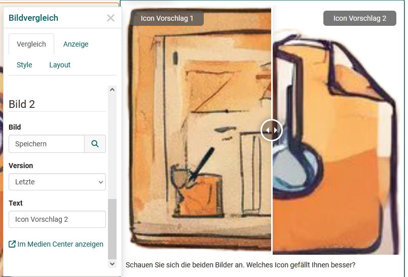

# The Portfolio Editor

!!! note "Availability"

    As of :octicons-tag-24: release 17.1. this portfolio editor is available.  If you want to fill an old entry with new content, use the new layouts.

Different layouts and content elements can be added to each portfolio entry. The configuration is carried out via the operating elements: Layout, the block menu and the inspector.

## Controls Overview
The Portfolio Editor includes various menu areas for configuration: 

{ class="lightbox" }

* **Layout Menu**: A layout is a higher-level block that allows you to structure the content in different ways using columns and rows. In the layout menu, you can select a single or multi-column layout, move layout areas or add new layouts. If you delete or change layouts, existing blocks are moved into the existing columns. The following layout templates are currently available:

* **Block Menu**: Menu of an individual content element within a layout. A content element can be moved, added or deleted via the block menu. The inspector with further settings for a content element can also be activated via the :material-cog: gear wheel. 
* **Inspector**: Used to configure individual content elements. There are all settings that change the functionality, as well as the appearance of the respective block or layout e.g. the alignment of images. By clicking on the title bar of the inspector window you can also move it. When you select a new block, the inspector jumps back to the default position.

**Note box in the inspectorr**

Another interesting feature is the option to add a hint box to the content elements. This option is available for almost all content elements except for titles and HTML text code. 

{ class="lightbox" }

Individual content elements can be highlighted and marked as Info, Tip, Important, etc., for example. It is also possible to assign your own title. In addition, the note boxes can be provided with an icon and it can be defined whether the note box is collapsible or not. For user-defined notice types, an icon can also be selected from the list and the color can be adjusted. These things are predefined for predefined types.

## Content blocks - add content

The specific content elements such as texts, images or other media are added via "Add content". The following content elements are available: 

{ class="lightbox" }

### Title

Use this element to add titles quickly and easily.

With the selection of h1-h6 the size of the heading can be chosen, where h1 corresponds to "Heading 1" and is therefore the largest and h6 corresponds to "Heading 6" and thus smallest.
The distance to the text can also be defined in the "Layout" tab.
{ class="lightbox" }

### Text

Use this element to insert any text passages. The text can be formatted appropriately using the editor, e.g. for bold print, links, font color etc.. 

### Table

Use this content element if you want to add a table to your portfolio. Define the number of rows and columns of a table and add a header row. Then fill in the respective table fields.

{ class="lightbox" }

### Math formula

Click in the editing field and you will be given access to a special formula editor. You can either enter the formula in the graphical editor or in the LaTeX editor.

{ class="lightbox" }

### Code example
Element for inserting programming code. The content is displayed as code and is not executed. Various code languages are available for selection. Line numbers can also be displayed for the overview. 
{ class="lightbox" }

### Quote

Here you can create new quotes (Add quote) or use quotes already stored in the Media Center and integrate them. Various information can be added to a new quote, e.g. source, language, author, URL.

### Image

Add image elements by uploading a graphic file or accessing a graphic from your Media Center. You can then configure the file further, e.g. place a title or subtitle and also define the size, placement or border. Use the Inspector menu for this.

!!! "Hint"

    To optimize the positioning of a graphic, it is best to use a suitable layout, e.g. multi-column layout. Depending on the type of graphics, this tip also applies to the "Gallery" content element.

### Gallery

New from :octicons-tag-24: Release 19 is the possibility to add a picture gallery. Click on the "Add" button to open the Media Center, in which several images can be selected. The display type - preview, grid or slideshow - can be defined in the Inspector. The example shown presents a gallery with a preview from the perspective of a user.

{ class="lightbox" }    

### Image comparison
New from :octicons-tag-24: Release 19 is the content element "Image comparison". This allows 2 images from the Media Center to be selected and placed next to each other, e.g. two versions of the same image. 
The images are selected via the inspector menu. In addition to the standard type, the image comparison can also be used to compare a correct and an incorrect image. 

{ class="lightbox" }

The user can adjust the viewing area of the images using a slider. 

### Video

You have the following options for loading a video into the editor:

* Add Video: Upload an mp4 video file
* Add video via URL
* Record Video: Create a video with a webcam
* Select and add a video file from the Media Center.
{ class="lightbox" }

### Audio
Here you have the following options: 
* Use the audio editor and create a sound recording (Record audio)
* Load an audio file (Add audio)
* Connect an audio file from your Media Center (select from the list).
{ class="lightbox" }

### Document

Here, you have three different possibilities:
* Create a new document according to the specified file types
* Upload a new document (add document) or
* Connect a document from your Media Center (Selection from the list).

If an external document editor is activated and the files are in a format that is supported by it, the files can also be edited directly online.

!!! tip "Note"

    The contents of the files are not displayed directly here, but must be opened by clicking on the link. 

### Diagram

You can create a new draw.io diagram or add an existing draw.io diagram from your Media Center. The actual design of the diagram is done by clicking on the "Edit" link in the entry.  

{ class="lightbox" }

When creating a diagram, you can also define whether or who is allowed to edit the diagram. 

### Separator 
Adding a separator line.

### HTML text code

A similar but slightly extended text editor appears here as for the "text" content element.

### Media Center

Instead of going through a specific media type, you can also access your [Media Center](../personal_menu/Media_Center.md)  directly and integrate artifacts stored there as well as create new Media Center media files. The search and filter options help you to find the desired file more quickly.
{ class="lightbox" }
