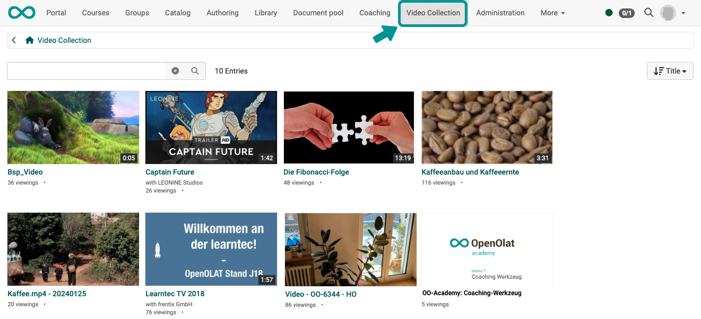

# Video Collection {: #video_collection}

You will find the Video Collection in the main menu of the header. It is a kind of "YouTube within OpenOlat". You can browse through all the videos available in OpenOlat (provided they have been released for you).

{ class="shadow lightbox" }

!!! info "Info"

    If the "Video Collection" entry does not appear in the main navigation in your OpenOlat instance, it has either been hidden by the administrator or you do not have the required rights. 

    For access authorization, please contact your administrator. The Video Collection can also be made available exclusively to learning resource administrators or authors, for example.

---

## What is offered in the Video Collection?  {: #offering}

The Video Collection lists video learning resources of your OpenOlat instance.

* This includes
  * videos uploaded in OpenOlat
  * videos imbedded by url.
* provided they are released.
* Videos available in OpenOlat as learning resources can also be supplemented with quiz questions that pause the video during playback and must first be answered before the video continues. Video learning resources with this and other supplementary OpenOlat functions are also listed in the Video Collection.

* The description of the info page is automatically displayed in the single view of a video. The content of the info page is taken from the settings under
**Authoring > Select learning resource > Administration > Settings > Tab "Info"**

* The preview image is also taken from the settings of the learning resource.
**Authoring > Select learing resource > Administration > Settings > Tab "Info"**

* Each video can be rated by awarding stars.

* A comment can be added to each video.

!!! info "Note"

    Videos linked directly with a URL in the [course element "HTML page"](../learningresources/Video_in_HTML_Pages.md) are not available as a learning resource in OpenOlat and are therefore not included in the Video Collection.

[To the top of the page ^](#video_collection)

---

## How are videos into the Video Collection? {: #selection}

The selection is compiled automatically. Whether a video learning resource is displayed in the Video Collection is controlled and depends on

* **Publication state:** In order for a video learning resource to be displayed in the "Video Collection", the publication status **"Published"** must be set.  
(Authoring > Select learning resource > "Status" button)

* **Share setting:** "Show in video collection" must be set in the sharing settings. 
(Authoring > Select learning resource > Administration > Settings > Tab "Share")
You can also specify here whether the video should only be visible to members of a specific organizational unit.

!!! tip "Hint"

    If you are missing a video, please check the settings of the video learning resource.

[To the top of the page ^](#video_collection)

## Further information

[Functional concept courses and learning resources > ](../learningresources/General_Functions_Concept.md) 
[Learning resource video > ](../learningresources/Learning_resource_Video.md) 
[Video upload > ](../learningresources/Video_Upload.md) 
[Video recording > ](../learningresources/Video_Recording.md) 
[Videos in HTML pages > ](../learningresources/Video_in_HTML_Pages.md) 

