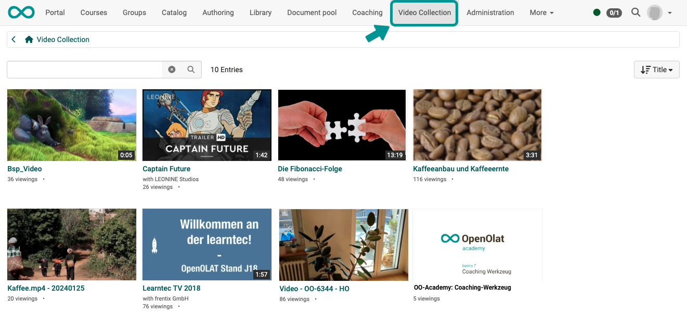

# Video Collection {: #video_collection}

You will find the "Video Collection" in the main menu of the header. It serves as a central overview of all video learning resources of your OpenOlat instance, provided they have been released for you. Here you can browse through the available videos and open individual videos directly.
For a video to be displayed in the "Video Collection", its publication status must be set to "Published". In the single view of a video, the description of the info page is displayed automatically. The rating and comment functions are also available there, provided they are activated.

{ class="shadow lightbox" }

!!! note "Note"

    If the "Video Collection" entry does not appear in the main navigation in your OpenOlat instance, it has either been hidden by administrators or you do not have the required rights. 

    For access authorization, please contact your administrators. The Video Collection can also be made available exclusively to learning resource managers or authors, for example.  

---

## What is offered in the Video Collection? {: #offering}

The Video Collection lists video learning resources of your OpenOlat instance.

* This includes
    * videos uploaded in OpenOlat
    * videos embedded via URL
* provided they are released.
* Videos available in OpenOlat as learning resources can also be supplemented with quiz questions that pause the video during playback and must first be answered before the video continues. Video learning resources with this and other supplementary OpenOlat functions are also listed in the Video Collection.

* In the single view of a video, the description of the info page is displayed automatically. The content of the info page is taken from the settings under 
`Authoring > "Learning resource" > Administration > Settings > Tab "Info"`

* The preview image is also taken from the settings of the learning resource. 
`Authoring > "Learning resource" > Administration > Settings > Tab "Info"`

* Each video can be rated by awarding stars.

* A comment can be added to each video.

!!! info "Important"

    Videos linked directly with a URL in the [course element "HTML page"](../basic_concepts/Video_in_HTML_Pages.md) are not available as a learning resource in OpenOlat and are therefore not included in the Video Collection.

[To the top of the page ^](#video_collection)

---

## How do the videos get into the Video Collection? {: #selection}

The selection is compiled automatically. Whether a video learning resource is displayed in the Video Collection depends on:

* **Publication status:** For a video learning resource to be displayed in the "Video Collection", the publication status **"Published"** must be set. 
`Authoring > "Learning resource" > Button "Status"`

* **Share setting:** "Show in video collection site" must be set in the share settings. 
`Authoring > "Learning resource" > Administration > Settings > Tab "Share"` 
You can also specify here whether the video should only be visible to members of a specific organizational unit.

!!! tip "Tip"

    If you are missing a video, please check the settings of the video learning resource.

[To the top of the page ^](#video_collection)

---

## Further information {: #further_information}

[Function concept courses and learning resources >](../learningresources/General_Functions_Concept.md) 
[Learning resource: Video >](../learningresources/Learning_resource_Video.md) 
[Video Upload >](../basic_concepts/Video_Upload.md) 
[Video Recording >](../basic_concepts/Video_Recording.md) 
[Videos in course element "HTML-Page" >](../basic_concepts/Video_in_HTML_Pages.md)

[To the top of the page ^](#video_collection)
