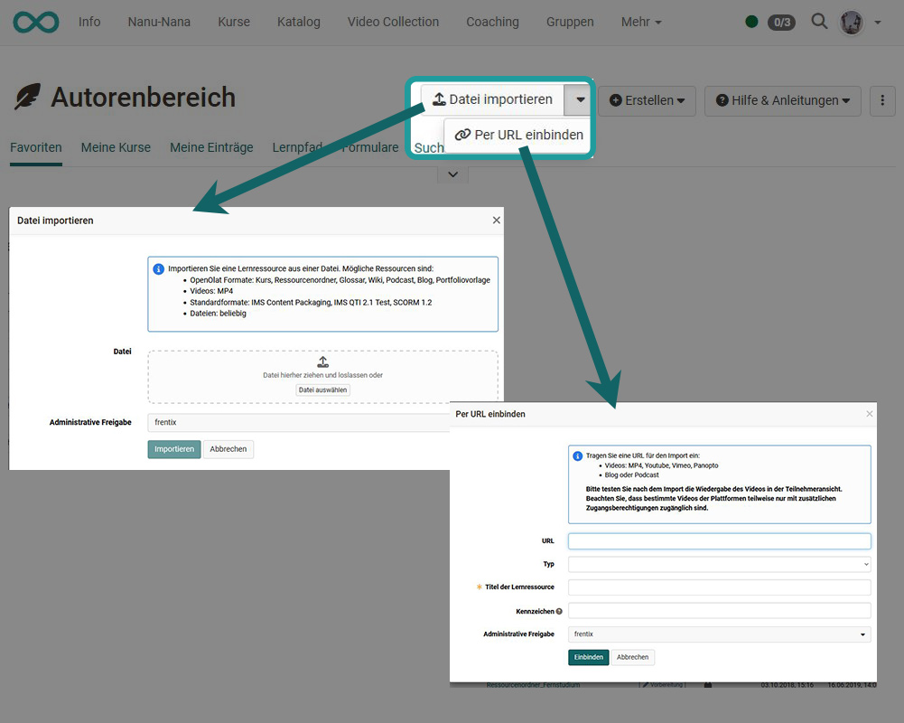

# Autorenbereich - Kurse und Lernressourcen erstellen

##  Neue OpenOlat Lernressourcen erstellen

Im Autorenbereich können die folgenden Lernressourcen erstellt werden:

{ class="shadow lightbox" }

Der konkrete Erstellungsprozess ist auf den folgenden Seiten beschrieben:

* Kurs erstellen  
[Handbuchartikel](../learningresources/Creating_Course.de.md) | [Ausführliche Anleitung](../../manual_how-to/my_first_course/my_first_course.de.md)

* Tests erstellen 
[Handbuchartikel](../learningresources/Test.de.md) | [Ausführliche Anleitung](../../manual_how-to/test_creation_procedure/test_creation_procedure.de.md)

* CP-Lerninhalt erstellen 
[Handbuchartikel](../learningresources/CP_Editor.de.md) | [Ausführliche Anleitung](../../manual_how-to/content_package/content_package.de.md)

* Wiki erstellen  
[Handbuchartikel](../learningresources/Wiki.de.md) | [Ausführliche Anleitung](../../manual_how-to/wikis/wikis.de.md)

* Podcast erstellen  
[Handbuchartikel](../learningresources/Podcast.de.md) | [Ausführliche Anleitung](../../manual_how-to/podcast/podcast.de.md)

* Blog erstellen 
[Handbuchartikel](../learningresources/Blog.de.md) | [Ausführliche Anleitung](../../manual_how-to/blog/blog.de.md)

* Ressourcenordner erstellen 
[Handbuchartikel](../learningresources/Resource_Folder.de.md) | [Ausführliche Anleitung](../../manual_how-to/multiple_use/multiple_use.de.md)

* Formulare erstellen  
[Handbuchartikel](../learningresources/Form.de.md)  | [Ausführliche Anleitung](../../manual_how-to/create_a_form/create_a_form.de.md)

* Vorbereitete bzw. vorstrukturierte Portfolio Vorlage erstellen 
[Handbuchartikel](../learningresources/Portfolio_template_Creation.de.md)

* Glossar erstellen 
[Handbuchartikel](../learningresources/Glossary.de.md) 

!!! tip "Tipp"

    Wenn Sie Ihre Kurse systematisch aufbauen und Lernressourcen in mehreren Kursen verwenden wollen, empfiehlt es sich, die Lernressourcen im Autorenbereich statt in den Kursbausteinen der Kurse zu erstellen.

---

##  Lernressourcen importieren

### Datei importieren
Lernressourcen, die außerhalb von OpenOlat erstellt oder aus einem anderen OpenOlat-System exportiert wurden, können in OpenOlat importiert werden – vorausgesetzt, sie liegen in einem kompatiblen Format vor. Dabei lassen sich alle genannten Arten von Lernressourcen, Videos, bestimmte standardisierte Formate sowie beliebige Dateien importieren.

Wenn Sie beispielsweise einen Kurs aus einer anderen OpenOlat-Instanz importieren, werden Sie gefragt, ob auch die im Kurs verwendeten Lernressourcen (z. B. ein Wiki oder ein Test) mitimportiert werden sollen. Nach dem Import müssen Sie den Kurs veröffentlichen, damit er für Sie und andere OpenOlat-Nutzer sichtbar ist.

Am Ende des Imports gelangen Sie zum Menü „Einstellungen“, in dem Sie weitere Konfigurationen vornehmen können – etwa die Lizenz des Kurses festlegen.

### Per URL einbinden
Darüber hinaus können externe Videos z.B. aus YouTube auch per URL eingebunden werden. Auf diesem Weg wird eine OpenOlat [Lernressource Video](../learningresources/Learning_resource_Video.de.md) angelegt, in der das Video verlinkt ist. Sämtliche Funktionen des OpenOlat Video-Editors stehen dann zur Verfügung. 

---

##  Links

!!! info "Ausführliche Anleitung zur Kurserstellung"

    Eine ausführliche Schritt-für-Schritt-Anleitung zum Erstellen eines Kurses finden Sie [hier](../../manual_how-to/my_first_course/my_first_course.de.md).

:octicons-device-camera-video-24: **Video-Einführung**: [Voraussetzungen für Autoren](<https://www.youtube.com/embed/L0jc_LBKXLE>){:target="_blank”}

:octicons-device-camera-video-24: **Video-Einführung**: [Funktionsprinzipien](<https://www.youtube.com/embed/M-JkSAFN298>){:target="_blank”}

:octicons-device-camera-video-24: **Video-Einführung**: [Kurse erstellen und bearbeiten](<https://www.youtube.com/embed/SfOSyDG0qvE>){:target="_blank”}

:octicons-device-camera-video-24: **Video-Einführung**: [Überblick Testing](<https://www.youtube.com/embed/fkqH41-8CaI>){:target="_blank”}

:octicons-device-camera-video-24: **Video-Einführung**: [Wie funktionieren Tests in OpenOlat?](<https://www.youtube.com/embed/M0p3UKaEOlg>){:target="_blank”}

:octicons-device-camera-video-24: **Video-Einführung**: [Kursbausteine konfigurieren](<https://www.youtube.com/embed/SAkzzoOQEoQ>){:target="_blank”}

:octicons-device-camera-video-24: **Video-Einführung**: [Test-Lernressource erstellen](<https://www.youtube.com/embed/WUs-upCf2tQ>){:target="_blank”}

:octicons-device-camera-video-24: **Video-Einführung**: [Fragen erstellen](<https://www.youtube.com/embed/2ZrINPQ6tYw>){:target="_blank”}

:octicons-device-camera-video-24: **Video-Einführung**: [Tests erstellen/bearbeiten](<https://www.youtube.com/embed/eNNdDdQDlfs>){:target="_blank”}

:octicons-device-camera-video-24: **Video-Einführung**: [Kursbausteine konfigurieren](<https://www.youtube.com/embed/SAkzzoOQEoQ>){:target="_blank”}

