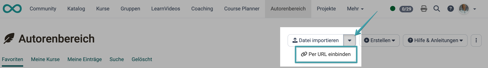
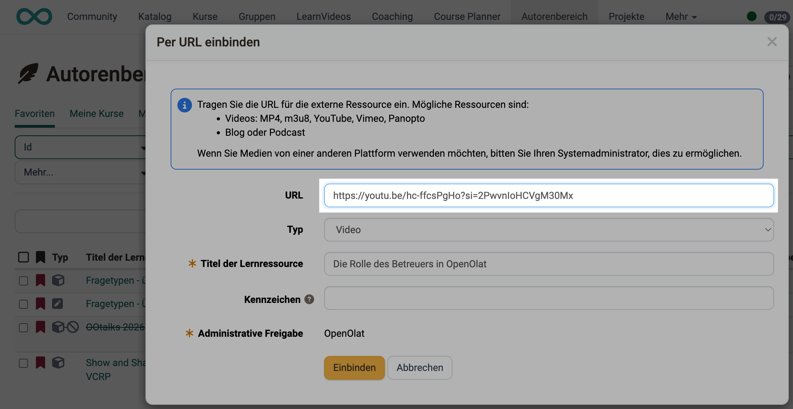

# Autorenbereich - Kurse und Lernressourcen erstellen {: #authoring_new_course}

## Neue OpenOlat Lernressourcen erstellen

Im Autorenbereich können die folgenden Lernressourcen erstellt werden:

{ class="shadow lightbox" }

Der konkrete Erstellungsprozess ist auf den folgenden Seiten beschrieben:

* Kurs erstellen  
[Handbuchartikel](../learningresources/Creating_Course.de.md) | [Ausführliche Anleitung](../../manual_how-to/my_first_course/my_first_course.de.md)

* Tests erstellen 
[Handbuchartikel](../learningresources/Test.de.md) | [Ausführliche Anleitung](../../manual_how-to/test_creation_procedure/test_creation_procedure.de.md)

* CP-Lerninhalt erstellen 
[Handbuchartikel](../learningresources/CP_Editor.de.md) | [Ausführliche Anleitung](../../manual_how-to/content_package/content_package.de.md)

* Wiki erstellen  
[Handbuchartikel](../learningresources/Wiki.de.md) | [Ausführliche Anleitung](../../manual_how-to/wikis/wikis.de.md)

* Podcast erstellen  
[Handbuchartikel](../learningresources/Podcast.de.md) | [Ausführliche Anleitung](../../manual_how-to/podcast/podcast.de.md)

* Blog erstellen 
[Handbuchartikel](../learningresources/Blog.de.md) | [Ausführliche Anleitung](../../manual_how-to/blog/blog.de.md)

* Ressourcenordner erstellen 
[Handbuchartikel](../learningresources/Resource_Folder.de.md) | [Ausführliche Anleitung](../../manual_how-to/multiple_use/multiple_use.de.md)

* Formulare erstellen  
[Handbuchartikel](../learningresources/Form.de.md)  | [Ausführliche Anleitung](../../manual_how-to/create_a_form/create_a_form.de.md)

* Vorbereitete bzw. vorstrukturierte Portfolio Vorlage erstellen 
[Handbuchartikel](../learningresources/Portfolio_template_Creation.de.md)

* Glossar erstellen 
[Handbuchartikel](../learningresources/Glossary.de.md)

!!! tip "Tipp"

    Wenn Sie Ihre Kurse systematisch aufbauen und Lernressourcen in mehreren Kursen verwenden wollen, empfiehlt es sich, die Lernressourcen im Autorenbereich statt in den Kursbausteinen der Kurse zu erstellen.

[Zum Seitenanfang ^](#authoring_new_course)

---

## Lernressourcen importieren

{ class="shadow lightbox" }

### Datei importieren
Lernressourcen, die ausserhalb von OpenOlat erstellt oder aus einem anderen OpenOlat-System exportiert wurden, können in OpenOlat importiert werden: vorausgesetzt, sie liegen in einem kompatiblen Format vor. Dabei lassen sich alle genannten Arten von Lernressourcen, Videos, bestimmte standardisierte Formate sowie beliebige Dateien importieren.

Wenn Sie beispielsweise einen Kurs aus einer anderen OpenOlat-Instanz importieren, werden Sie gefragt, ob auch die im Kurs verwendeten Lernressourcen (z. B. ein Wiki oder ein Test) mitimportiert werden sollen. Nach dem Import müssen Sie den Kurs veröffentlichen, damit er für Sie und andere OpenOlat-Benutzer:innen sichtbar ist.

Am Ende des Imports gelangen Sie zum Menü „Einstellungen“, in dem Sie weitere Konfigurationen vornehmen können: etwa die Lizenz des Kurses festlegen.

### Per URL einbinden [:octicons-tag-16:{ title="ab Release 13.2 (OO-3859)" }](https://track.frentix.com/issue/OO-3859)
Externe Medien lassen sich auch per URL einbinden, ohne die Datei nach OpenOlat hochzuladen. Öffnen Sie dazu im Autorenbereich das Auswahlmenü neben der Schaltfläche **Datei importieren** und wählen Sie **Per URL einbinden**.

{ class="shadow lightbox" }

OpenOlat erkennt anhand der URL automatisch den passenden Ressourcentyp und legt eine entsprechende Lernressource an, in der das Medium verlinkt ist. Bei Videos entsteht so eine [Lernressource Video](../learningresources/Learning_resource_Video.de.md); sämtliche Funktionen des OpenOlat Video-Editors stehen anschliessend zur Verfügung.

{ class="shadow lightbox" }

Unterstützt werden folgende Ressourcen:

* Videos: MP4, m3u8, YouTube, Vimeo, Panopto
* Blog oder Podcast

Medien von weiteren Plattformen können bei Bedarf durch die System-Administration freigeschaltet werden.

Der Dialog enthält folgende Felder:

| Feld | Beschreibung |
| ---- | ------------ |
| **URL** | Link zur externen Ressource. Nach der Eingabe ermittelt OpenOlat automatisch den Typ und, sofern verfügbar, den Titel des Mediums. |
| **Typ** | Der erkannte Ressourcentyp. Passen mehrere Typen zur URL, wählen Sie hier den gewünschten aus. |
| **Titel der Lernressource** | Pflichtfeld. Name der neuen Lernressource. Bei Videos wird der Titel aus der Quelle vorausgefüllt und kann angepasst werden. |
| **Kennzeichen** | Optionale externe Kennung, die in der Kursübersicht angezeigt wird. |
| **Administrative Freigabe** | Pflichtfeld. Organisation, der die Lernressource administrativ zugeordnet wird. |

Mit **Einbinden** wird die Lernressource erstellt.

[Zum Seitenanfang ^](#authoring_new_course)

---

## Weiterführende Informationen {: #further_information}

**Auf dieser Seite erwähnt** 
[Kurs erstellen >](../learningresources/Creating_Course.de.md) 
[Wie erstelle ich meinen ersten OpenOlat-Kurs? >](../../manual_how-to/my_first_course/my_first_course.de.md) 
[Tests erstellen >](../learningresources/Test.de.md) 
[Wie gehe ich vor, wenn ich einen Test erstelle? >](../../manual_how-to/test_creation_procedure/test_creation_procedure.de.md) 
[CP-Lerninhalt erstellen >](../learningresources/CP_Editor.de.md) 
[Wie erstelle ich ein Content Package? >](../../manual_how-to/content_package/content_package.de.md) 
[Wiki erstellen >](../learningresources/Wiki.de.md) 
[Wie erstelle ich ein Wiki? >](../../manual_how-to/wikis/wikis.de.md) 
[Podcast: Übersicht >](../learningresources/Podcast.de.md) 
[Wie erstelle ich einen Podcast? >](../../manual_how-to/podcast/podcast.de.md) 
[Blog: Übersicht >](../learningresources/Blog.de.md) 
[Wie erstelle ich einen Blog? >](../../manual_how-to/blog/blog.de.md) 
[Ressourcenordner >](../learningresources/Resource_Folder.de.md) 
[Wie kann ich dieselben Dateien in mehreren Kursen einsetzen? >](../../manual_how-to/multiple_use/multiple_use.de.md) 
[Formulare - Übersicht >](../learningresources/Form.de.md) 
[Wie erstelle ich eine Formular-Lernressource? >](../../manual_how-to/create_a_form/create_a_form.de.md) 
[Portfoliovorlage: Erstellung >](../learningresources/Portfolio_template_Creation.de.md) 
[Glossar >](../learningresources/Glossary.de.md) 
[Lernressource: Video >](../learningresources/Learning_resource_Video.de.md)

**youtube** 
[Voraussetzungen für Autoren](<https://www.youtube.com/embed/L0jc_LBKXLE>) 
[Funktionsprinzipien](<https://www.youtube.com/embed/M-JkSAFN298>) 
[Kurse erstellen und bearbeiten](<https://www.youtube.com/embed/SfOSyDG0qvE>) 
[Überblick Testing](<https://www.youtube.com/embed/fkqH41-8CaI>) 
[Wie funktionieren Tests in OpenOlat?](<https://www.youtube.com/embed/M0p3UKaEOlg>) 
[Kursbausteine konfigurieren](<https://www.youtube.com/embed/SAkzzoOQEoQ>) 
[Test-Lernressource erstellen](<https://www.youtube.com/embed/WUs-upCf2tQ>) 
[Fragen erstellen](<https://www.youtube.com/embed/2ZrINPQ6tYw>) 
[Tests erstellen/bearbeiten](<https://www.youtube.com/embed/eNNdDdQDlfs>)

[Zum Seitenanfang ^](#authoring_new_course)
