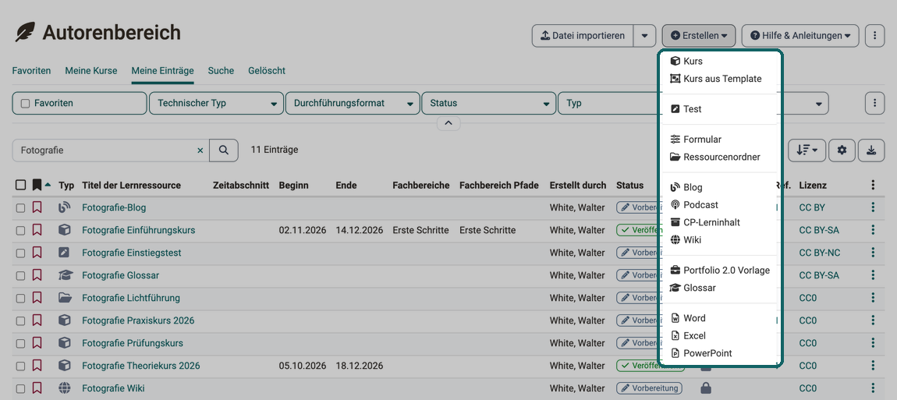
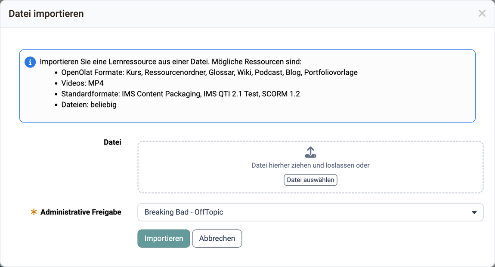
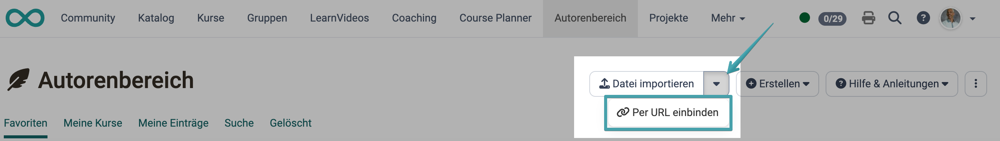
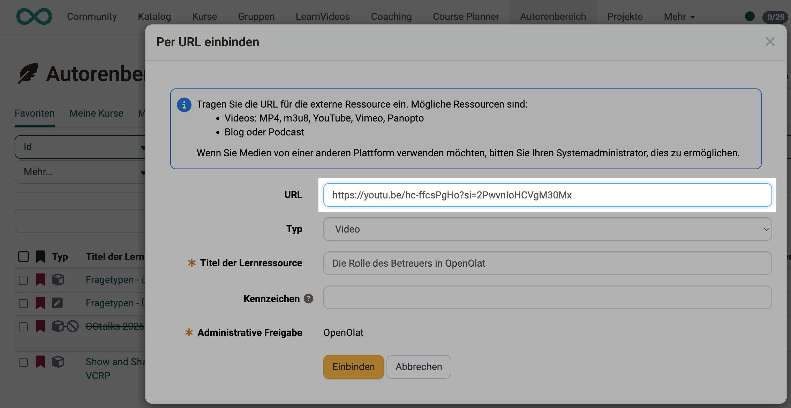

# Autorenbereich - Kurse und Lernressourcen erstellen {: #authoring_new_course}

## Neue OpenOlat Lernressourcen erstellen

Im Autorenbereich öffnet der Button "Erstellen" ein Menü mit den Lernressourcen, die Sie erstellen können:

{ class="shadow lightbox" title="Menü Erstellen im Autorenbereich · 2026.10.09" }

Einige Einträge zeigt das Menü nur, wenn die System-Administration die zugehörige Funktion eingeschaltet hat: Formular, Wiki und Portfolio 2.0 Vorlage über das jeweilige Modul, Word, Excel und PowerPoint über einen [Dokumenteneditor](../../manual_admin/administration/External_Tools_-_Administration.de.md#dokumenteneditoren).

Die Buttons "Erstellen" und "Datei importieren" sehen Autor:innen, Lernressourcenverwalter:innen und Administrator:innen.

Der konkrete Erstellungsprozess ist auf den folgenden Seiten beschrieben:

* Kurs erstellen  
[Handbuchartikel](../learningresources/Creating_Course.de.md) | [Ausführliche Anleitung](../../manual_how-to/my_first_course/my_first_course.de.md)

* Kurs aus Template erstellen [:octicons-tag-16:{ title="ab Release 20.2 (OO-8897)" }](https://track.frentix.com/issue/OO-8897){:target="_blank"} 
[Handbuchartikel](../learningresources/Creating_Course.de.md#purpose)

* Tests erstellen 
[Handbuchartikel](../learningresources/Test.de.md) | [Ausführliche Anleitung](../../manual_how-to/test_creation_procedure/test_creation_procedure.de.md)

* Formulare erstellen  
[Handbuchartikel](../learningresources/Form.de.md)  | [Ausführliche Anleitung](../../manual_how-to/create_a_form/create_a_form.de.md)

* Ressourcenordner erstellen 
[Handbuchartikel](../learningresources/Resource_Folder.de.md) | [Ausführliche Anleitung](../../manual_how-to/multiple_use/multiple_use.de.md)

* Blog erstellen 
[Handbuchartikel](../learningresources/Blog.de.md) | [Ausführliche Anleitung](../../manual_how-to/blog/blog.de.md)

* Podcast erstellen  
[Handbuchartikel](../learningresources/Podcast.de.md) | [Ausführliche Anleitung](../../manual_how-to/podcast/podcast.de.md)

* CP-Lerninhalt erstellen 
[Handbuchartikel](../learningresources/CP_Editor.de.md) | [Ausführliche Anleitung](../../manual_how-to/content_package/content_package.de.md)

* Wiki erstellen  
[Handbuchartikel](../learningresources/Wiki.de.md) | [Ausführliche Anleitung](../../manual_how-to/wikis/wikis.de.md)

* Portfolio 2.0 Vorlage erstellen 
[Handbuchartikel](../learningresources/Portfolio_template_Creation.de.md)

* Glossar erstellen 
[Handbuchartikel](../learningresources/Glossary.de.md)

* Word-, Excel- und PowerPoint-Dateien erstellen 
[Handbuchartikel](../learningresources/index.de.md#further_learningresources)

!!! tip "Tipp"

    Wenn Sie Ihre Kurse systematisch aufbauen und Lernressourcen in mehreren Kursen verwenden wollen, empfiehlt es sich, die Lernressourcen im Autorenbereich statt in den Kursbausteinen der Kurse zu erstellen.

[Zum Seitenanfang ^](#authoring_new_course)

---

## Lernressourcen importieren

{ class="shadow lightbox" title="Dialog Datei importieren · 2026.10.09" }

### Datei importieren
Lernressourcen, die ausserhalb von OpenOlat erstellt oder aus einem anderen OpenOlat-System exportiert wurden, können in OpenOlat importiert werden: vorausgesetzt, sie liegen in einem kompatiblen Format vor. Importieren lassen sich aus OpenOlat exportierte Lernressourcen, Videos im Format MP4, die Standardformate IMS Content Packaging, IMS QTI 2.1 Test und SCORM 1.2 sowie beliebige Dateien.

Im Dialog "Datei importieren" laden Sie die Datei im Feld "Datei" hoch und wählen unter "Administrative Freigabe" die Organisation, der die Lernressource zugeordnet wird. Nach dem Hochladen zeigt der Dialog den erkannten Typ und das Feld "Titel der Lernressource" mit dem Titel aus der Datei, den Sie anpassen können.

Verwendet die importierte Lernressource weitere Lernressourcen, zum Beispiel ein Kurs mit einem Wiki oder einem Test, zeigt der Dialog zusätzlich "Referenzierte Ressourcen". Die Option "importieren und verknüpfen" ist vorausgewählt: OpenOlat importiert die verwendeten Lernressourcen mit und verknüpft sie. Nach dem Import eines Kurses publizieren Sie ihn im Kurseditor, damit seine Inhalte für Sie und andere OpenOlat-Benutzer:innen sichtbar sind.

Am Ende des Imports öffnet OpenOlat die Einstellungen der Lernressource auf dem [Tab "Metadaten"](../learningresources/Course_Settings_Metadata.de.md). Dort prüfen Sie Titel und Kennzeichen und nehmen weitere Konfigurationen vor, etwa die Lizenz.

### Per URL einbinden [:octicons-tag-16:{ title="ab Release 13.2 (OO-3859)" }](https://track.frentix.com/issue/OO-3859)
Externe Medien lassen sich auch per URL einbinden, ohne die Datei nach OpenOlat hochzuladen. Öffnen Sie dazu im Autorenbereich das Auswahlmenü neben dem Button "Datei importieren" und wählen Sie "Per URL einbinden".

{ class="shadow lightbox" title="Auswahlmenü im Autorenbereich" }

OpenOlat erkennt anhand der URL automatisch den passenden Ressourcentyp und legt eine entsprechende Lernressource an, in der das Medium verlinkt ist. Bei Videos entsteht so eine [Lernressource Video](../learningresources/Learning_resource_Video.de.md); sämtliche Funktionen des OpenOlat Video-Editors stehen anschliessend zur Verfügung.

{ class="shadow lightbox" title="Dialog Per URL einbinden" }

Unterstützt werden folgende Ressourcen:

* Videos: MP4, m3u8, YouTube, Vimeo, Panopto
* Blog oder Podcast

Medien von weiteren Plattformen gibt die System-Administration bei Bedarf als Medien-Server frei, unter: 
`Administration > Login > Sicherheit > Tab "Medien-Server"` 
Mehr dazu unter [Sicherheit](../../manual_admin/administration/Login_Security.de.md#tab_mediaserver).

Der Dialog enthält folgende Felder:

| Feld | Beschreibung |
| ---- | ------------ |
| **URL** | Link zur externen Ressource. Nach der Eingabe ermittelt OpenOlat automatisch den Typ und, sofern verfügbar, den Titel des Mediums. |
| **Typ** | Der erkannte Ressourcentyp. Passen mehrere Typen zur URL, wählen Sie hier den gewünschten aus. |
| **Titel der Lernressource** | Pflichtfeld. Name der neuen Lernressource. Bei Videos wird der Titel aus der Quelle vorausgefüllt und kann angepasst werden. |
| **Kennzeichen** | Optionale externe Kennung, die in der Kursübersicht angezeigt wird, siehe [Kennzeichen](../learningresources/Course_Settings_Metadata.de.md#externalref). |
| **Administrative Freigabe** | Pflichtfeld. Organisation, der die Lernressource administrativ zugeordnet wird. |

Mit "Einbinden" erstellen Sie die Lernressource.

[Zum Seitenanfang ^](#authoring_new_course)

---

## Weiterführende Informationen {: #further_information}

**Auf dieser Seite erwähnt** 
[Externe Werkzeuge: Übersicht >](../../manual_admin/administration/External_Tools_-_Administration.de.md) 
[Kurs erstellen >](../learningresources/Creating_Course.de.md) 
[Wie erstelle ich meinen ersten OpenOlat-Kurs? >](../../manual_how-to/my_first_course/my_first_course.de.md) 
[Tests erstellen >](../learningresources/Test.de.md) 
[Wie gehe ich vor, wenn ich einen Test erstelle? >](../../manual_how-to/test_creation_procedure/test_creation_procedure.de.md) 
[Formulare - Übersicht >](../learningresources/Form.de.md) 
[Wie erstelle ich eine Formular-Lernressource? >](../../manual_how-to/create_a_form/create_a_form.de.md) 
[Ressourcenordner >](../learningresources/Resource_Folder.de.md) 
[Wie kann ich dieselben Dateien in mehreren Kursen einsetzen? >](../../manual_how-to/multiple_use/multiple_use.de.md) 
[Blog: Übersicht >](../learningresources/Blog.de.md) 
[Wie erstelle ich einen Blog? >](../../manual_how-to/blog/blog.de.md) 
[Podcast: Übersicht >](../learningresources/Podcast.de.md) 
[Wie erstelle ich einen Podcast? >](../../manual_how-to/podcast/podcast.de.md) 
[CP-Lerninhalt erstellen >](../learningresources/CP_Editor.de.md) 
[Wie erstelle ich ein Content Package? >](../../manual_how-to/content_package/content_package.de.md) 
[Wiki erstellen >](../learningresources/Wiki.de.md) 
[Wie erstelle ich ein Wiki? >](../../manual_how-to/wikis/wikis.de.md) 
[Portfoliovorlage: Erstellung >](../learningresources/Portfolio_template_Creation.de.md) 
[Glossar >](../learningresources/Glossary.de.md) 
[Lernressourcen >](../learningresources/index.de.md) 
[Kurseinstellungen - Tab Metadaten >](../learningresources/Course_Settings_Metadata.de.md) 
[Lernressource: Video >](../learningresources/Learning_resource_Video.de.md) 
[Sicherheit >](../../manual_admin/administration/Login_Security.de.md)

**Weiterführend** 
[Autorenbereich - Übersicht >](../area_modules/Authoring.de.md) 
[Kurseinstellungen >](../learningresources/Course_Settings.de.md)

**youtube** 
[Voraussetzungen für Autoren](<https://www.youtube.com/embed/L0jc_LBKXLE>) 
[Funktionsprinzipien](<https://www.youtube.com/embed/M-JkSAFN298>) 
[Kurse erstellen und bearbeiten](<https://www.youtube.com/embed/SfOSyDG0qvE>) 
[Überblick Testing](<https://www.youtube.com/embed/fkqH41-8CaI>) 
[Wie funktionieren Tests in OpenOlat?](<https://www.youtube.com/embed/M0p3UKaEOlg>) 
[Kursbausteine konfigurieren](<https://www.youtube.com/embed/SAkzzoOQEoQ>) 
[Test-Lernressource erstellen](<https://www.youtube.com/embed/WUs-upCf2tQ>) 
[Fragen erstellen](<https://www.youtube.com/embed/2ZrINPQ6tYw>) 
[Tests erstellen/bearbeiten](<https://www.youtube.com/embed/eNNdDdQDlfs>)

[Zum Seitenanfang ^](#authoring_new_course)
