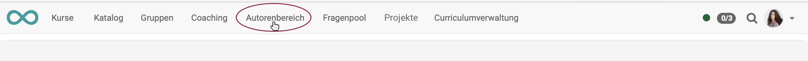

{ class="shadow lightbox" }

# Autorenbereich - Kurse und Lernressourcen erstellen

##  Neue OpenOlat Lernressourcen erstellen

Im Autorenbereich können die folgenden Lernressourcen erstellt werden:

{ class="shadow lightbox" }

Der konkrete Erstellungsprozess ist auf den folgenden Seiten beschrieben:

* Kurs erstellen  
[Ausführliche Anleitung](../../manual_how-to/my_first_course/my_first_course.de.md)

* Tests erstellen 
[Ausführliche Anleitung](../../manual_how-to/test_creation_procedure/test_creation_procedure.de.md)

* CP-Lerninhalt erstellen 
[Handbuchartikel](../learningresources/CP_Editor.de.md) | [Ausführliche Anleitung](../../manual_how-to/content_package/content_package.de.md)

* Wiki erstellen  
[Handbuchartikel](../learningresources/Wiki.de.md) | [Ausführliche Anleitung](../../manual_how-to/wikis/wikis.de.md)

* Podcast erstellen  
[Handbuchartikel](../learningresources/Podcast.de.md) | [Ausführliche Anleitung](../../manual_how-to/podcast/podcast.de.md)

* Blog erstellen 
[Handbuchartikel](../learningresources/Blog.de.md) | [Ausführliche Anleitung](../../manual_how-to/blog/blog.de.md)

* Ressourcenordner erstellen

* Formulare erstellen  
[Handbuchartikel](../learningresources/Form.de.md)  | [Ausführliche Anleitung](../../manual_how-to/create_a_form/create_a_form.de.md)

* Portfolio erstellen 
[Handbuchartikel](../learningresources/Portfolio_template_Creation.de.md) 

* Glossar erstellen 
[Handbuchartikel](../learningresources/Glossary.de.md) 

!!! tip "Tipp"

    Wenn Sie Ihre Kurse systematisch aufbauen und Lernressourcen in mehreren Kursen verwenden wollen, empfiehlt es sich, die Lernressourcen im Autorenbereich statt in den Kursbausteinen der Kurse zu erstellen.

---

##  Lernressourcen importieren

Ausserhalb von OpenOlat erstellte oder aus einem OpenOlat System exportierte Lernressourcen können in OpenOlat importiert werden, wenn Sie in einem für OpenOlat kompatiblen Format vorliegen.

Mit "Importieren URL" können auch Links zu externen Videos z.B. in YouTube gesetzt und als OpenOlat [Lernressource
Video](../learningresources/Learning_resource_Video.de.md) angelegt werden.

{ class="shadow lightbox" }

Wenn Sie einen Kurs z.B. aus einer anderen OpenOlat Instanz importieren möchten, werden Sie gefragt, ob Sie die vom Kurs referenzierten Lernressourcen (z.B. ein Wiki oder einen Test) ebenfalls importieren möchten. 

Markieren Sie die entsprechende Checkbox, wenn Sie die referenzierten Lernressourcen ebenfalls importieren möchten. Publizieren Sie den importierten Kurs im Anschluss, um ihn für Sie und andere OpenOlat-Benutzer sichtbar zu machen.

Am Ende des Imports erscheint das Menü „Einstellungen“, wo Sie weitere Konfigurationen vornehmen können, z.B. eine Definition der Lizenz.

---

##  Lizenzen

Ist eine Lernressource importiert oder erstellt, kann in den Metadaten ein Lizenztyp und ein Lizenzgeber zugeordnet werden.

  
In der Übersicht des Autorenbereichs werden die zugeordneten Lizenzen in der
Spalte «Lizenz» angezeigt werden. Mit Klick auf die Lizenz erhalten Sie detaillierte Informationen zur jeweiligen Lizenz.

---

##  Links

!!! info "Ausführliche Anleitung zur Kurserstellung"

    Eine ausführliche Schritt-für-Schritt-Anleitung zum Erstellen eines Kurses finden Sie hier [„hier"](../../manual_how-to/my_first_course/my_first_course.de.md).

:octicons-device-camera-video-24: **Video-Einführung**: [Voraussetzungen für Autoren](<https://www.youtube.com/embed/L0jc_LBKXLE>){:target="_blank”}

:octicons-device-camera-video-24: **Video-Einführung**: [Funktionsprinzipien](<https://www.youtube.com/embed/M-JkSAFN298>){:target="_blank”}

:octicons-device-camera-video-24: **Video-Einführung**: [Kurse erstellen und bearbeiten](<https://www.youtube.com/embed/SfOSyDG0qvE>){:target="_blank”}

:octicons-device-camera-video-24: **Video-Einführung**: [Überblick Testing](<https://www.youtube.com/embed/fkqH41-8CaI>){:target="_blank”}

:octicons-device-camera-video-24: **Video-Einführung**: [Wie funktionieren Tests in OpenOlat?](<https://www.youtube.com/embed/M0p3UKaEOlg>){:target="_blank”}

:octicons-device-camera-video-24: **Video-Einführung**: [Kursbausteine konfigurieren](<https://www.youtube.com/embed/SAkzzoOQEoQ>){:target="_blank”}

:octicons-device-camera-video-24: **Video-Einführung**: [Test-Lernressource erstellen](<https://www.youtube.com/embed/WUs-upCf2tQ>){:target="_blank”}

:octicons-device-camera-video-24: **Video-Einführung**: [Fragen erstellen](<https://www.youtube.com/embed/2ZrINPQ6tYw>){:target="_blank”}

:octicons-device-camera-video-24: **Video-Einführung**: [Tests erstellen/bearbeiten](<https://www.youtube.com/embed/eNNdDdQDlfs>){:target="_blank”}

:octicons-device-camera-video-24: **Video-Einführung**: [Kursbausteine konfigurieren](<https://www.youtube.com/embed/SAkzzoOQEoQ>){:target="_blank”}

