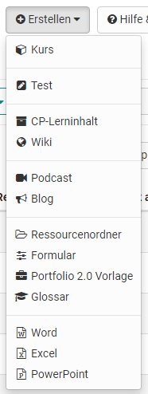

{ class="shadow lightbox" }

# Autorenbereich - Kurse und Lernressourcen erstellen

##  OpenOlat Lernressourcen erstellen und importieren

Im Autorenbereich können die folgenden Lernressourcen erstellt
werden. 

Darüber hinaus können Lernressourcen und weitere Dateien importiert
werden, sowie URLs importiert werden.

Jede Lernressource kann im Bereich "Einstellungen" der Administration weiter
konfiguriert werden. Beispielsweise können hier Beschreibungen und Metadaten hinterlegt sowie die Freigabe der Lernressource definiert werden. Je nach Lernressource sind auch weitere Konfigurationen möglich. 

In den folgenden Kapiteln finden Sie Erläuterungen zu den einzelnen [OpenOlat Lernressourcen](Various_Types_of_Learning_Resources.de.md), welche Aktionen
sie im Autorenbereich vornehmen können, und Informationen zur [Infoseite](Set_up_info_page.de.md) einer Lernressource.

!!! info "Kurserstellung"

    Eine ausführliche Schritt-für-Schritt-Anleitung zum Erstellen eines Kurses finden Sie hier [„hier"](../../manual_how-to/my_first_course/my_first_course.de.md).