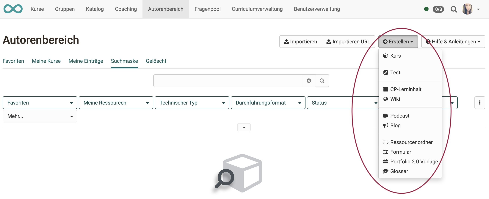
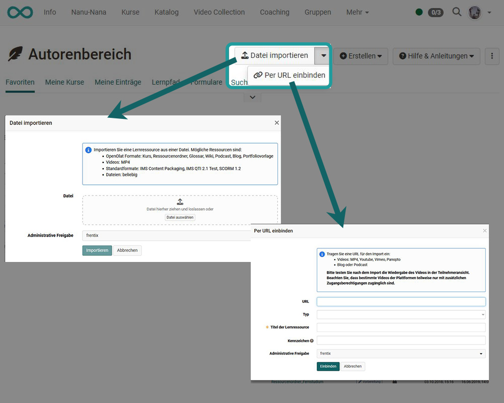
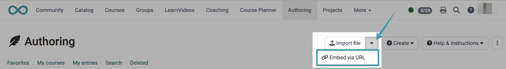
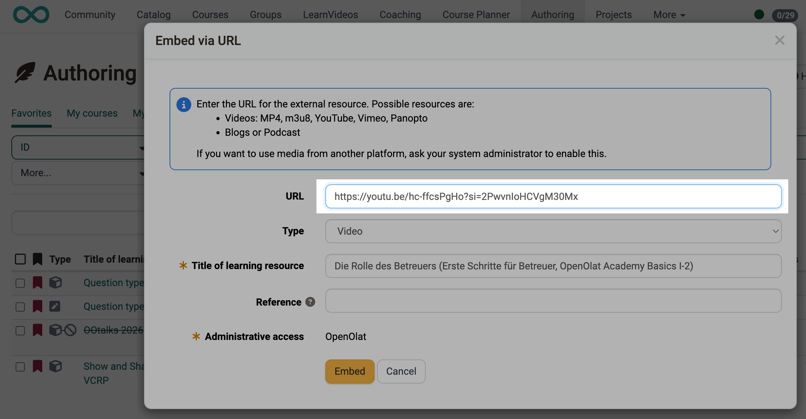

# Authoring - Create courses and learning resources {: #authoring_new_course}

## Create new OpenOlat learning resources

The following learning resources can be created in Authoring:

{ class="shadow lightbox" }

The specific creation process is described on the following pages:

* Creating courses  
[User manual article](../learningresources/Creating_Course.md) | [Detailed instructions](../../manual_how-to/my_first_course/my_first_course.md)

* Creating tests 
[User manual article](../learningresources/Test.md) | [Detailed instructions](../../manual_how-to/test_creation_procedure/test_creation_procedure.md)

* Creating CP learning content 
[User manual article](../learningresources/CP_Editor.md) | [Detailed instructions](../../manual_how-to/content_package/content_package.md)

* Creating wikis  
[User manual article](../learningresources/Wiki.md) | [Detailed instructions](../../manual_how-to/wikis/wikis.md)

* Creating podcasts  
[User manual article](../learningresources/Podcast.md) | [Detailed instructions](../../manual_how-to/podcast/podcast.md)

* Creating blogs 
[User manual article](../learningresources/Blog.md) | [Detailed instructions](../../manual_how-to/blog/blog.md)

* Creating resource folders 
[User manual article](../learningresources/Resource_Folder.md) | [Detailed instructions](../../manual_how-to/multiple_use/multiple_use.md)

* Creating forms  
[User manual article](../learningresources/Form.md)  | [Detailed instructions](../../manual_how-to/create_a_form/create_a_form.md)

* Create a prepared or pre-structured portfolio template 
[User manual article](../learningresources/Portfolio_template_Creation.md)

* Creating glossaries 
[User manual article](../learningresources/Glossary.md)

!!! tip "Tip"

    If you want to build your courses systematically and use learning resources in multiple courses, it is recommended to create the learning resources in Authoring instead of in the course elements of the courses.

[To the top of the page ^](#authoring_new_course)

---

## Import learning resources

{ class="shadow lightbox" }

### Import file
Learning resources created outside OpenOlat or exported from another OpenOlat system can be imported into OpenOlat, provided they are in a compatible format. All of the mentioned types of learning resources, videos, certain standardized formats and any files can be imported.

If you import a course from another OpenOlat instance, for example, you will be asked whether the learning resources used in the course (e.g. a wiki or a test) should also be imported. After the import, you must publish the course so that it is visible to you and other OpenOlat users.

At the end of the import, you reach the "Settings" menu, where you can make further configurations, for example define the licence of the course.

### Embed via URL [:octicons-tag-16:{ title="from Release 13.2 (OO-3859)" }](https://track.frentix.com/issue/OO-3859)
External media can also be embedded via URL without uploading the file to OpenOlat. To do so, open the selection menu next to the **Import file** button in Authoring and select **Embed via URL**.

{ class="shadow lightbox" }

Based on the URL, OpenOlat automatically detects the appropriate resource type and creates a corresponding learning resource in which the medium is linked. For videos, this creates a [Learning resource video](../learningresources/Learning_resource_Video.md); all functions of the OpenOlat video editor are then available.

{ class="shadow lightbox" }

The following resources are supported:

* Videos: MP4, m3u8, YouTube, Vimeo, Panopto
* Blog or Podcast

Media from additional platforms can be enabled by the system administration if required.

The dialog contains the following fields:

| Field | Description |
| ----- | ----------- |
| **URL** | Link to the external resource. After entering it, OpenOlat automatically determines the type and, if available, the title of the medium. |
| **Type** | The detected resource type. If several types match the URL, select the desired one here. |
| **Title of learning resource** | Mandatory field. Name of the new learning resource. For videos, the title is prefilled from the source and can be adjusted. |
| **Reference** | Optional external identifier, displayed on the course overview page. |
| **Administrative access** | Mandatory field. Organisation to which the learning resource is administratively assigned. |

Click **Embed** to create the learning resource.

[To the top of the page ^](#authoring_new_course)

---

## Further information {: #further_information}

**Mentioned on this page** 
[Creating Courses >](../learningresources/Creating_Course.md) 
[How do I create my first OpenOlat course? >](../../manual_how-to/my_first_course/my_first_course.md) 
[Creating Tests >](../learningresources/Test.md) 
[How do I proceed when I create a test? >](../../manual_how-to/test_creation_procedure/test_creation_procedure.md) 
[CP Editor >](../learningresources/CP_Editor.md) 
[How do I create a content package? >](../../manual_how-to/content_package/content_package.md) 
[Creating Wikis >](../learningresources/Wiki.md) 
[How do I create a wiki? >](../../manual_how-to/wikis/wikis.md) 
[Podcast: Overview >](../learningresources/Podcast.md) 
[How do I create a podcast? >](../../manual_how-to/podcast/podcast.md) 
[Blog: Overview >](../learningresources/Blog.md) 
[How do I create a blog? >](../../manual_how-to/blog/blog.md) 
[Resource folder >](../learningresources/Resource_Folder.md) 
[How can I use the same files in several courses? >](../../manual_how-to/multiple_use/multiple_use.md) 
[Forms - Overview >](../learningresources/Form.md) 
[How do I create a form learning resource? >](../../manual_how-to/create_a_form/create_a_form.md) 
[Portfolio template: Creation >](../learningresources/Portfolio_template_Creation.md) 
[Glossary >](../learningresources/Glossary.md) 
[Learning resource: Video >](../learningresources/Learning_resource_Video.md)

**youtube** 
[Voraussetzungen für Autoren](<https://www.youtube.com/embed/L0jc_LBKXLE>) 
[Funktionsprinzipien](<https://www.youtube.com/embed/M-JkSAFN298>) 
[Kurse erstellen und bearbeiten](<https://www.youtube.com/embed/SfOSyDG0qvE>) 
[Überblick Testing](<https://www.youtube.com/embed/fkqH41-8CaI>) 
[Wie funktionieren Tests in OpenOlat?](<https://www.youtube.com/embed/M0p3UKaEOlg>) 
[Kursbausteine konfigurieren](<https://www.youtube.com/embed/SAkzzoOQEoQ>) 
[Test-Lernressource erstellen](<https://www.youtube.com/embed/WUs-upCf2tQ>) 
[Fragen erstellen](<https://www.youtube.com/embed/2ZrINPQ6tYw>) 
[Tests erstellen/bearbeiten](<https://www.youtube.com/embed/eNNdDdQDlfs>)

[To the top of the page ^](#authoring_new_course)
