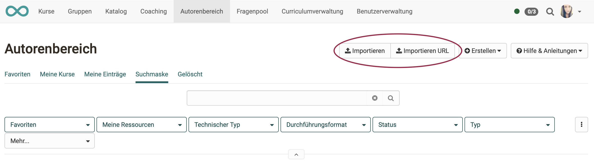
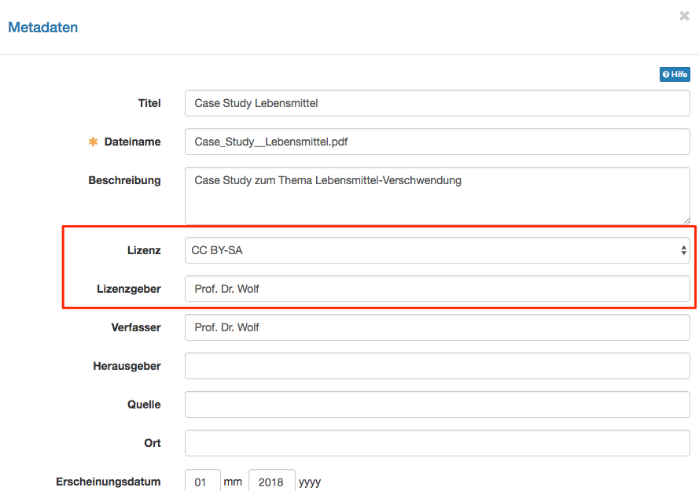
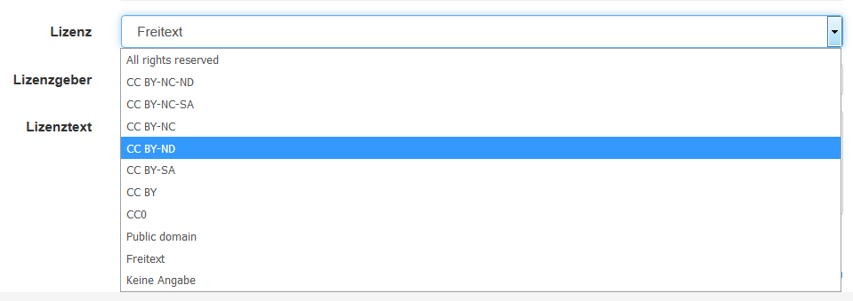

# Authoring - Create courses and learning resources

##  Create new OpenOlat learning resources

The following learning resources can be created in authoring:

{ class="shadow lightbox" }

The specific creation process is described on the following pages:

* Creating courses  
[User manual article](../learningresources/Creating_Course.de.md) | [Detailed instructions](../../manual_how-to/my_first_course/my_first_course.md)

* Creating tests 
[User manual article](../learningresources/Test.de.md) | [Detailed instructions](../../manual_how-to/test_creation_procedure/test_creation_procedure.de.md)

* Creating CP learning content 
[User manual article](../learningresources/CP_Editor.de.md) | [Detailed instructions](../../manual_how-to/content_package/content_package.de.md)

* Creating wikis  
[User manual article](../learningresources/Wiki.de.md) | [Detailed instructions](../../manual_how-to/wikis/wikis.de.md)

* Creating podcasts  
[User manual article](../learningresources/Podcast.de.md) | [Detailed instructions](../../manual_how-to/podcast/podcast.de.md)

* Creating blogs 
[User manual article](../learningresources/Blog.de.md) | [Detailed instructions](../../manual_how-to/blog/blog.de.md)

* Creating resource folders

* Creating forms  
[User manual article](../learningresources/Form.de.md)  | [Detailed instructions](../../manual_how-to/create_a_form/create_a_form.de.md)

* Creating portfolios 
[User manual article](../learningresources/Portfolio_template_Creation.de.md) 

* Creating glossaries 
[User manual article](../learningresources/Glossary.de.md) 

!!! tip "Hint"

    If you want to build your courses systematically and use learning resources in multiple courses, it is recommended to create learning resources in "authoring" instead of using course elements in a specific course.

---

##  Import learning resources

Learning resources created outside OpenOlat or exported from an OpenOlat system can be imported into OpenOlat if they are in a format compatible with OpenOlat.
Possible types are explained in ["Different types of learning resources"](../learningresources/index.md).

With "Import URL", links to external videos, e.g. on YouTube, can also be set and created as OpenOlat [learning resource video](../learningresources/Learning_resource_Video.de.md).

{ class="shadow lightbox" }

If you want to import a course e.g. from another OpenOlat instance, you will be asked if you also want to import the learning resources referenced by the course (e.g. a wiki or a test).

Select the corresponding checkbox if you want to import the referenced learning resources as well. Publish the imported course afterwards to make it visible for you and other OpenOlat users.

At the end of the import, the "settings" menu appears. Here you can make further configurations, e.g. a definition of the licence.

---

##  Licences

Once a learning resource has been imported or created, a licence type and licensor can be assigned in the metadata.

In the authoring overview, the assigned licences are shown in the column "Licence". Click on the licence to obtain detailed information on the respective licence.

---

##  Links

!!! info "Detailed course creation guide"

    You can find detailed step-by-step instructions on how to create a course ["here"](../../manual_how-to/my_first_course/my_first_course.md).

:octicons-device-camera-video-24: **Video Introduction (German)**: [Requirements for authors](<https://www.youtube.com/embed/L0jc_LBKXLE>){:target="_blank”}

:octicons-device-camera-video-24: **Video Introduction (German)**: [Operating principles](<https://www.youtube.com/embed/M-JkSAFN298>){:target="_blank”}

:octicons-device-camera-video-24: **Video Introduction (German)**: [Creating and editing courses](<https://www.youtube.com/embed/SfOSyDG0qvE>){:target="_blank”}

:octicons-device-camera-video-24: **Video Introduction (German)**: [Testing overview](<https://www.youtube.com/embed/fkqH41-8CaI>){:target="_blank”}

:octicons-device-camera-video-24: **Video Introduction (German)**: [How do tests work in OpenOlat?](<https://www.youtube.com/embed/M0p3UKaEOlg>){:target="_blank”}

:octicons-device-camera-video-24: **Video Introduction (German)**: [Configuring course elements](<https://www.youtube.com/embed/SAkzzoOQEoQ>){:target="_blank”}

:octicons-device-camera-video-24: **Video Introduction (German)**: [Creating a test learning resource](<https://www.youtube.com/embed/WUs-upCf2tQ>){:target="_blank”}

:octicons-device-camera-video-24: **Video Introduction (German)**: [Creating questions](<https://www.youtube.com/embed/2ZrINPQ6tYw>){:target="_blank”}

:octicons-device-camera-video-24: **Video Introduction (German)**: [Creating and editing tests](<https://www.youtube.com/embed/eNNdDdQDlfs>){:target="_blank”}

:octicons-device-camera-video-24: **Video Introduction (German)**: [Configuring course elements](<https://www.youtube.com/embed/SAkzzoOQEoQ>){:target="_blank”}
