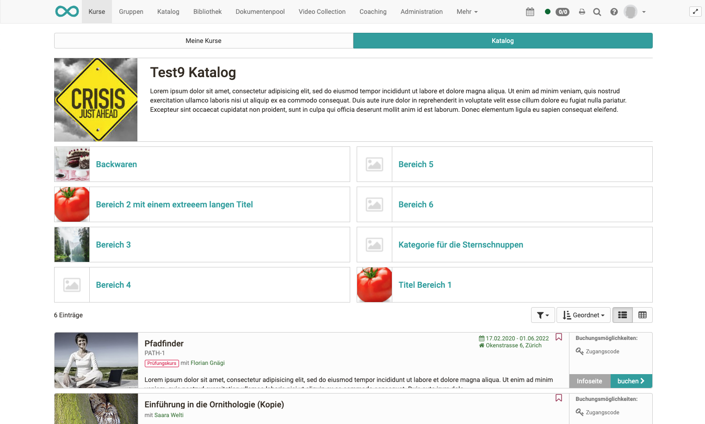
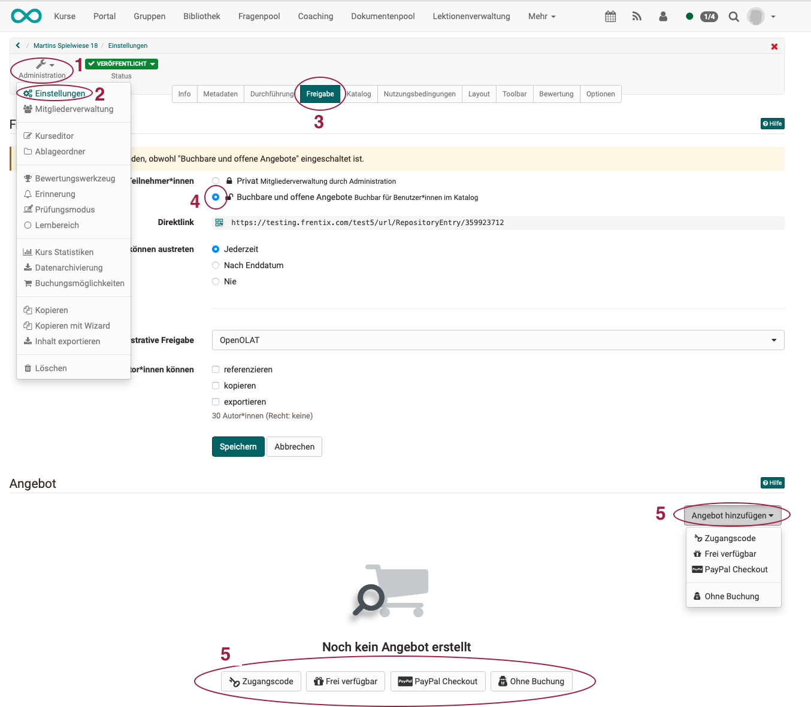
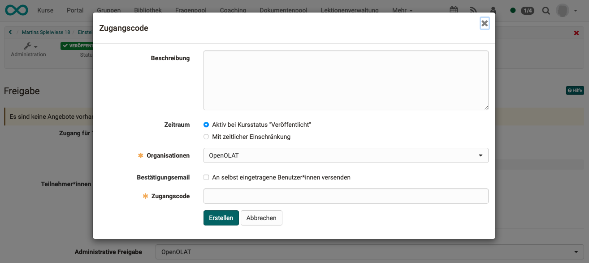
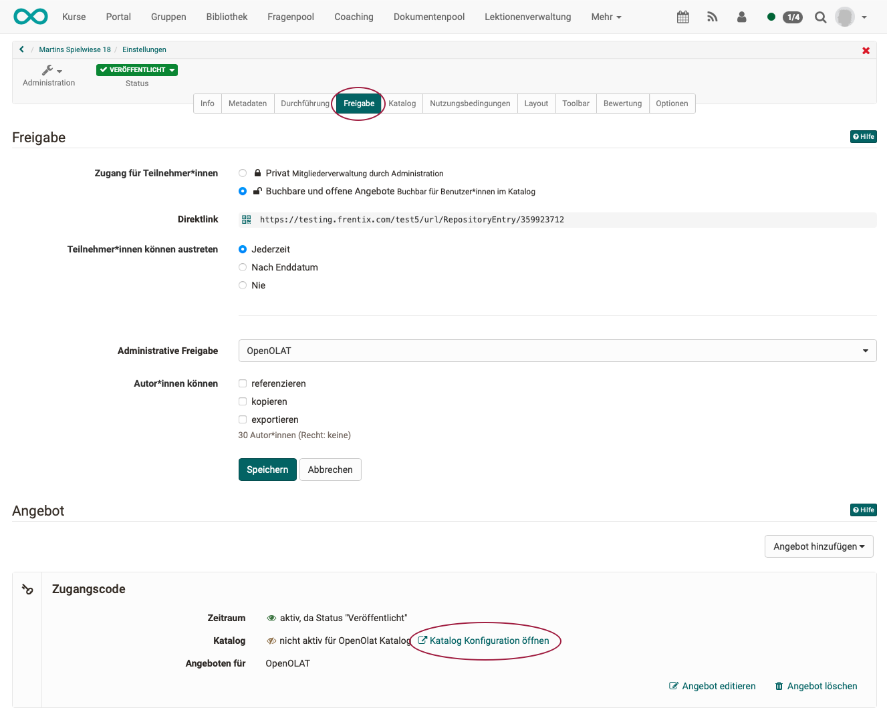
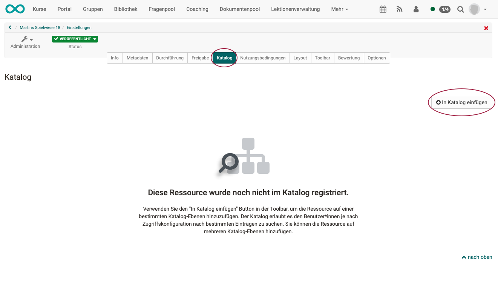
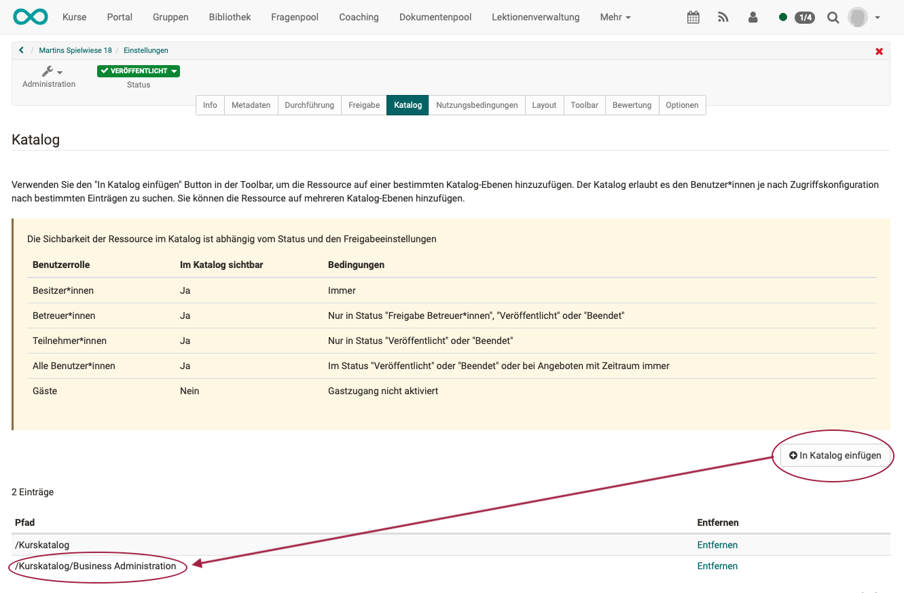
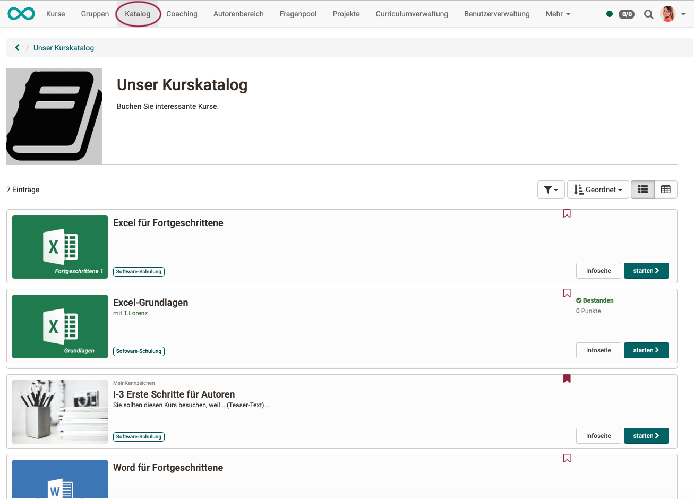

# Katalog 1.0

:octicons-device-camera-video-24: **Video-Einführung**: [Katalog](<https://www.youtube.com/embed/LiqkkT06hWo>){:target="_blank”}

:octicons-device-camera-video-24: **Video-Einführung**: [Kurs in Katalog eintragen](<https://www.youtube.com/embed/hc5yJAPIX9s>){:target="_blank”}

## Funktionsweise

Der Katalog 1.0 kann von einem Administrator oder Katalogverwalter eingerichtet werden, so dass die Autoren Kurse und andere
Lernressourcen sinnvoll in den Katalog einsortieren können. Die Reihenfolge
der Katalogeinträge kann vom Administrator bzw. Katalogverwalter definiert
werden.

Verwenden Sie die Suchmaske, wenn Sie den gewünschten Kurs im Katalog nicht
finden. Möglicherweise hat der Besitzer den Kurs noch nicht in den Katalog
eingetragen.

In den Katalog können nur Kurse und Lernressourcen vom Lehrenden eingetragen
werden, die auch für die Lerner frei geschaltet sind. Die Sichtbarkeit im
Katalog ist abhängig vom Publikationsstatus und den Freigabeeinstellungen der
Lernressource:

Benutzerrolle| Freigabeeinstellung| Publikationsstatus  
---|---|---  
Besitzer der Lernressource| Privat, Buchbar, Offen| immer sichtbar  
Betreuer der Lernressource| Privat, Buchbar, Offen|  "Freigabe Betreuer", "Veröffentlicht" oder "Beendet"  
Teilnehmer der Lernressource| Privat, Buchbar, Offen| "Veröffentlicht" oder "Beendet"  
Alle OpenOlat Benutzer| Buchbar, Offen| "Veröffentlicht" oder "Beendet"  
Gäste| Offen & Gastzugang aktiviert| "Veröffentlicht" oder "Beendet"  

## Angebote im Katalog 1.0

Im Katalog 1.0 werden alle Angebote in den Kursen erstellt (**Administration > Einstellungen > Tab Freigabe**) und dann in der **Katalogverwaltung** zusammengestellt.

!!! hint "Voraussetzung für ein Angebot"

    Damit Sie ein Angebot erstellen können, muss als Buchungsmethode die Option "Buchbare und offene Angebote" gewählt werden. 
    (**Administration > Einstellungen > Tab Freigabe**)
    
    { class="shadow lightbox" }

    Bei der Wahl "**Privat**" werden die Teilnehmenden durch die Besitzer bzw. Personen, die über das Recht der Mitgliederverwaltung verfügen, eingetragen. Was privat ist, soll auch nicht im Katalog veröffentlicht werden.

    Bei Wahl der Option "**Buchbare und offene Angebote**" können die Lernenden einen Kurs/Lernressource selbst buchen, müssen aber eventuell (je nach Einstellung) ein Passwort eingeben.

    Nur wenn die zweite Option "Buchbare und offene Angebote“ gewählt wird, können Sie anschliessend Angebote erstellen.

{ class="shadow lightbox" }

**Wählen Sie einen Angebotstyp** und öffnen Sie dadurch das Popup zum Erstellen eines neuen Angebots. 
Mit Klick auf den **Button "Erstellen"** wird das neue Angebot erstellt.

{ class="shadow lightbox" }

Klicken Sie im Angebot auf "**Katalog Konfiguration öffnen**". Sie springen damit direkt vom Tab "Freigabe" in den Tab "Katalog".

{ class="shadow lightbox" }

Klicken Sie anschliessend auf den Button "**In Katalog einfügen**" um den Kurs im Katalog zu registrieren.

{ class="shadow lightbox" }

Soll das Angebot an weiteren Stellen im Katalog (Unterordner) angezeigt werden, können nach Bedarf weitere Einträge hinzugefügt werden.

{ class="shadow lightbox" }

Der fertige Katalog kann im Menü der Kopfzeile aufgerufen werden.

{ class="shadow lightbox" }

!!! tipp "Katalog 2.0"

    Informationen zum Erstellen von Angeboten im Katalog 2.0 finden Sie [hier](catalog2.0_angebote.md). 