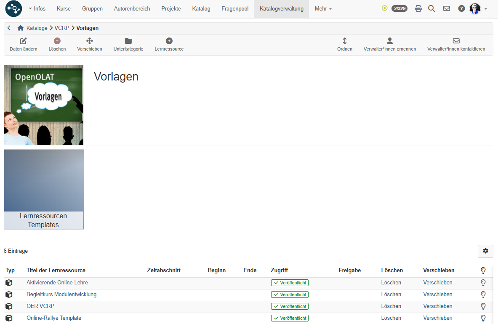
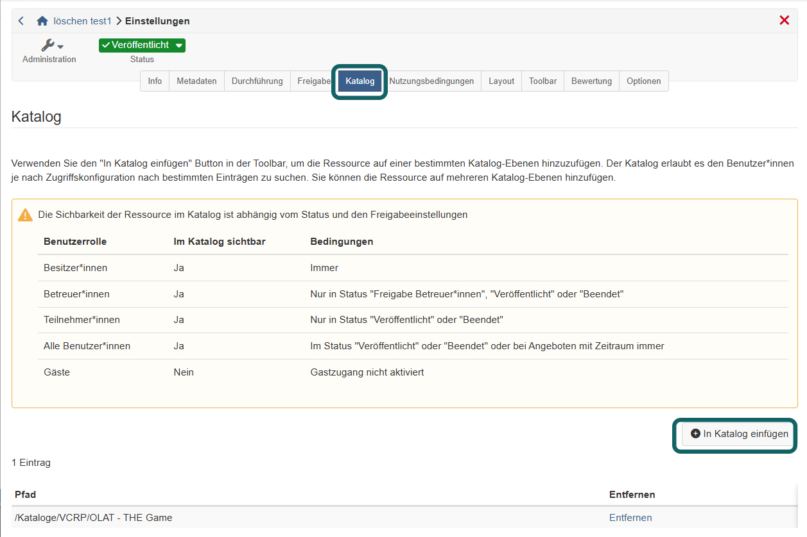
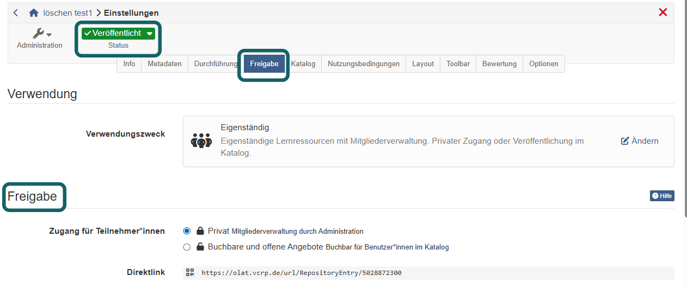
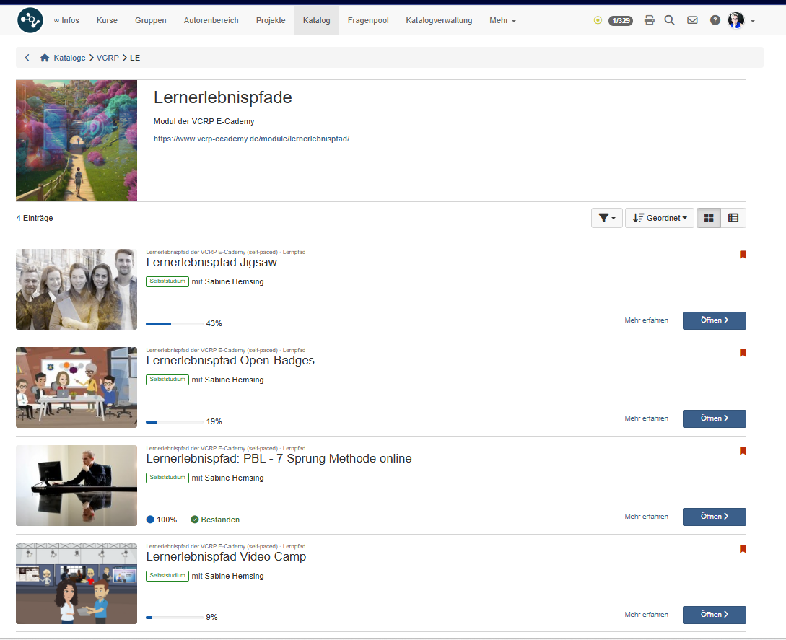

# Katalog 1.0 {: #catalog_1}

:octicons-device-camera-video-24: **Video-Einführung**: [Katalog](<https://www.youtube.com/embed/LiqkkT06hWo>){:target="_blank”}

:octicons-device-camera-video-24: **Video-Einführung**: [Kurs in Katalog eintragen](<https://www.youtube.com/embed/hc5yJAPIX9s>){:target="_blank”}

## Funktionsweise des Katalog 1.0

Im Katalog 1.0 können Kursbesitzer:innen ihre Kurse eintragen und diese so sichtbar machen. Zusätzlich besteht die Möglichkeit, über den Katalog auf die Informationen der jeweiligen Kursinfoseite zuzugreifen und sich vorab zu orientieren, ohne einen Kurs betreten oder buchen zu müssen.

Je nach Konfiguration lassen sich Kurse direkt über den Katalog buchen oder sie dienen als Übersicht für Kurse, in die Kursteilnehmende bereits eingetragen sind.

Der Katalog lässt sich zudem nutzen, um Strukturen einer Hochschule oder Weiterbildungseinrichtung abzubilden. Dadurch entsteht ein schneller Überblick über buchbare Angebote und bereits zugeordnete Kurse.

**Verwaltung durch Katalogverwalter:innen:**

Administrator:innen oder Katalogverwalter:innen bereiten die Struktur des Katalogs vor und können auch die Reihenfolge der Einträge ändern.

{ class="shadow lightbox" }

Kursbesitzer:innen können dann ihre Kurse innerhalb der vordefinierten Struktur verknüpfen. 

## Kurs in den Katalog 1.0 eintragen:

Um einen Kurs dem Katalog hinzuzufügen, gehen Sie als Kursbesitzer:in in die Kursadministration und öffnen den Tab "Katalog". Klicken Sie auf den Button "In Katalog einfügen" und navigieren Sie zur gewünschten Position im Katalog.

{ class="shadow lightbox" }

Anschliessend wird angezeigt für wen der Kurs im aktuellen Zustand sichtbar ist. Sie können den Vorgang auch wiederholen und so mehrere Katalogeinträge für einen Kurs vornehmen.  

**Weitere Einstellungen:**

Gehen Sie nun als Kursbesitzer:in in der Kursadministration in den Tab „Freigabe“ um die gewünschten weiteren Einstellungen vorzunehmen. 

{ class="shadow lightbox" }

!!! Tip „Tipp“

    Häufig ist es sinnvoll den Eintrag in den Katalog als letzten Schritt vorzunehmen. Nämlich dann, wenn der Kurs fertiggestellt und der Zugang für die Lernenden freigegeben werden soll. 

    Setzen Sie den Status des Kurses auf „veröffentlicht“ damit die Teilnehmenden den Kurs auch betreten können. 

## Wer sieht was im Katalog 1.0?

Kurse können jederzeit in den Katalog eingetragen werden, sind jedoch nicht in jedem Fall für alle sichtbar oder zugänglich. Die Sichtbarkeit im Katalog wird durch mehrere Faktoren beeinflusst, darunter die Kursrolle der aufrufenden Person, der Veröffentlichungsstatus des Kurses sowie die Art der Kursfreigabe, etwa privat oder buchbar.

Benutzerrolle| Freigabeeinstellung| Publikationsstatus  
---|---|---  
Besitzer der Lernressource| Privat, Buchbar, Offen| immer sichtbar  
Betreuer der Lernressource| Privat, Buchbar, Offen|  "Freigabe Betreuer", "Veröffentlicht" oder "Beendet"  
Teilnehmer der Lernressource| Privat, Buchbar, Offen| "Veröffentlicht" oder "Beendet"  
Alle OpenOlat Benutzer| Buchbar, Offen| "Veröffentlicht" oder "Beendet"  
Gäste| Offen & Gastzugang aktiviert| "Veröffentlicht" oder "Beendet"  

Hier noch ein Beispiel wie sich die Einstellungen der Konfiguration auf den Katalog auswirken: 

### Beispiel

Ein Kurs wurde vom Kursbesitzer im Katalog eingetragen. Der Kurs hat den Status „Vorbereitung“ und steht bei der Freigabe auf „Privat Mitgliederverwaltung durch Administration“. 

In diesem Fall wird der Kurs im Katalog für Kursbesitzer:innen sowie für alle eingetragenen Mitglieder angezeigt. Der Kurs selbst kann jedoch noch nicht betreten werden, da er sich weiterhin im Status "Vorbereitung" befindet. Erst nach der Veröffentlichung ist der Zugriff für die Mitglieder auch über den Katalog möglich.

Personen die nicht Mitglied im Kurs sind sehen den Kurs im Katalog *nicht* und können den Kurs nicht betreten, sich nicht eintragen und ihn auch nicht buchen.

## Anmelden über den Katalog

Soll ein Kurs im Katalog erscheinen damit sich die Interessenten in den Kurs eintragen können, sollten Sie ihn wie folgt konfigurieren.   

* Den Kurs wie oben beschrieben im Tab "Katalog" dem Katalog hinzufügen

* Im Tab "Freigabe" ein Angebot vom Typ "frei verfügbar" einrichten
Optional kann bei der Konfiguration ein Enddatum gesetzt werden, wenn die Einschreibung zeitlich begrenzt sein soll.
Zusätzlich empfiehlt sich eine Angebotsbeschreibung sowie das Entfernen des Hakens bei "Automatisch buchen"

* Der Kursstatus muss auf "Vorbereitung" stehen und darf nicht auf "Veröffentlicht" gesetzt sein

So können sich User die Kurs-Info-Seite durchlesen und sich in den Kurs eintragen. 
Kursbesitzende sehen alle eingetragenen Personen in der Mitgliederverwaltung des Kurses und können einzelne Personen bei Bedarf wieder entfernen oder per E-Mail kontaktieren. Ein Zugriff auf Inhalte und Kursbausteine ist für die Teilnehmenden aber noch nicht möglich. Dieser wird erst freigeschaltet, wenn der Kurs von den Kursbesitzenden auf "Veröffentlicht" gesetzt wird.

## So gelangen User zum Katalog

User können den Katalog 1.0 über das obere Menü aufrufen und zur gewünschten Stelle navigieren. 

{ class="shadow lightbox" }

Die Darstellung ist sowohl als Listen- als auch als Tabellenansicht möglich. Angezeigt werden dabei jeweils weitere Informationen z.B. zum Lernfortschritt in Lernerlebnispfaden, dem Durchführungsformat, dem Zeitabschnitt, ob der Kurs bereits bestanden wurde sowie weitere  Informationen, die in den Kurseinstellungen hinterlegt wurden. Über den Button "Mehr erfahren" gelangen User zur Kursinfo-Seite. 

!!! info "Katalog 2.0"

    Informationen zum Erstellen von Angeboten im Katalog 2.0 finden Sie [hier](../area_modules/catalog2.0_angebote.de.md). 