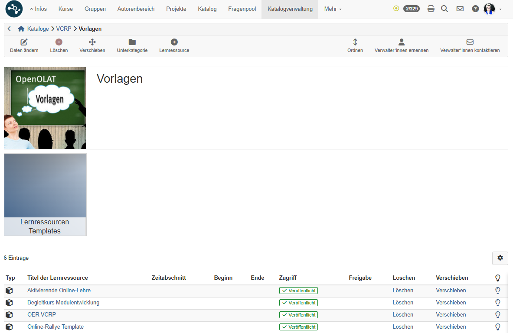
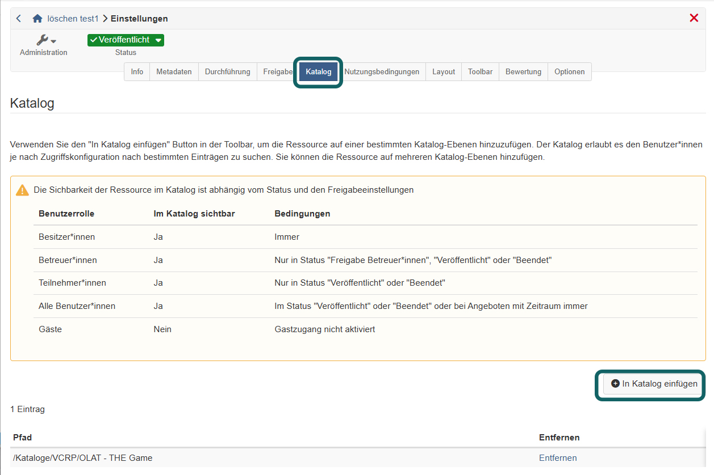
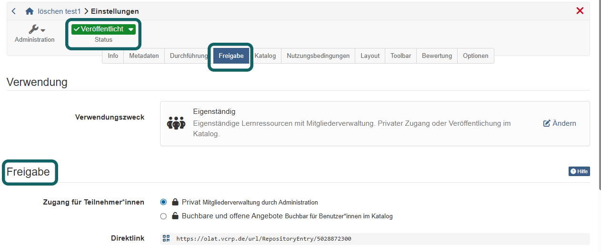
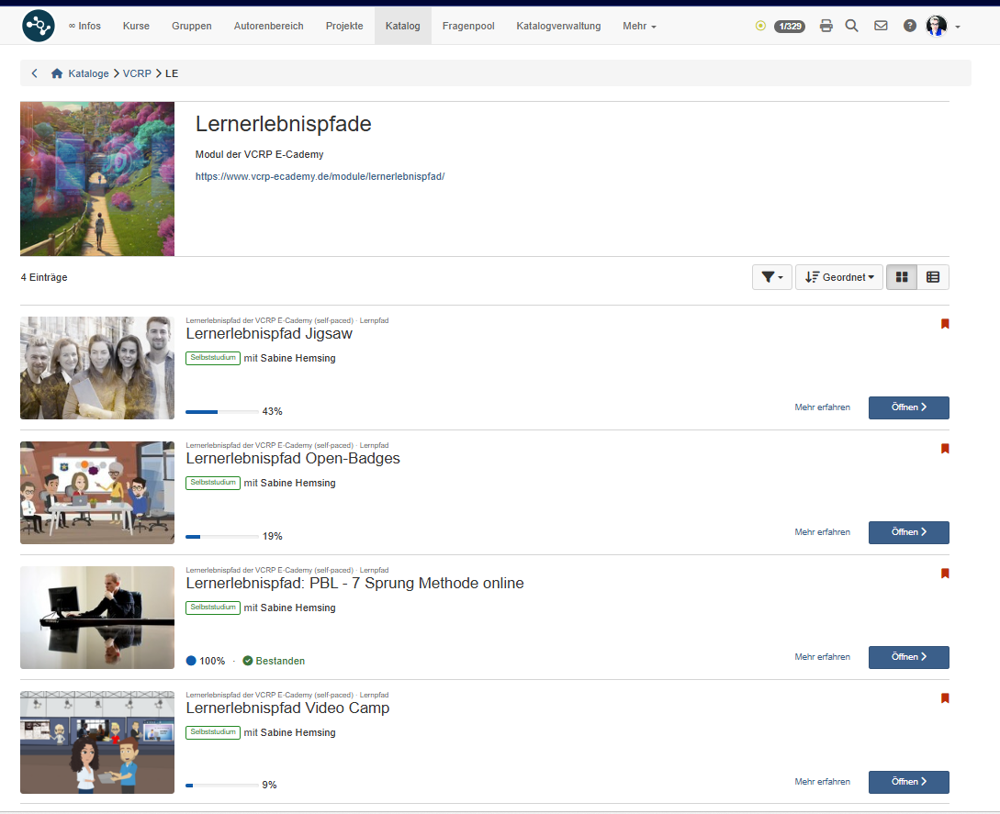

# Catalog 1.0 {: #catalog_1}

:octicons-device-camera-video-24: **Video introduction (German)**: [Katalog](<https://www.youtube.com/embed/LiqkkT06hWo>){:target="_blank"}

:octicons-device-camera-video-24: **Video introduction (German)**: [Kurs in Katalog eintragen](<https://www.youtube.com/embed/hc5yJAPIX9s>){:target="_blank"}

## How the Catalog 1.0 works

In the Catalog 1.0, course owners can enter their courses and thus make them visible. In addition, the catalog gives access to the information of the respective course info page, so that users can get an overview in advance without having to enter or book a course.

Depending on the configuration, courses can be booked directly via the catalog, or the catalog serves as an overview of the courses in which participants are already enrolled.

The catalog can also be used to map the structures of a university or further education institution. This provides a quick overview of bookable offers and courses already assigned.

**Management by catalog administrators:**

Administrators or catalog administrators prepare the structure of the catalog and can also change the order of the entries.

{ class="shadow lightbox" }

Course owners can then link their courses within the predefined structure.

## Enter a course in the Catalog 1.0

To add a course to the catalog, open the "Catalog" tab of the course settings as course owner: 
`Course > Administration > Settings > Tab "Catalog"`

Click on the "Add to catalog" button and navigate to the desired position in the catalog.

{ class="shadow lightbox" }

Afterwards it is displayed for whom the course is visible in its current state. You can also repeat the process and thus create several catalog entries for one course.

**Further settings:**

Now go to the "Share" tab as course owner to make the desired further settings: 
`Course > Administration > Settings > Tab "Share"`

{ class="shadow lightbox" }

!!! tip "Hint"

    It is often useful to enter the course in the catalog as the last step, namely when the course is finished and access is to be released for the learners.

    Set the status of the course to "Published" so that the participants can also enter the course.

## Who sees what in the Catalog 1.0?

Courses can be entered in the catalog at any time, but are not visible or accessible to everyone in every case. The visibility in the catalog is influenced by several factors, including the course role of the person calling up the catalog, the publication status of the course and the type of course access, e.g. private or bookable.

User role| Access setting| Publication status
---|---|---
Owner of the learning resource| Private, Bookable, Open| always visible
Coach of the learning resource| Private, Bookable, Open| "Access for coach", "Published" or "Finished"
Participant of the learning resource| Private, Bookable, Open| "Published" or "Finished"
All OpenOlat users| Bookable, Open| "Published" or "Finished"
Guests| Open & guest access enabled| "Published" or "Finished"

Here is an example of how the configuration settings affect the catalog:

### Example

A course owner enters a course in the catalog. The course has the status "Preparation" and its access is set to "Private Membership management by administration".

In this case, the course is displayed in the catalog for course owners and for all enrolled members. However, the course itself cannot yet be entered, as it is still in the status "Preparation". Only after publication can the members also access it via the catalog.

Persons who are not members of the course do *not* see the course in the catalog and cannot enter, enrol in or book the course.

## Enrolling via the catalog

If a course is to appear in the catalog so that interested persons can enrol in it, you should configure it as follows.

* Add the course to the catalog in the "Catalog" tab as described above

* Set up an offer of the type "Freely available" in the "Share" tab
Optionally, an end date can be set in the configuration if the enrolment is to be limited in time.
In addition, an offer description is recommended, as well as removing the check mark for "Book automatically"

* The course status must be "Preparation" and must not be set to "Published"

This way, users can read the course info page and enrol in the course.
Course owners see all enrolled persons in the members management of the course and can remove individual persons if necessary or contact them by e-mail. However, participants cannot yet access content and course elements. This access is only activated when the course owners set the course to "Published".

## How users get to the catalog

Users can call up the Catalog 1.0 via the top menu and navigate to the desired position.

{ class="shadow lightbox" }

The display is possible both as a list view and as a table view. In each case, further information is displayed, e.g. on the learning progress in learning paths, the implementation format, the time period, whether the course has already been passed, and further information stored in the course settings. The "Learn more" button takes users to the course info page.

!!! note "Catalog 2.0"

    Information on creating offers in Catalog 2.0 can be found [here](../area_modules/catalog2.0_angebote.md).

[To the top of the page ^](#catalog_1)

---

## Further information {: #further_information}

[Catalog 2.0: Offers >](catalog2.0_angebote.md)

**youtube** 
[Katalog](<https://www.youtube.com/embed/LiqkkT06hWo>) 
[Kurs in Katalog eintragen](<https://www.youtube.com/embed/hc5yJAPIX9s>)

[To the top of the page ^](#catalog_1)
