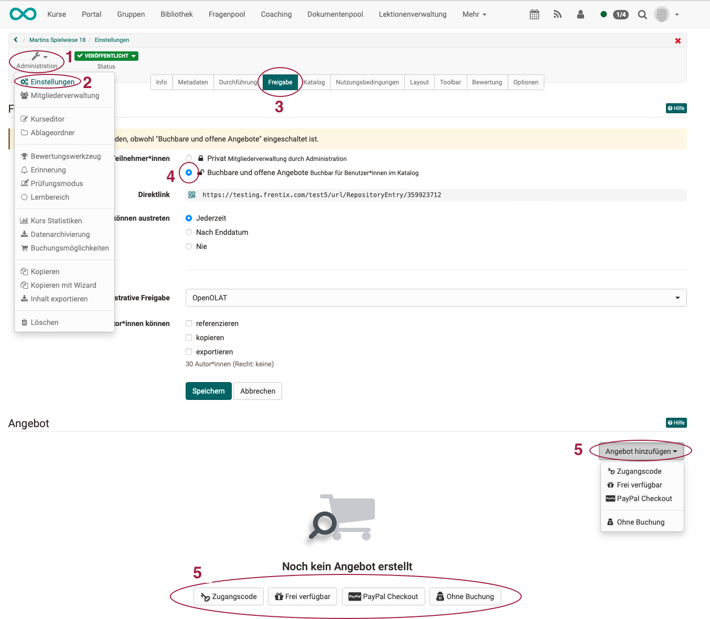
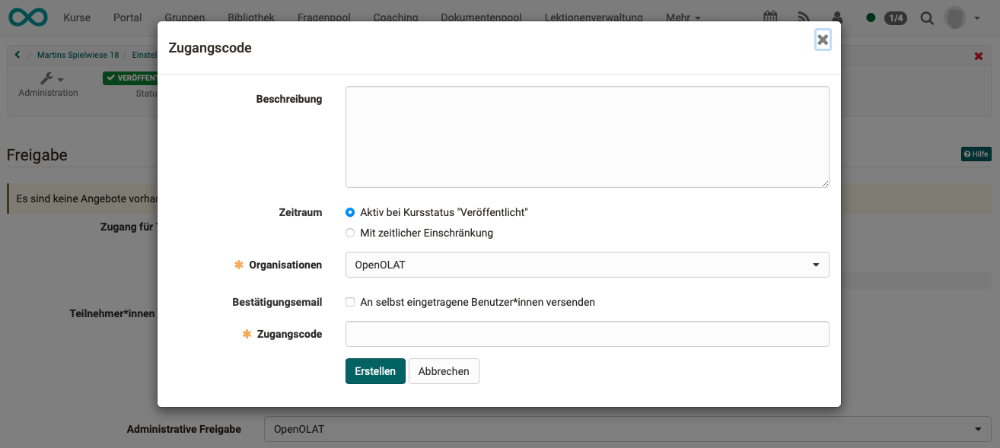
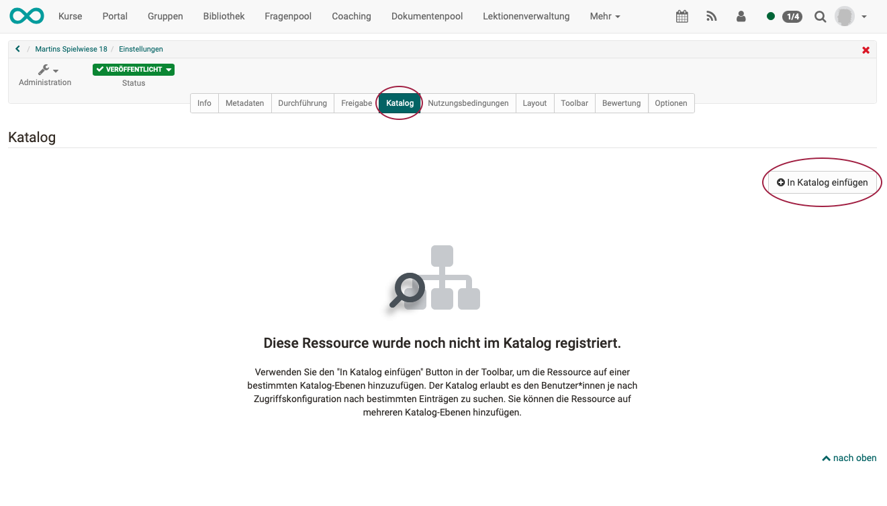
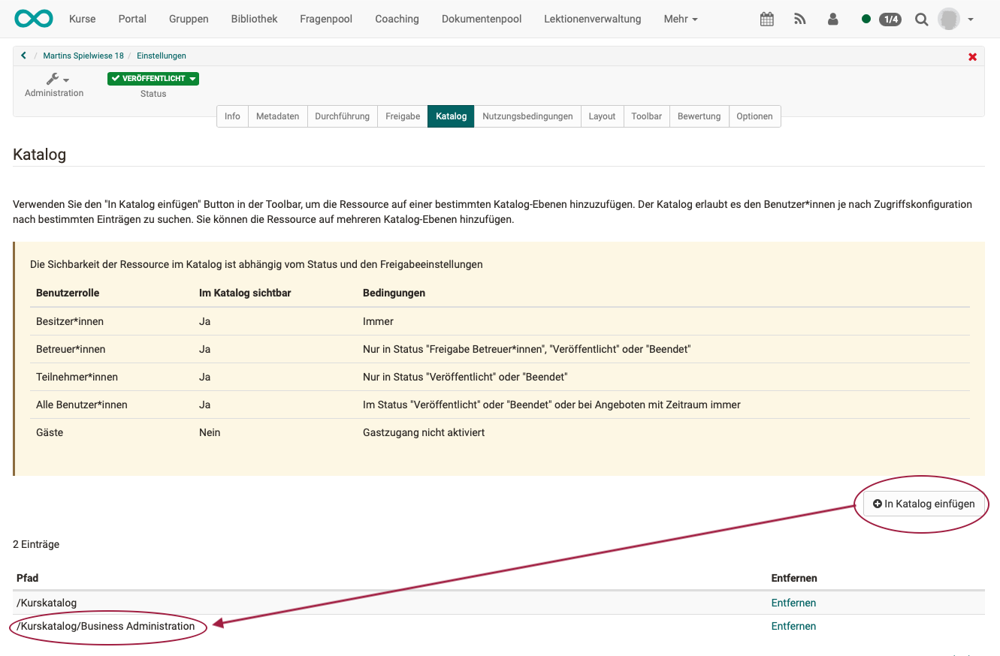
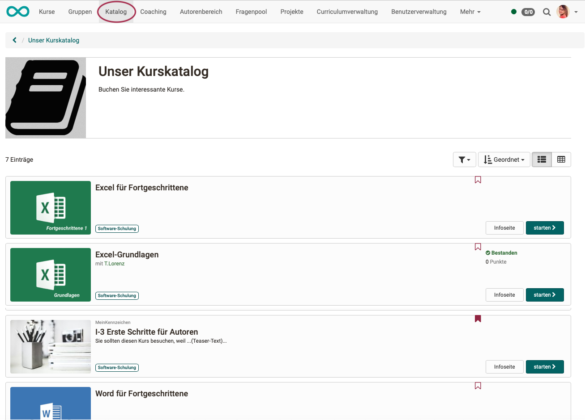

# Catalog 1.0

## Functionality

The Catalog 1.0 can be set up by an administrator or catalog administrator, so that authors can sort courses and other learning resources into the catalog in a meaningful way. The order of catalog entries can be defined by the administrator or catalog administrator.

Use the search mask in case you should not find the appropriate course in the catalog. Perhaps the course author has not yet listed that course in the OpenOlat catalog.

Teachers can only enter courses and learning resources in the catalog that are also available to learners. The visibility in the catalog depends on the publication status and access settings of the learning resource:

Users role | Access settings | Publication status
---|---|---  
Owner of learning resource| Private, Bookable, Open| Always visible  
Coach of learning resource| Private, Bookable, Open|  "Access for coach", "Published" oder "Finished"  
Participant of learning resource| Private, Bookable, Open | "Published" or "Finished"  
All OpenOlat users| Bookable, Open | "Published" or "Finished"  
Guests| Open & Access without login enabled | "Published" or "Finished"  

## Offers in catalog 1.0

In the catalog 1.0, all offers are created in the courses (**Administration > Settings > Tab Shared**) and then compiled in the **catalog administration**.

!!! hint "Requirements for an offer"

    To be able to create a quote, you must select the option "Bookable and open quotes" as the booking method.
    (**Administration > Settings > Tab Shared**)

    { class="shadow lightbox" }

    If "**Private**" is selected, the participants are entered by the owners or persons who have the right to manage members. What is private should not be published in the catalog.

    If the option "**Bookable and open offers**" is selected, learners can book a course/learning resource themselves, but may have to enter a password (depending on the setting).

    Only if the second option "Bookable and open offers" is selected can you then create offers.

{ class="shadow lightbox" }

**Select an offer type** and open the popup to create a new offer. 
Click on the **"Create" button** to create the new offer.

{ class="shadow lightbox" }

Click on "**Open catalog configuration**" in the offer. This will take you directly from the "Release" tab to the "Catalog" tab.

{ class="shadow lightbox" }

Then click on the "**Add to catalog**" button to register the course in the catalog.

{ class="shadow lightbox" }

If the offer is to be displayed in other places in the catalog (subfolders), additional entries can be added as required.

{ class="shadow lightbox" }

The finished catalog can be called up in the header menu.

{ class="shadow lightbox" }

!!! tipp "Catalog 2.0"

    Information on creating offers in catalog 2.0 can be found [here](../area_modules/catalog2.0_angebote.md).