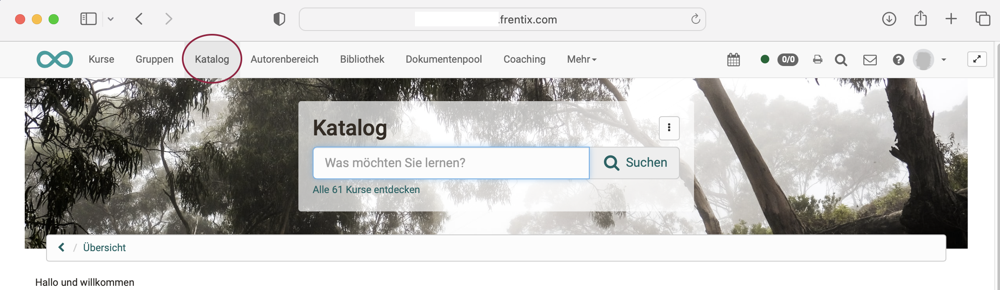
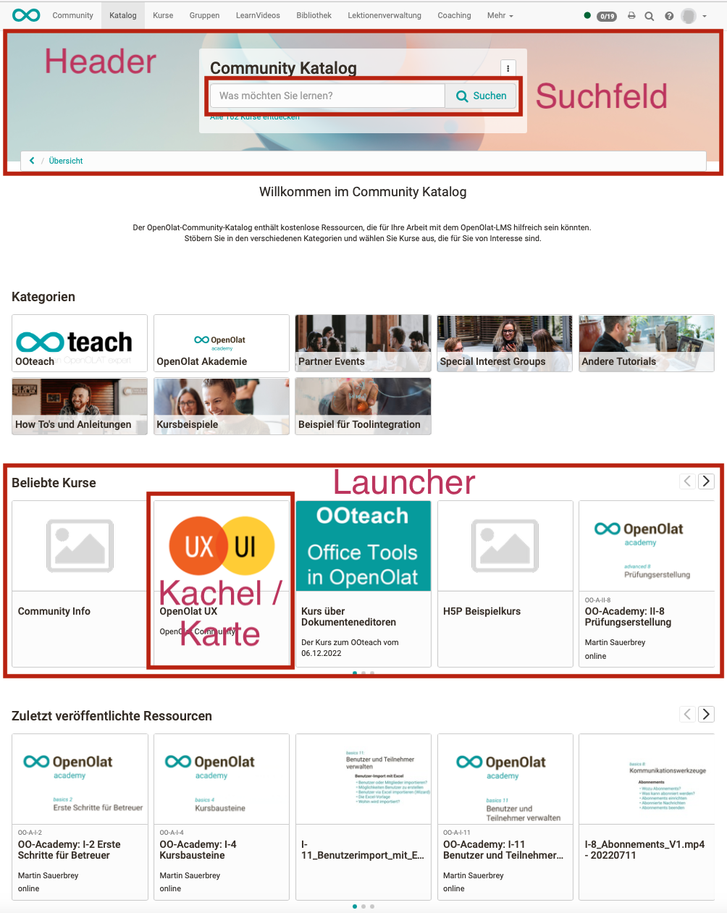
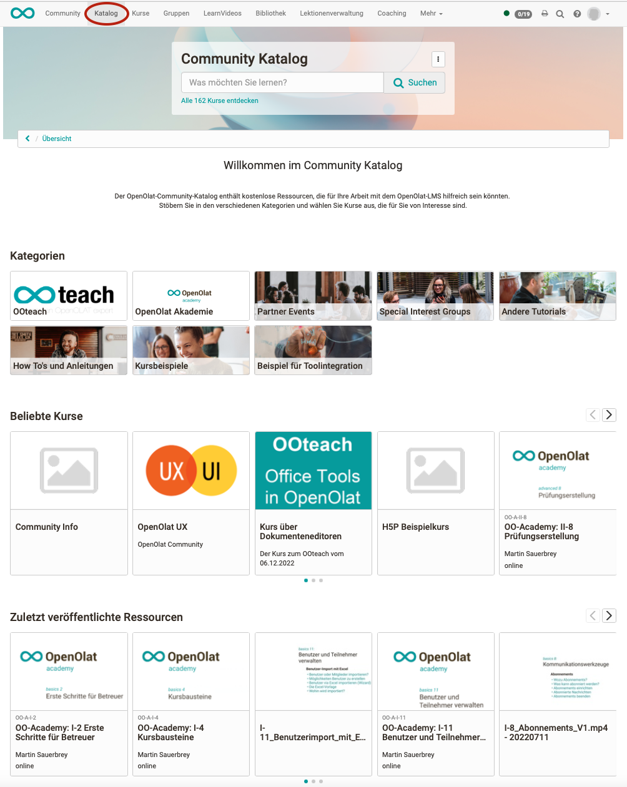
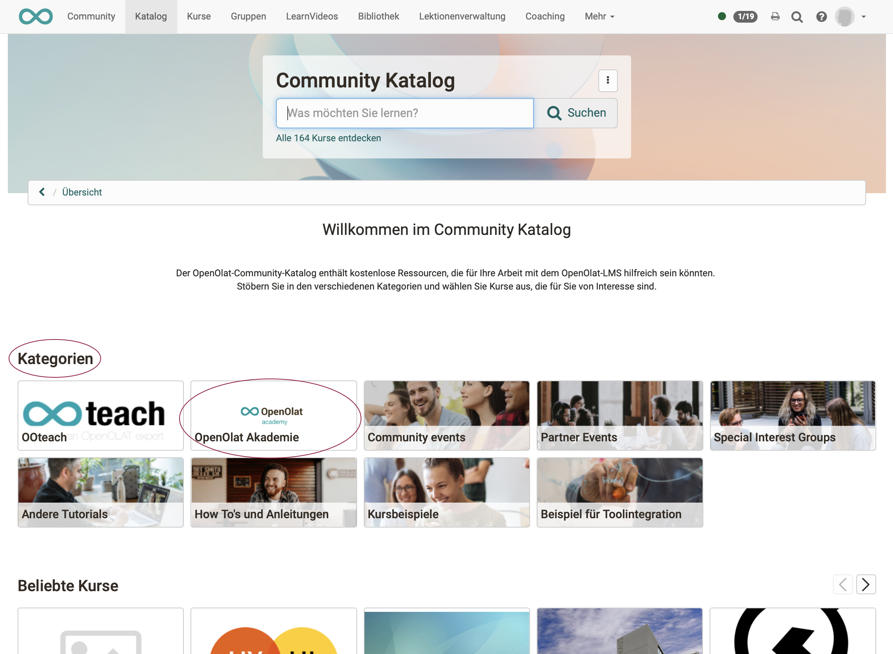
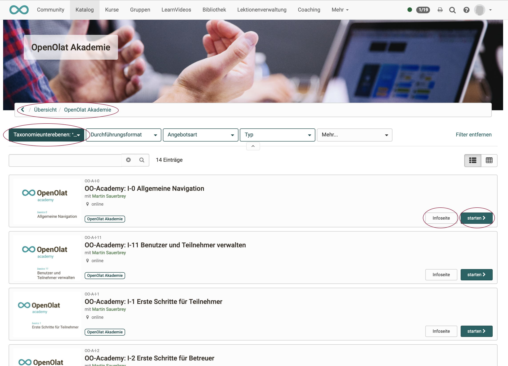

# Katalog 2.0 - Übersicht

## Wozu dient der Katalog?

Im Katalog können die in OpenOlat erstellten Kurse und Lernressourcen für die Lernenden präsentiert werden.

Interessiert sich jemand genauer für ein bestimmtes Angebot, kann zu jedem Eintrag die zugehörige Infoseite aufgerufen werden.

Entscheidet sich die Benutzerin / der Benutzer zum Besuch eines Kurses, kann dieser direkt vom Katalog aus aufgerufen werden, bzw. man gelangt zur Einstiegsseite, auf der ggf. Anmeldedaten eingegeben werden müssen.

## Wo findet man den Katalog 2.0?

Die OpenOlat-User finden den Katalog im **Menü der Kopfzeile**.

{ class="shadow lightbox" }

Voraussetzung: Der Katalog muss in der OpenOlat [Administration aktiviert](../../../manual_admin/docs/administration/Modules_Catalog_2.0.de.md) worden sein. 

!!! tip "Hinweis"

    Falls Sie den Eintrag im Menü nicht sehen, aber sicher sind, dass der Katalog 2.0 verwendet wird, schauen Sie bitte unter "Mehr" ganz rechts nach. Hierhin werden alle Menüs verschoben, die aufgrund der Anzeigebreite des Monitors/Geräts nicht direkt angezeigt werden können.

## Die Bestandteile des Katalogs

Der Katalog 2.0 enthält die folgenden Bestandteile:

- Header: Kopfzeile mit Hintergrundbild
- Suchfeld (innerhalb Header)
- Filter für eine gezeilte Suche z.B. nach  Durchführungsformat, Typ der Lernressource, usw.
- Launcher: Abschnitte im Katalog, in denen Katalogeinträge nach bestimmten Kriterien zusammengestellt werden z.B. zuletzt veröffentlichte Kurse (je nach Launchertyp und Launcherkonfiguration)
- Kacheln/Karten mit Beschreibung eines Kurses oder einer Lernressource (entspricht der [Infoseite](../learningresources/Info_page.de.md))

{ class="shadow lightbox" }

## Welche Seiten und Ansichten hat der Katalog?

**Seite/Ansicht 1:** 
Wird in der Kopfzeile der Katalog (2.0) aufgerufen, dann gelangt man zunächst auf die Startseite (Landing page) mit den Launchern.

{ class="shadow lightbox" }

Im Suchfeld kann direkt nach bestimmten Lernressourcen gesucht werden. Indexiert sind dafür der Titel, der Teaser-Text und die Taxonomie. Sie können aber auch die angezeigten Kacheln/Karten anklicken, die in den Launchern gruppiert sind.

**Seite/Ansicht 2:** 
Bei Klick auf eine Karte/Kachel in einem Kategorie-Launcher öffnet sich eine Microsite (Listenansicht) mit den Kursen und Lernressourcen dieser Kategorie. Zu einer Kategorie gehören alle Kurse und Lernressourcen die dem gleichen Taxonomie-Begriff zugeordnet sind. Auch Unterkategorien sind möglich.

{ class="shadow lightbox" }

Erfolgt der Klick auf eine Karte/Kachel in einem anderen Launcher (nicht vom Typ Kategorie-Launcher) oder in einer Microsite öffnet sich die Info-Seite oder sofort der Kurs.

**Seite/Ansicht 3:** 
Wird zuerst eine Microsite geöffnet, können Sie in der Liste die [Infoseiten](../learningresources/Info_page.de.md) anzeigen lassen oder die Kurs bzw. Lernressourcen gleich starten. 

{ class="shadow lightbox" }

!!! info "Hinweis"

    Entsprechend der Struktur der Taxonomie können Microsites auch Unter-Microsites enthalten. 

!!! tip "Tipp"

    Mit den Filtern kann die Listenansicht angepasst werden.

