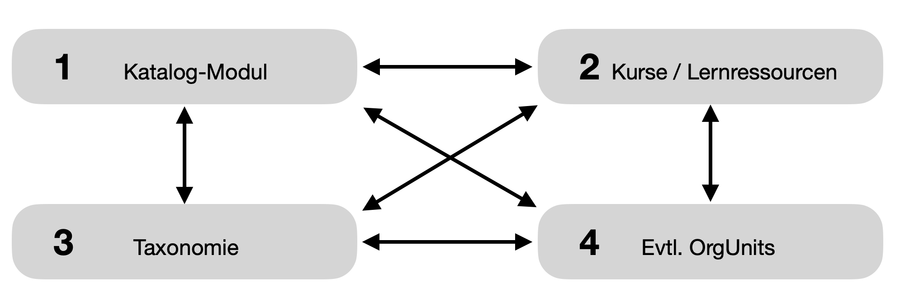

# Catalog 2.0

## Where can I find the catalog?

Die OpenOlat-User finden den Katalog im **Menü der Kopfzeile**.

{ class="shadow lightbox" }

Voraussetzung: Der Katalog muss aktiviert sein. (In jeder OpenOlat-Instanz kann dies vom Administrator ein- oder ausgeschaltet werden.)

!!! tip "Hinweis"

    Der Menü-Eintrag kann auch an einer anderen Stelle stehen. Wenn viele Einträge in der Kopfzeile angezeigt werden, kann es auch sein, dass der Katalog unter „Mehr“ ganz rechts enthalten ist.

## Was enthält der OpenOlat-Katalog?

Wie in anderen Katalogen, werden auch im OpenOlat-Katalog in vielen kleinen Einträgen Kurzbeschreibungen zu „Produkten“ angezeigt. In OpenOlat sind dies Kurse oder andere Lernressourcen, wie z.B. Tests oder Videos. (Alles, was im Autorenbereich zu finden ist.)

- Kurse
- Tests
- SCORM-Inhalte
- Content Packages (CP)
- Wikis
- Podcasts
- Blog
- Ressourcenordner
- Formulare
- Portfolio 2.0 Templates
- Glossar
- Video-Dateien (mp4-Dateien und verlinkte Ressourcen)
- Word-Dateien
- Excel-Dateien
- PowerPoint-Dateien
- pdf-Dateien
- Bilder (png, jpg)
- Sound (mp3-Dateien und ???verlinkte Ressourcen)
- und bestimmte weitere Dateien

## Welche Philosophie steckt hinter dem Katalog V1?

Der Katalog V1 gründet auf der **„Browse“-Strategie:** Die Benutzer suchen im Katalog, indem sie  die Kategorien des Katalogs durchstöbern (browsen).
Das Browsen war in den Anfängen des Internets sehr beliebt, heute bevorzugen die meisten Nutzer die Strategie „Suchen und Filtern“.

## Welche Philosophie steckt hinter dem Katalog V2?

Im Unterschied zum Katalog V1, der auf dem Konzept des „Browsens“ aufbaut, liegt dem Katalog V2 das **Konzept „Suchen und Filtern“** zu Grunde.

Der Katalog V2 bietet etliche Vorteile:

- Die Buchungsmethoden wurden erweitert, um die Veröffentlichung für bestimmte Organisationen und für das Web zu ermöglichen. Dadurch erhält man eine präzisere Kontrolle über den Veröffentlichungsmechanismus.
- Eine bereits vorhandene Taxonomiestruktur kann nun genutzt werden, um Kurse automatisch zu kategorisieren.
- Der neue Tabellenfiltermechanismus kann benutzt werden, um einfache und intuitive Such- und Filteroptionen zu implementieren.
- Die Navigation kann entweder mit der Browse- oder der Such- und Filter-Metapher erfolgen, die das Beste aus beiden Welten in einer einheitlichen Ansicht zusammenführt. Die Nutzer finden Prinzipien vor, die sie bereits von der Nutzung anderer Plattformen wie Linked-In Learning oder Coursera kennen. Die verfügbaren Filter können in der Katalogverwaltung konfiguriert und an die Bedürfnisse der Institution angepasst werden.

## Dynamischer Katalog - statischer Katalog

In einem statischen Katalog werden die Einträge manuell eingefügt und gruppiert.

Der Katalog 2.0 besitzt keine manuelle Sortierung auf Kursebene, es ist ein dynamischer Katalog. In ihm werden die Katalogeinträge automatisch anhand bestimmter Kriterien (z.B. einer Taxonomie) angezeigt. 

Das kann innerhalb von vorgegebenen Clustern (Gruppen, Abschnitten) geschehen. Im Katalog V2 nennen wir diese Abschnitte „Launcher“.
Was einem bestimmten Fachbereich zugeordnet wird und ein Angebot besitzt, wird automatisch in einem bestimmten Launcher aggregiert und im Katalog angezeigt.

Der dynamische Katalog 2.0 wird durch zugrunde liegende Taxonomien zusammengestellt, anstelle von fixen, manuell definierten Katalogstrukturen, wie im Katalog V1.

Die User suchen im Katalog V2 dann einfach mit Hilfe von Filtern nach dem, was sie interessiert.Denn auf Grundlage der Taxonomie kann gefiltert werden (Google Search & Filter-Konzept).Wenn die Kurse in den jeweiligen Organisationseinheiten publiziert sind, finden die User nur das, was für sie freigegeben ist.

## Welche Komponenten arbeiten beim dynamischen Katalog V2 zusammen?

In einem dynamisch Katalog wirken folgende Komponenten zusammen und bestimmen gemeinsam, ob ein Angebot im Katalog angezeigt wird:

{ class="shadow lightbox" }

1. **Das Katalog-Modul** 
Es muss vom Administrator aktiviert sein, damit überhaupt ein Katalog im Menü der Benutzer erscheint. Im Katalog-Modul wird die Struktur und die Gestaltung des Katalogs konfiguriert.

2. **Die Einstellungen im Kurs bzw. der Lernressourcea)** 
Ein Kurs oder eine andere Lernressource, die im Katalog erscheinen soll, muss vom Autor dafür frei gegeben und buchbar sein.b) Damit ein Kurs oder eine andere Lernressource überhaupt im Katalog erscheinen kann, muss im betreffenden Kurs bzw. der Lernressource ein Angebot definiert worden sein. Es können auch mehrere Angebote gemacht werden, so dass der gleiche Kurs z.B. einmal für eine bestimmte Teilnehmergruppe kostenlos und für übrige Interessenten kostenpflichtig angeboten wird. 

3. **Die für den Katalog verwendete Taxonomie** 
In OpenOlat können verschiedene Taxonomien angelegt und verwendet werden. Deshalb muss klar sein, welche Taxonomie für den Katalog verwendet wird.

4. **Evtl. OrgUnits (Organisationseinheiten)** 
Angebote im Katalog können auch nur für bestimmte Organisationseinheiten angezeigt werden. Dazu muss das OpenOlat-Modul „Organisation“ aktiviert sein.Für jede OrgUnit können dann- bestimmte Kurse und Lernressourcen ein- und ausgeblendet werden- bestimmte Launcher ein- und ausgeblendet werden