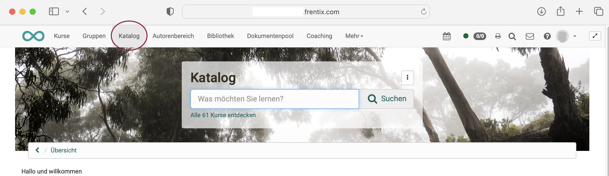
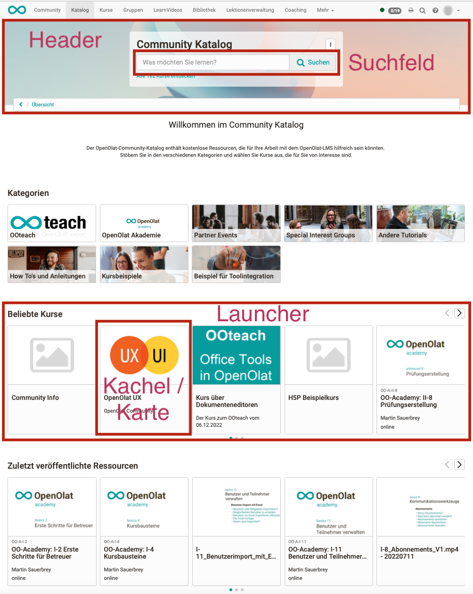
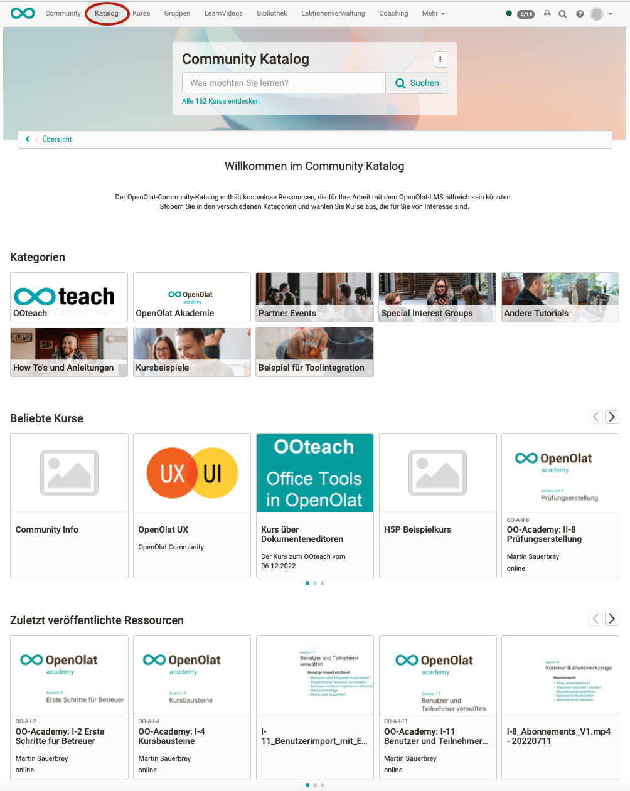
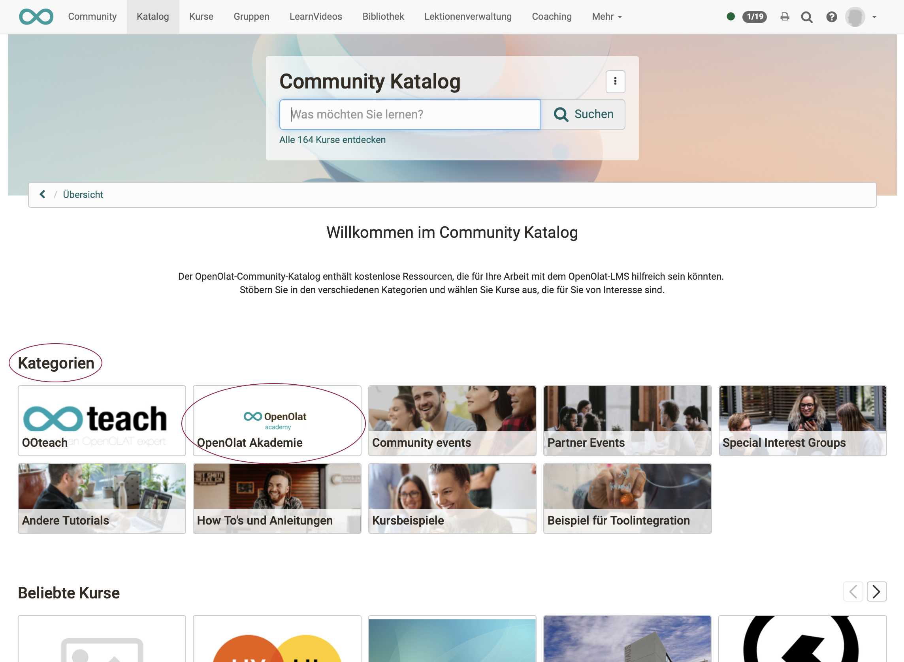
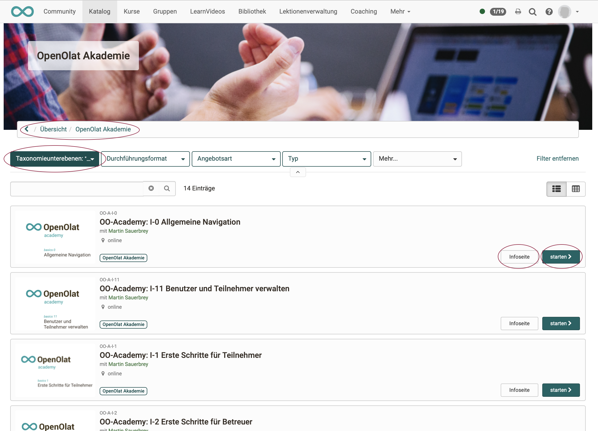

# Catalog 2.0: Overview {: #catalog_overview}

## What is the catalog for? {: #catalog_purpose}

The courses and learning resources created in OpenOlat can be presented to learners in the catalog.

If someone is interested in a specific offer, the corresponding info page can be called up for each entry.

If the user decides to attend a course, it can be accessed directly from the catalog, or the user is taken to the entry page where registration data may have to be entered.

[To the top of the page ^](#catalog_overview)

---

## Where can I find the catalog 2.0? {: #catalog_access}

The catalog can be made available to both registered and unregistered persons. Where you can access the catalog depends on whether you are already registered as a user in OpenOlat or not.

The **registered OpenOlat users** can find the catalog in the **header menu**.

{ class="shadow lightbox" }

Requirement: The catalog must be activated in the system administration: `Administration > Modules > Catalog > Tab "Settings"`. The setup is described in the [administration manual](../../manual_admin/administration/Modules_Catalog_2.0.md).

!!! tip "Hint"

    If you do not see the entry in the menu, but are sure that Catalog 2.0 is being used, please look under "More" on the far right. All menus that cannot be displayed directly due to the display width of the monitor/device are moved here.

**Unregistered persons** can access an externally accessible, mirrored version of the catalog, provided this so-called web catalog is activated. Access is possible directly from the login screen. However, the link to the web catalog can also be integrated elsewhere in a website. [:octicons-tag-16:{ title="from Release 20.0 (OO-8002)" }](https://track.frentix.com/issue/OO-8002)

{ class="shadow lightbox" }

[Further information on the external catalog >](../../manual_user/area_modules/catalog2.0_web.md) 
[To the top of the page ^](#catalog_overview)

---

## The components of the catalog {: #catalog_elements}

Catalog 2.0 contains the following components:

- Header: Header with background image
- Search field (inside the header)
- Filter for a directed search, e.g. by implementation format, type of learning resource, etc.
- Launcher: Sections in the catalog in which catalog entries are compiled according to certain criteria, e.g. recently published courses (depending on the launcher type and launcher configuration)
- Tiles/cards with a description of a course or learning resource (corresponds to the [info page](../learningresources/Info_page.md))

{ class="shadow lightbox" }

[To the top of the page ^](#catalog_overview)

---

## What pages and displays does the catalog have? {: #catalog_views}

**Page/Display 1:** 
If you call up the catalog (2.0) in the header, you will first be taken to the start page (landing page) with the launchers.

{ class="shadow lightbox" }

Specific learning resources can be searched for directly in the search field. The title, teaser text and taxonomy are indexed for this purpose. However, you can also click on the displayed tiles/cards that are grouped in the launchers.

**Page/Display 2:** 
Clicking on a card/tile in a launcher of type "taxonomy level" (category) opens a microsite (list view) with the courses and learning resources in this category. A category includes all courses and learning resources that are assigned to the same taxonomy term (level). Subcategories are also possible.

In a "taxonomy level" launcher, courses and learning resources are not displayed directly; instead, subfolders (taxonomy levels) are shown, which then contain the courses and learning resources.

{ class="shadow lightbox" }

If you click on a card/tile in another launcher (not of the taxonomy launcher type) or in a microsite, the info page or the course opens immediately.

**Page/Display 3:** 
If a microsite is opened first, you can display the [info pages](../learningresources/Info_page.md) in the list or start the course or learning resource immediately.

{ class="shadow lightbox" }

!!! note "Note"

    According to the structure of the taxonomy, microsites can also contain sub-microsites.

!!! tip "Hint"

    The list view can be customized using the filters.

[To the top of the page ^](#catalog_overview)

---

## Further information {: #further_information}

[Create offers >](../area_modules/catalog2.0_angebote.md) 
[Catalog design >](../area_modules/catalog2.0_design.md) 
[The web catalog >](../area_modules/catalog2.0_web.md) 
[Set up catalog (administration manual) >](../../manual_admin/administration/Modules_Catalog_2.0.md)

[To the top of the page ^](#catalog_overview)
