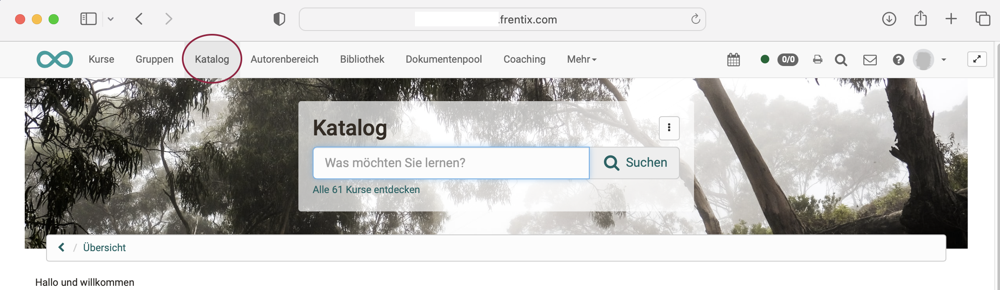
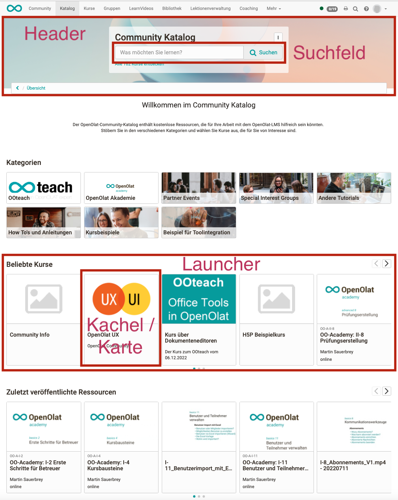
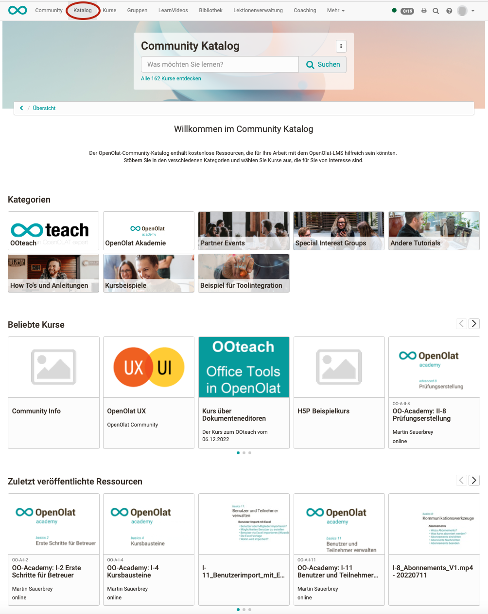

# Catalog 2.0 - Overview

## What is the catalog for?

The courses and learning resources created in OpenOlat can be presented to learners in the catalog.

If someone is interested in a specific offer, the corresponding information page can be called up for each entry.

If the user decides to attend a course, it can be accessed directly from the catalog, or the user is taken to the entry page where registration data may have to be entered.

## Where can I find the catalog 2.0?

OpenOlat users can find the catalog in the **header menu**.

{ class="shadow lightbox" }

Requirement: The catalog must be activated in the [administration](../../../manual_admin/docs/administration/Modules_Catalog_2.0.md). 

!!! tip "Note"

    If you do not see the entry in the menu, but are sure that Catalog 2.0 is being used, please look under "More" on the far right. All menus that cannot be displayed directly due to the display width of the monitor/device are moved here.

## The components of the catalog

Catalog 2.0 contains the following components:

- Header: Header with background image
- Search field (inside the header)
- Filter for a directed search, e.g. by implementation format, type of learning resource, etc.
- Launcher: Sections in the catalog in which catalog entries are compiled according to certain criteria, e.g. recently published courses (depending on the launcher type and launcher configuration)
- Tiles/cards with a description of a course or learning resource (corresponds to the [info page](../learningresources/Info_page.md))

{ class="shadow lightbox" }

## What pages and displays does the catalog have?

**Page/Display 1:** 
If you call up the catalog (2.0) in the header, you will first be taken to the landing page with the launchers.

{ class="shadow lightbox" }

Specific learning resources can be searched for directly in the search field. The title, teaser text and taxonomy are indexed for this purpose. However, you can also click on the displayed tiles/maps that are grouped in the launchers.

**Page/Display 2:** 
Clicking on a card/tile in a category launcher opens a microsite (list view) with the courses and learning resources in this category. A category includes all courses and learning resources that are assigned to the same taxonomy term. Subcategories are also possible.

{ class="shadow lightbox" }

If you click on a card/tile in another launcher (not of the category launcher type) or in a microsite, the info page or the course opens immediately.

**Page/Display 3:** 
If a microsite is opened first, you can display the [Info pages](../learningresources/Info_page.md) in the list or start the course or learning resources immediately.

{ class="shadow lightbox" }

!!! info "Note"

    According to the structure of the taxonomy, microsites can also contain sub-microsites.

!!! tip "Hint"

    The list view can be customized using the filters.

