# Katalog 2.0 - Angebote

## Was enthält der OpenOlat-Katalog?

Wie in anderen Katalogen, werden auch im OpenOlat-Katalog in vielen kleinen Einträgen Kurzbeschreibungen zu "Produkten" angezeigt. In OpenOlat sind dies

- Kurse 
- oder andere Lernressourcen, wie z.B. Tests oder Videos.

## Erscheinen alle Kurse im Katalog?

Im Katalog werden **nicht automatisch** alle erstellten Kurse und Lernressourcen angezeigt. Die Autor:innen der jeweiligen Kurse und Lernressourcen entscheiden, ob etwas in den Katalog aufgenommen wird.

Dazu muss im jeweiligen Kurs bzw. der Lernressource ein **Angebot** erstellt werden. 
Wenn kein Angebot erstellt wird, erfolgt auch kein Katalogeintrag.

## Wie wird ein Angebot erstellt?

Angebote hängen am Kurs und werden dort von Autor:innen in den Einstellungen definiert: 
**Administration > Einstellungen > Tab "Freigabe"**

!!! info "Unterschied Katalog 1.0 und Katalog 2.0"

    Im Katalog 1.0 werden alle Angebote in den Kursen erstellt (**Administration > Einstellungen > Tab Freigabe**) und dann in der **Katalogverwaltung** zusammengestellt.

    Im Katalog 2.0 werden Angebote ebenfalls in den Kurseinstellungen erstellt. Zusätzlich werden hier noch Angaben gemacht, **wo** im Katalog das Angebot erscheinen soll. Anhand dieser Angaben kann der Katalog 2.0 die Angebote dann **dynamisch selbst zusammenstellen**.

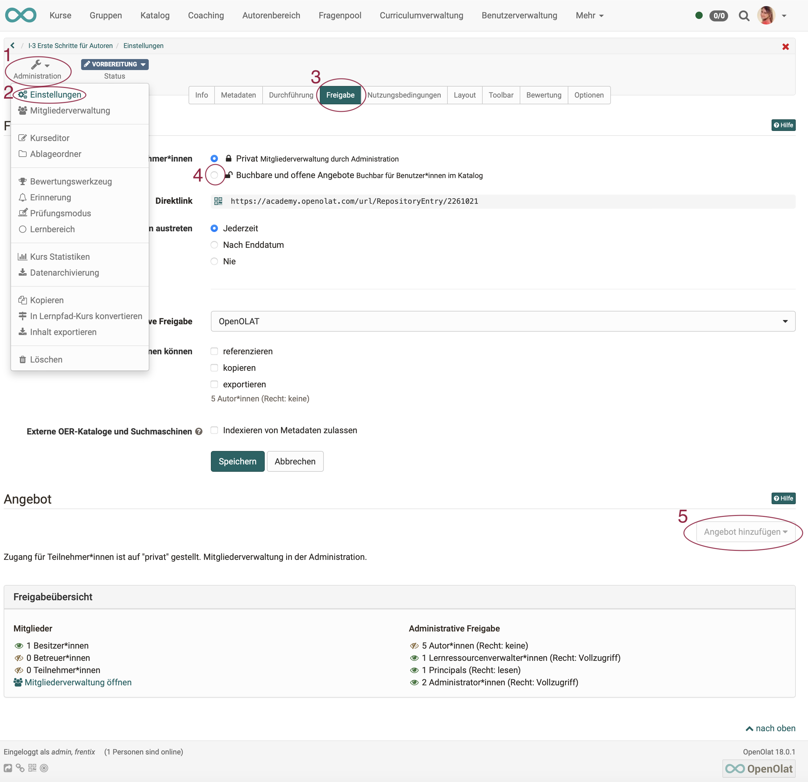{ class="shadow lightbox" }

## Voraussetzung für ein Angebot

Auch der Zugang zu einem Kurs wird in der **Administration** unter den **Einstellungen** im **Tab Freigabe** konfiguriert. Es stehen zwei grundsätzliche Varianten zur Verfügung:

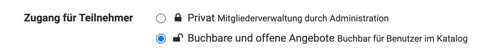{ class="shadow lightbox" }

Bei der Wahl "Privat" werden die Teilnehmenden durch die Besitzer bzw. Personen, die über das Recht der Mitgliederverwaltung verfügen, eingetragen. Was privat ist, soll auch nicht im Katalog veröffentlicht werden.

Bei Wahl der Option "Buchbare und offene Angebote" können die Lernenden einen Kurs/Lernressource selbst buchen, müssen aber eventuell (je nach Einstellung) ein Passwort eingeben.

Wird die zweite Option "Buchbare und offene Angebote“ gewählt, können Sie anschliessend Angebote erstellen.

## Was enthält ein Angebot?

Ein Angebot enthält die Bedingungen, zu denen der Kurs oder die Lernressource genutzt werden kann.

In einem **Angebot** wird definiert, wer sich unter welchen Umständen in die gewählte Lernressource bzw. den Kurs eintragen bzw. diese buchen kann. So ist eine Buchung mit Zugangscode, ohne oder per PayPal (sofern vom Admin aktiviert) möglich. Auch ein Zugang ohne Buchung oder als Gast können konfiguriert werden. Buchen kann dabei als Synonym für belegen, einschreiben, einkaufen verstanden werden. Wählen Sie die Schaltfläche "Angebot hinzufügen", um Buchungsmethoden (Angebote) hinzuzufügen.

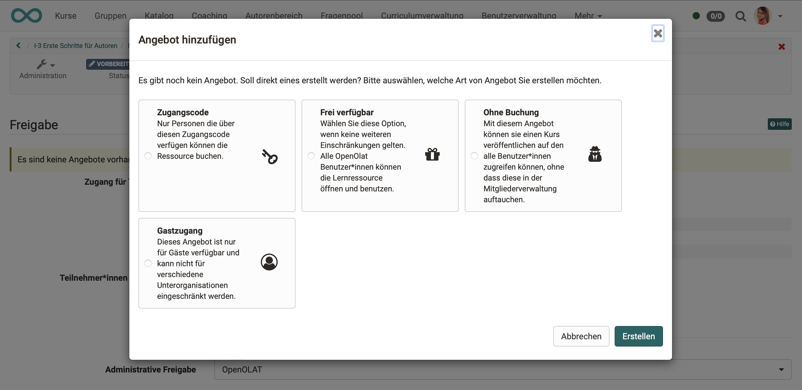{ class="shadow lightbox" }

Es können zum gleichen Kurs mehrere verschiedene Angebote erstellt werden. Z.B. kann dann der gleiche Kurs für einige Teilnehmer kostenlos, für andere kostenpflichtig angeboten werden.

Angebote können auch auf verschiedene Teilbereiche von Organisationen (Unterorganisationen) beschränkt werden.

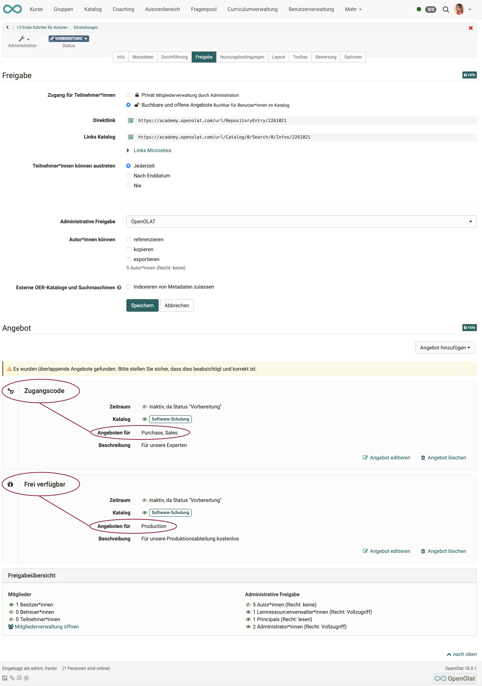{ class="shadow lightbox" }

## Angebote veröffentlichen

Editieren Sie ein Angebot um festzulegen, wann und wo es im Katalog erscheinen wird.

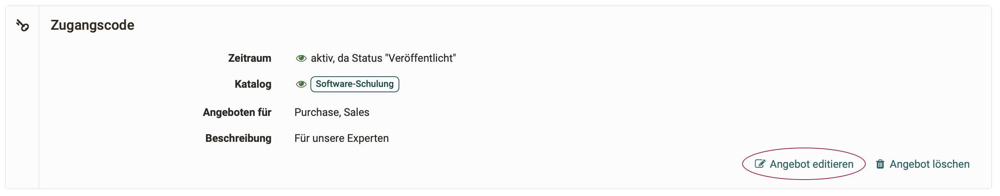{ class="shadow lightbox" }

Angebote können unabhängig vom Publikationsstatus des Kurses veröffentlicht werden. Dazu wählt man in der Angebotserstellung "zeitbeschränkt" aus und definiert einen zukünftigen Zeitraum. Das Angebot ist dann im Katalog für diesen definierten Zeitraum verfügbar.

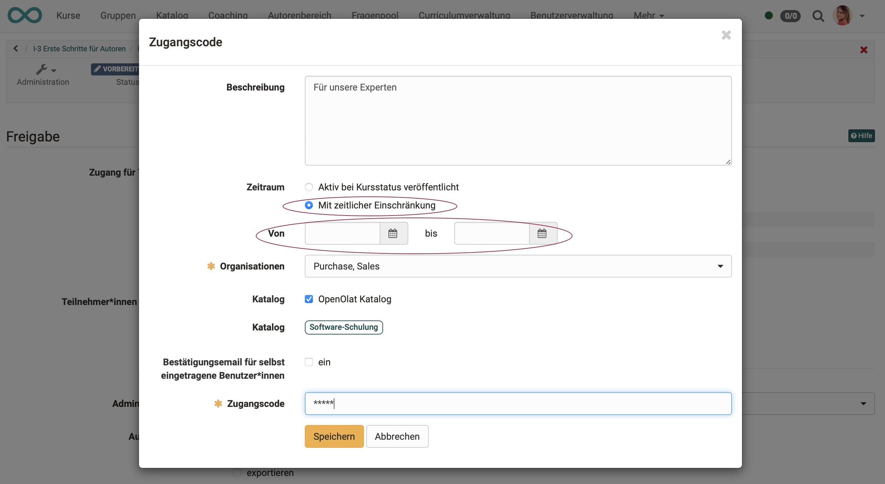{ class="shadow lightbox" }

Neben der **grundsätzlichen Aktivierung**, dass das Angebot in einem Katalog angezeigt werden soll, kann ein **Fachbereich** angegeben werden. Wird kein Fachbereich angegeben, kann das Angebot zwar z.B. über die Suchfunktion im Katalog gefunden werden, es wird jedoch in keinem Taxonomie-Launcher angezeigt, in dem Angebote mit gleichem Fachbereich zusammengefasst angezeigt werden. 

Ausserdem muss je nach Angebotstyp z.B. der **Zugangscode** definiert werden.

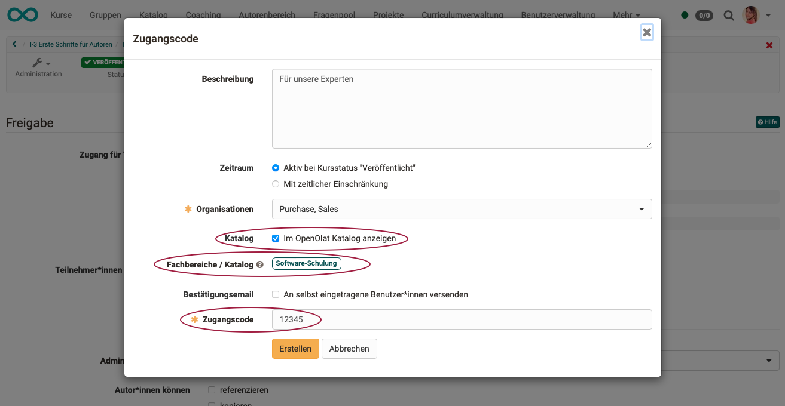{ class="shadow lightbox" }

## Infoseite

Wer im Katalog auf eine Kachel klickt, bekommt eine nährere Beschreibung zum angebotenen Kurs bzw. der Lernressource, ohne dass der Kurs bereits gestartet wird. Auch wenn für den Kursstart evtl. eine Zugangsberechtigung eingerichtet wurde, ist diese Infoseite im Katalog einsehbar. Sie enthält Angaben, die die Autorin / der Autor unter den Metadaten gemacht haben:
**Administration > Einstellungen > Tab "Info"**

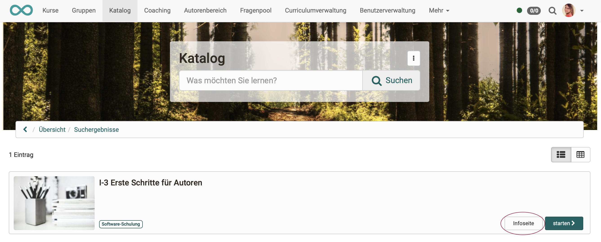{ class="shadow lightbox" }

{ class="shadow lightbox" }

## Metadaten, Fachbereich

Es ist von grosser Bedeutung, welchem Fachbereich Autor:innen einen Kurs bzw. eine Lernressource zuordnen. Denn hinter dem Fachbereich steht die Taxonomie, nach der in den Taxonomie-Launchern des Katalogs Kurse zusammengestellt werden. Sie wählen den Fachbereich unter **Administration > Einstellungen > Tab "Metadaten"** 

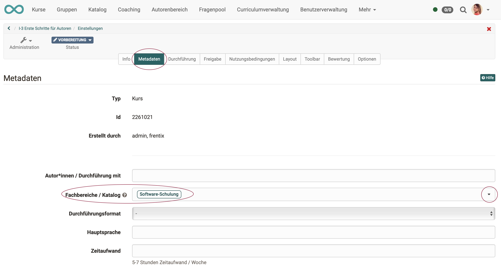{ class="shadow lightbox" }

Die im Tab "**Metadaten**" gemachten Angaben zum Fachbereich können im Tab "**Freigabe**" bei der Erstellung eines Angebots genutzt werden. Die Fachbereiche dienen der **Verschlagwortung** im Katalog. Es können mehrere Fachbereiche als Schlagwort angegeben werden. 

Wenn Sie auf den kleinen Pfeil am Ende der Zeile "Fachbereiche / Katalog" klicken, können Sie die Schlagworte auswählen. Zunächst erscheint ein Popup, in dem die verwendeten Fachbereiche aufgelistet sind. 

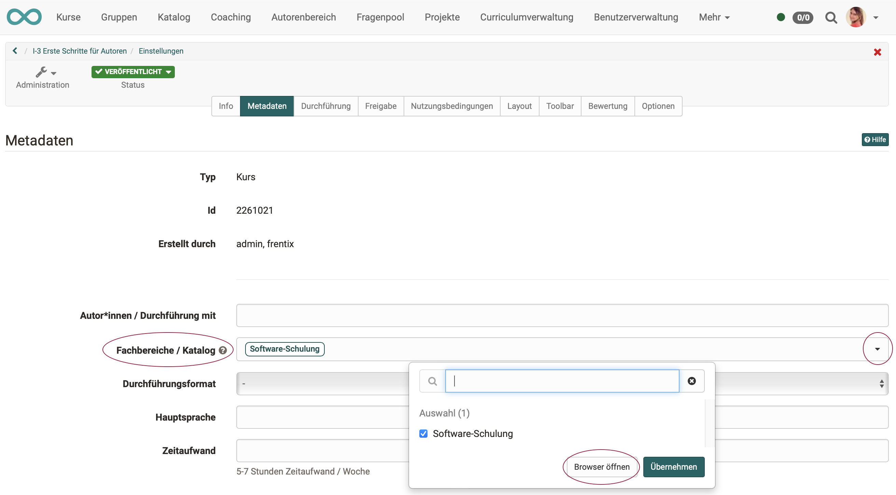{ class="shadow lightbox" }

Sie können nun über das Suchfeld oder durch Öffnen eines Browsers weitere Fachbereiche hinzufügen.

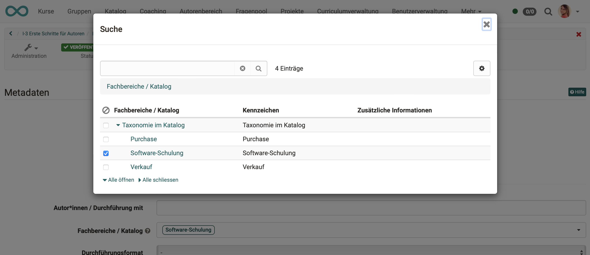{ class="shadow lightbox" }

Der dynamische Katalog 2.0 kann mit diesen Metadaten alle Angebote, die die gleiche Taxonomie verwenden (die gleichen Fachbereiche angegeben haben), zusammenfassen und in einem Katalogabschnitt (Launcher) zusammen anzeigen (Taxonomie-Launcher). 

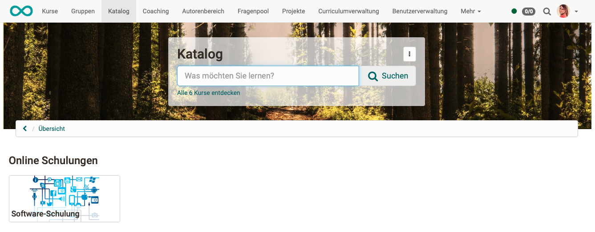{ class="shadow lightbox" }

Nach Klick auf die Kachel des Taxonomie-Launchers öffnet sich die sogenannte Microsite mit der Liste aller Kurse und Lernressourcen, die diesem Fachbereich zugeordnet wurden.  

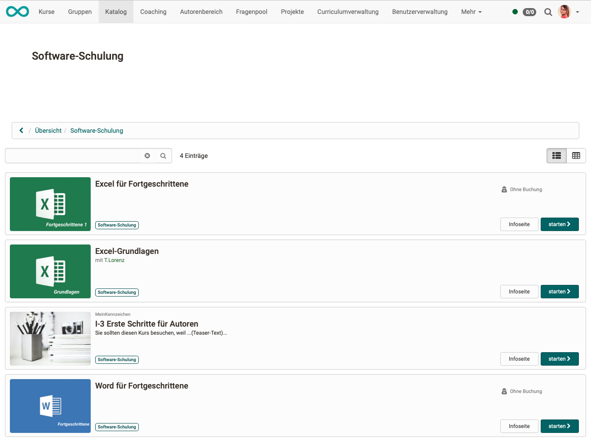{ class="shadow lightbox" }

!!! tipp "Katalog 1.0"

    Informationen zum Erstellen von Angeboten im Katalog 1.0 finden Sie [hier](catalog1.0.de.md). 