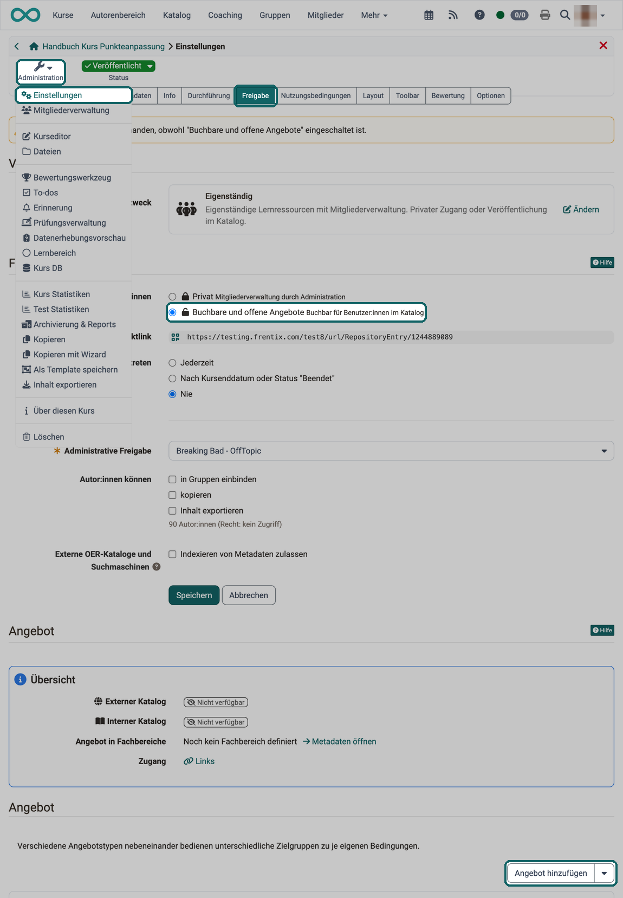

# Katalog 2.0 - Angebote {: #offers}

## Was enthält der OpenOlat-Katalog? [:octicons-tag-16:{ title="ab Release 17.1 (OO-6201)" }](https://track.frentix.com/issue/OO-6201) {: #offers_catalog_content}

Wie in anderen Katalogen, werden auch im OpenOlat-Katalog in vielen kleinen Einträgen Kurzbeschreibungen zu "Produkten" angezeigt. In OpenOlat sind dies

- Kurse
- Durchführungen von Curricula/Produkten
- oder andere Lernressourcen, wie z.B. Tests oder Videos.

## Erscheinen alle Kurse im Katalog? {: #offers_display_decision}

Im Katalog werden **nicht automatisch** alle erstellten Kurse und Lernressourcen angezeigt. Die Autor:innen der jeweiligen Kurse und Lernressourcen entscheiden, ob etwas in den Katalog aufgenommen wird.

Dazu muss im jeweiligen Kurs bzw. der Lernressource ein **Angebot** erstellt werden. 
Wenn kein Angebot erstellt wird, erfolgt auch kein Katalogeintrag.

[Zum Seitenanfang ^](#offers)

---

## Wie wird ein Angebot erstellt? {: #offers_create}

Angebote hängen am Kurs und werden dort von Autor:innen in den Einstellungen definiert: 
`Kurs > Administration > Einstellungen > Tab "Freigabe"`

!!! note "Unterschied Katalog 1.0 und Katalog 2.0"

    Im Katalog 1.0 werden alle Angebote in den Kursen erstellt: `Kurs > Administration > Einstellungen > Tab "Freigabe"`. Anschliessend werden sie in der **Katalogverwaltung** zusammengestellt.

    Im Katalog 2.0 werden Angebote ebenfalls in den Kurseinstellungen erstellt. Zusätzlich werden hier noch Angaben gemacht, **wo** im Katalog das Angebot erscheinen soll. Anhand dieser Angaben kann der Katalog 2.0 die Angebote dann **dynamisch selbst zusammenstellen**.

{ class="shadow lightbox" title="Tab Freigabe der Kurseinstellungen · 2026.09.28" }

[Zum Seitenanfang ^](#offers)

---

## Voraussetzung für ein Angebot {: #offers_requirements}

Auch der Zugang zu einem Kurs wird in den Kurseinstellungen konfiguriert: `Kurs > Administration > Einstellungen > Tab "Freigabe"`. Es stehen zwei grundsätzliche Varianten zur Verfügung:

{ class="shadow lightbox" title="Tab Freigabe der Kurseinstellungen" }

Bei der Wahl "Privat" werden die Teilnehmenden durch die Besitzer:innen bzw. Personen, die über das Recht der Mitgliederverwaltung verfügen, eingetragen. Was privat ist, soll auch nicht im Katalog veröffentlicht werden.

Bei Wahl der Option "Buchbare und offene Angebote" können die Lernenden einen Kurs/Lernressource selbst buchen, müssen aber eventuell (je nach Einstellung) ein Passwort eingeben.

Wird die zweite Option "Buchbare und offene Angebote" gewählt, können Sie anschliessend Angebote erstellen.

[Zum Seitenanfang ^](#offers)

---

## Was enthält ein Angebot? {: #offer_content}

Ein Angebot enthält die Bedingungen, zu denen der Kurs oder die Lernressource genutzt werden kann.

In einem **Angebot** wird definiert, wer sich unter welchen Umständen in die gewählte Lernressource bzw. den Kurs eintragen bzw. diese buchen kann. So ist ein Buchungsauftrag mit Zugangscode, ohne oder per PayPal (sofern von Administrator:innen aktiviert) möglich. Auch ein Zugang ohne Buchungsauftrag oder als Gast können konfiguriert werden. Buchen kann dabei als Synonym für belegen, einschreiben, einkaufen verstanden werden. Wählen Sie die Schaltfläche "Angebot hinzufügen", um Angebote hinzuzufügen.

Bei Angeboten einer Durchführung im Course Planner kann ein Angebot zusätzlich Formulare verlangen, die beim Buchen als Schritte ausgefüllt werden. Bei Angeboten eines Kurses oder einer anderen Lernressource ist das nicht möglich. [Formulare für Buchungsaufträge >](Course_Planner_Implementations.de.md#booking_order_forms) [:octicons-tag-16:{ title="ab Release 21.1 (OO-9724)" }](https://track.frentix.com/issue/OO-9724){:target="_blank"}

{ class="shadow lightbox" title="Dialog Angebot hinzufügen" }

Es können zum gleichen Kurs mehrere verschiedene Angebote erstellt werden. Z.B. kann dann der gleiche Kurs für einige Teilnehmer:innen kostenlos, für andere kostenpflichtig angeboten werden.

{ class="shadow lightbox" title="Abschnitt Angebot im Tab Freigabe" }

Angebote können auch auf verschiedene Teilbereiche von Organisationen (Unterorganisationen) beschränkt werden.

!!! info "Organisationszugehörigkeit"

    Ist ein Angebot auf eine bestimmte Organisation oder Unterorganisation eingeschränkt, erscheint es im Katalog **nur für Benutzer:innen, die Mitglied dieser Organisation sind**. Benutzer:innen ausserhalb der Organisation sehen das Angebot nicht, auch wenn der Kurs veröffentlicht ist.

    Die Organisationszugehörigkeit wird in der [Benutzerverwaltung](../../manual_admin/usermanagement/index.de.md) gepflegt.

[Zum Seitenanfang ^](#offers)

---

## Angebote veröffentlichen {: #offer_publish}

Editieren Sie ein Angebot um festzulegen, wann und wo es im Katalog erscheinen wird.

{ class="shadow lightbox" title="Abschnitt Angebot im Tab Freigabe" }

Angebote können unabhängig vom Publikationsstatus des Kurses veröffentlicht werden. Dazu wählt man in der Angebotserstellung "zeitbeschränkt" aus und definiert einen zukünftigen Zeitraum. Das Angebot ist dann im Katalog für diesen definierten Zeitraum verfügbar.

{ class="shadow lightbox" title="Dialog Zugangscode" }

Neben der **grundsätzlichen Aktivierung**, dass das Angebot in einem Katalog angezeigt werden soll, kann ein **Fachbereich** angegeben werden. Wird kein Fachbereich angegeben, kann das Angebot zwar z.B. über die Suchfunktion im Katalog gefunden werden, es wird jedoch in keinem Taxonomie-Launcher angezeigt, in dem Angebote mit gleichem Fachbereich zusammengefasst angezeigt werden.

Ausserdem muss je nach Angebotstyp z.B. der **Zugangscode** definiert werden.

{ class="shadow lightbox" title="Dialog Zugangscode" }

[Zum Seitenanfang ^](#offers)

---

## Wie läuft die Buchung eines Angebots ab? {: #offer_booking}

Mit einer Buchung erhalten Sie Zugang zu einem Kurs oder einer Durchführung aus dem Katalog. Sie buchen auf der Infoseite: Beim gewünschten Angebot wählen Sie **Buchen**. Was danach geschieht, hängt von der Angebotsart ab und davon, ob das Angebot Formulare verwendet.

Verwendet das Angebot kein Formular, bucht der Klick auf **Buchen** bei "Frei verfügbar" sofort. Bei "Zugangscode" öffnet sich der Dialog "Zugangscode", bei "Rechnung" der Dialog "Buchung auf Rechnung" mit dem Button **Kostenpflichtig buchen**. Angebote einzelner Kurse verwenden nie Formulare: Mit Zugangscode oder frei verfügbar buchen Sie diese immer auf diesem Weg. Die Angebotsart "Rechnung" gibt es nur bei Durchführungen.

### Buchung mit Formularen als Assistent [:octicons-tag-16:{ title="ab Release 21.1 (OO-9742)" }](https://track.frentix.com/issue/OO-9742){:target="_blank"} {: #offer_booking_wizard}

Verwendet das Angebot einer Durchführung mindestens ein Formular, führt OpenOlat Sie durch einen Assistenten. So geben Sie die Angaben, welche die Verantwortlichen für die Planung brauchen, etwa Essenswünsche oder Vorkenntnisse, gleich mit der Buchung ab. Ihre Antworten stehen danach bei Ihrem Buchungsauftrag.

Der Titel des Assistenten nennt die Angebotsart und die Durchführung: "Buchung frei verfügbar für", "Buchung mit Zugangscode für" oder "Buchung auf Rechnung für", gefolgt vom Titel der Durchführung und, falls gesetzt, ihrem Kennzeichen.

Welche Schritte der Assistent zeigt, hängt von der Angebotsart ab:

| Angebotsart | Schritte |
|---|---|
| Frei verfügbar | die Formulare |
| Zugangscode | zuerst der Schritt "Zugangscode", danach die Formulare |
| Rechnung | zuerst der Schritt "Buchungsdetails", danach die Formulare |

Im Schritt "Zugangscode" geben Sie den Zugangscode ein, den Sie erhalten haben. Im Schritt "Buchungsdetails" wählen Sie über **Rechnungsadresse auswählen** die Rechnungsadresse, sie ist Pflicht. Die "Bestellnummer (PO-Nummer)" und der "Kommentar" sind freiwillig. Hat das Angebot einen Preis oder eine Stornierungsgebühr, zeigt der Schritt diese Angaben an.

Jedes Formular ist ein eigener Schritt, beschriftet mit seinem Schrittnamen. Die Reihenfolge der Formulare legt das Angebot fest.

- **Weiter** prüft die Pflichtfelder des angezeigten Schritts und führt zum nächsten Schritt.
- **Zurück** führt ohne Prüfung zum vorherigen Schritt. Ihre Eingaben bleiben erhalten.
- Im letzten Schritt schliesst der hervorgehobene Button die Buchung ab: **Buchen** bei "Frei verfügbar" und "Zugangscode", **Kostenpflichtig buchen** bei "Rechnung".

Der Buchungsauftrag entsteht erst mit diesem letzten Klick. Brechen Sie den Assistenten vorher mit **Abbrechen** oder dem Schliessen-Symbol ab, sind Sie nicht gebucht, und OpenOlat speichert keine Antworten.

Bucht eine andere Person für Sie, etwa mit [Buchen im Namen von](Coaching_People.de.md#linemanager_educationmanager_book_participants) im Coaching oder beim [Hinzufügen von Teilnehmer:innen](Course_Planner_Implementations.de.md#add_members) im Course Planner, füllt diese Person die Formulare aus. Die Antworten gehören zu Ihrem Buchungsauftrag. Ihre ausgefüllten Formulare sehen Sie unter [Buchungsaufträge](../personal_menu/Bookings.de.md) im Dialog "Buchung" des Buchungsauftrags.

Formulare an Angeboten gibt es nur bei Durchführungen im Course Planner, nicht bei Angeboten einzelner Kurse und nicht bei der Angebotsart PayPal Checkout. Wie Sie ein Formular in einem Angebot verwenden, beschreibt [Formular im Angebot verwenden](Course_Planner_Implementations.de.md#booking_order_forms_offer).

[Zum Seitenanfang ^](#offers)

---

## Infoseite {: #offer_info}

Wer im Katalog auf eine Kachel klickt, bekommt eine nähere Beschreibung zum angebotenen Kurs bzw. der Lernressource, ohne dass der Kurs bereits gestartet wird. Auch wenn für den Kursstart evtl. eine Zugangsberechtigung eingerichtet wurde, ist diese Infoseite im Katalog einsehbar. Sie enthält Angaben, die die Autor:innen unter den Metadaten gemacht haben: 
`Kurs > Administration > Einstellungen > Tab "Info"`

{ class="shadow lightbox" title="Suchergebnisse im Katalog" }

{ class="shadow lightbox" title="Infoseite im Katalog" }

[Zum Seitenanfang ^](#offers)

---

## Metadaten, Fachbereich {: #offer_metadata}

Es ist von grosser Bedeutung, welchem Fachbereich Autor:innen einen Kurs bzw. eine Lernressource zuordnen. Denn hinter dem Fachbereich steht die Taxonomie, nach der in den Taxonomie-Launchern des Katalogs Kurse zusammengestellt werden. Sie wählen den Fachbereich unter: 
`Kurs > Administration > Einstellungen > Tab "Metadaten"`

{ class="shadow lightbox" title="Tab Metadaten der Kurseinstellungen" }

Die im Tab "**Metadaten**" gemachten Angaben zum Fachbereich können im Tab "**Freigabe**" bei der Erstellung eines Angebots genutzt werden. Die Fachbereiche dienen der **Verschlagwortung** im Katalog. Es können mehrere Fachbereiche als Schlagwort angegeben werden.

Wenn Sie auf den kleinen Pfeil am Ende der Zeile "Fachbereiche / Katalog" klicken, können Sie die Schlagworte auswählen. Zunächst erscheint ein Popup, in dem die verwendeten Fachbereiche aufgelistet sind.

{ class="shadow lightbox" title="Feld Fachbereiche / Katalog im Tab Metadaten" }

Sie können nun über das Suchfeld oder durch Öffnen eines Browsers weitere Fachbereiche hinzufügen.

{ class="shadow lightbox" title="Dialog Suche für die Fachbereiche" }

Der dynamische Katalog 2.0 kann mit diesen Metadaten alle Angebote, die die gleiche Taxonomie verwenden (die gleichen Fachbereiche angegeben haben), zusammenfassen und in einem Katalogabschnitt (Launcher) zusammen anzeigen (Taxonomie-Launcher).

{ class="shadow lightbox" title="Startseite des Katalogs" }

Nach Klick auf die Kachel des Taxonomie-Launchers öffnet sich die sogenannte Microsite mit der Liste aller Kurse und Lernressourcen, die diesem Fachbereich zugeordnet wurden.

{ class="shadow lightbox" title="Microsite des Taxonomie-Launchers" }

!!! note "Katalog 1.0"

    Informationen zum Erstellen von Angeboten im Katalog 1.0 finden Sie [hier](catalog1.0.de.md).

[Zum Seitenanfang ^](#offers)

---

## Weiterführende Informationen {: #further_information}

[Course Planner: Durchführungen >](Course_Planner_Implementations.de.md) 
[Benutzerverwaltung (Administrationshandbuch) >](../../manual_admin/usermanagement/index.de.md) 
[Coaching - Personen >](Coaching_People.de.md) 
[Persönliche Werkzeuge: Buchungsaufträge >](../personal_menu/Bookings.de.md) 
[Katalog 1.0 >](catalog1.0.de.md) 
[Angebotskonzepte >](../basic_concepts/Offer_Concepts.de.md) 
[Zugangskonfiguration / Freigabe >](../learningresources/Access_configuration.de.md)

[Zum Seitenanfang ^](#offers)
