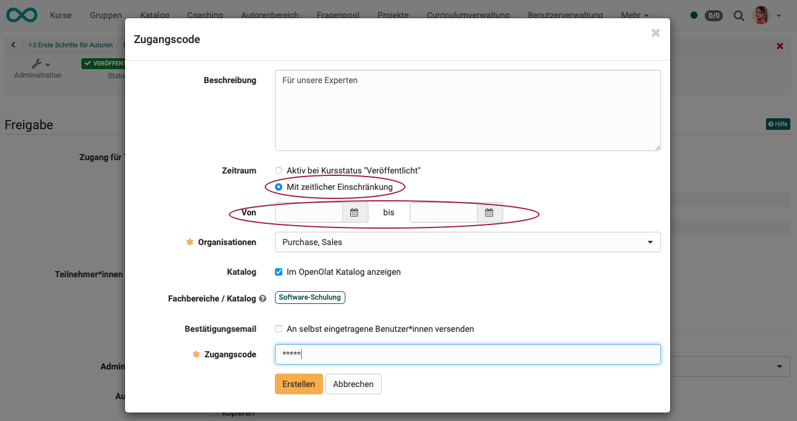
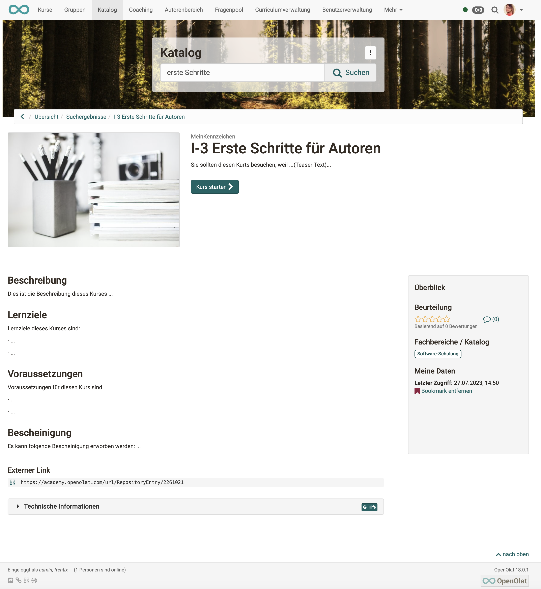

# Katalog 2.0 - Angebote

## Was enthält der OpenOlat-Katalog?

Wie in anderen Katalogen, werden auch im OpenOlat-Katalog in vielen kleinen Einträgen Kurzbeschreibungen zu „Produkten“ angezeigt. In OpenOlat sind dies

- Kurse 
- oder andere Lernressourcen, wie z.B. Tests oder Videos.

## Erscheinen alle Kurse im Katalog?

Im Katalog werden **nicht automatisch** alle erstellten Kurse und Lernressourcen angezeigt. Die Autor:innen der jeweiligen Kurse und Lernressourcen entscheiden, ob etwas in den Katalog aufgenommen wird.

Dazu muss im jeweiligen Kurs bzw. der Lernressource ein **Angebot** erstellt werden. 
Wenn kein Angebot erstellt wird, erfolgt auch kein Katalogeintrag.

## Wie wird ein Angebot erstellt?

Angebote hängen am Kurs und werden dort von Autor:innen in den Einstellungen definiert: 
**Administration > Einstellungen > Tab „Freigabe“**

{ class="shadow lightbox" }

## Voraussetzung für ein Angebot

Auch der Zugang zu einem Kurs wird in der **Administration** unter den **Einstellungen** im **Tab Freigabe** konfiguriert. Es stehen zwei grundsätzliche Varianten zur Verfügung:

{ class="shadow lightbox" }

Bei der Wahl "Privat" werden die Teilnehmenden durch die Besitzer bzw. Personen, die über das Recht der Mitgliederverwaltung verfügen, eingetragen. Was privat ist, soll auch nicht im Katalog veröffentlicht werden.

Bei der Wahl der Option "Buchbare und offene Angebote" können die Lernenden einen Kurs/Lernressource selbst buchen, müssen aber eventuell (je nach Einstellung) ein Passwort eingeben.

Wird die zweite Option "Buchbare und offene Angebote“ gewählt, können Sie anschliessend Angebote erstellen.

## Was enthält ein Angebot?

Ein Angebot enthält die Bedingungen, zu denen der Kurs oder die Lernressource genutzt werden kann.

In einem **Angebot** wird definiert, wer sich unter welchen Umständen in die gewählte Lernressource bzw. den Kurs eintragen bzw. diese buchen kann. So ist eine Buchung mit Zugangscode, ohne oder per PayPal (sofern vom Admin aktiviert) möglich. Auch ein Zugang ohne Buchung oder als Gast können konfiguriert werden. Buchen kann dabei als Synonym für belegen, einschreiben, einkaufen verstanden werden.
Wählen Sie die Schaltfläche "Angebot hinzufügen", um Buchungsmethoden (Angebote) hinzuzufügen.

{ class="shadow lightbox" }

Es können zum gleichen Kurs mehrere verschiedene Angebote erstellt werden. Z.B. kann dann der gleiche Kurs für einige Teilnehmer kostenlos, für andere kostenpflichtig angeboten werden.

Angebote können auch auf verschiedene Teilbereiche von Organisationen (Unterorganisationen) beschränkt werden.

{ class="shadow lightbox" }

## Angebote veröffentlichen

Angebote können unabhängig vom Publikationsstatus des Kurses veröffentlicht werden. Dazu wählt man in der Angebotserstellung "zeitbeschränkt" aus und definiert einen zukünftigen Zeitraum. Das Angebot ist dann im Katalog für diesen definierten Zeitraum verfügbar.

{ class="shadow lightbox" }

## Infoseite

Wer im Katalog auf eine Kachel klickt, bekommt eine nährere Beschreibung zum angebotenen Kurs bzw. der Lernressource, ohne dass der Kurs bereits gestartet wird. Auch wenn für den Kursstart evtl. eine Zugangsberechtigung eingerichtet wurde, ist diese Infoseite im Katalog einsehbar. Sie enthält Angaben, die die Autorin / der Autor unter den Metadaten gemacht haben:
**Administration > Einstellungen > Tab "Info"**

{ class="shadow lightbox" }

{ class="shadow lightbox" }

## Metadaten, Fachbereich

Es ist von grosser Bedeutung, welchem Fachbereich Autor:innen einen Kurs bzw. eine Lernressource zuordnen. Denn hinter dem Fachbereich steht die Taxonomie, nach der in den Taxonomie-Launchern des Katalogs Kurse zusammengestellt werden. Sie wählen den Fachbereich unter **Administration > Einstellungen > Tab "Metadaten"** 

{ class="shadow lightbox" }
